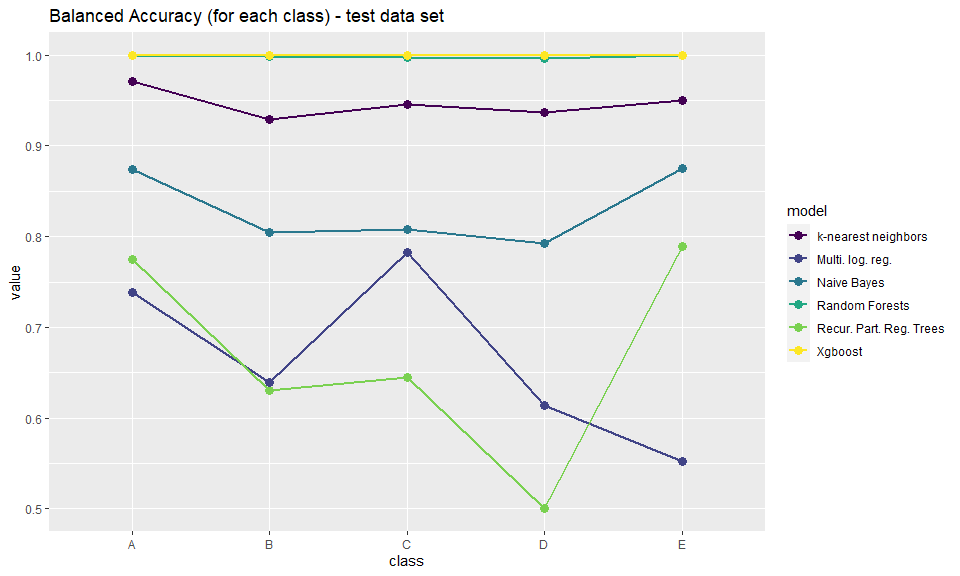
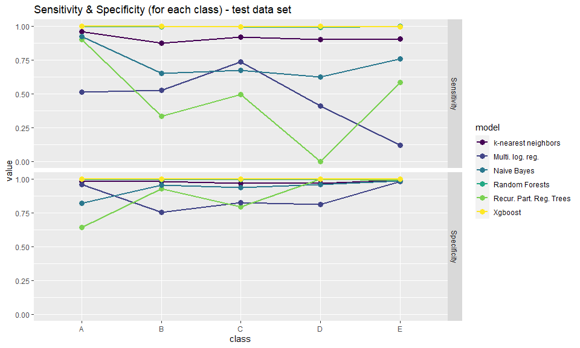
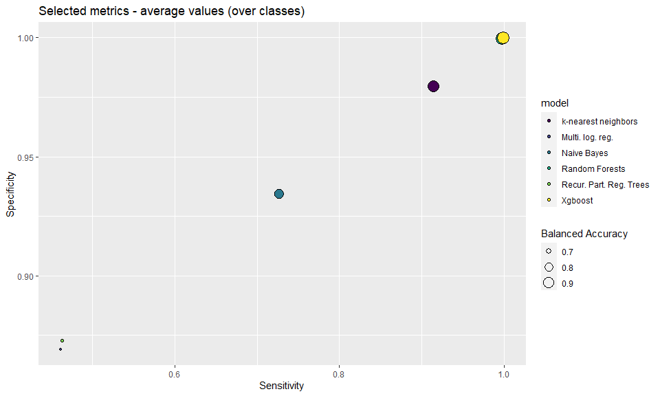

## Introduction

In this analysis we are focusing on data gathered from accelerometers, which were attached on participants' belt, forearm, arm, and dumbbell, and were colecting data regarding exercises. In the data collection process 6 participants were participating. The main goal of the analysis is to build a machine learning algorithm that will be able to predict the manner in which participants did the exercise using the data collected on accelometers.


## Data 

In this project data was provided by group of researchers who written publication titled **Wearable Computing: Accelerometers' Data Classification of Body Postures and Movements** (reference here [url](http://groupware.les.inf.puc-rio.br/work.jsf?p1=10335)).


We have obtained two separate data files (stored in *.csv* format):

* **pmltraining.csv**
* **pmltesting.csv**


The case is we have to be fair and we will behave that we are not able to see **pmltesting.csv** file, which corresponds to new measurements we receive, and where we must predict the classes. Therefore given file will only be used for final model predictions.


* **train** data set (75% of measurements)
* **test** data set (25% of measurements)

Splitting will be done based on our outcome variable (**classe**) and doing a random shuffling of rows and then splitting into two parts (based on selected percentage). In the model training procedure we will use so called **k-fold cross-validation** technique om **train** data set, meaning our train data set will be randomly splitted into *k*-different folds and we will use *k-1* folds to train our model and check model performance on the fold left out We will repeat *k* iterations of training, in each iteration leaving out one new fold, therefore each fold will be once left out. By doing so we will get better model estimates and try to reduce the over-fitting of the model parameters. For data exploration we will also use only **train** data set. The **test** data set will be used for model benchmark, in order to select the top performing models.


### Data import


```r
# Check if data folder exists
if(!dir.exists("data")){
  dir.create("data")
}

# download csv files train/test
if(!file.exists("./data/pmltraining.csv")){
  download.file(url = "https://d396qusza40orc.cloudfront.net/predmachlearn/pml-training.csv", 
                destfile = "./data/pmltraining.csv")
}
if(!file.exists("./data/pmltesting.csv")){
  download.file(url = "https://d396qusza40orc.cloudfront.net/predmachlearn/pml-testing.csv", 
                destfile = "./data/pmltesting.csv")
}


# import csv
pml_training <- read.csv(file = "./data/pmltraining.csv", header = T, 
                         sep = ",", quote = '"', row.names = 1) %>% 
  clean_names()
pml_testing <- read.csv(file = "./data/pmltesting.csv", header = T, 
                         sep = ",", quote = '"', row.names = 1) %>% 
  clean_names()
```


### Data split

Now let's do the splitting of **pml_training** data source using caret package.


```r
set.seed(11235) # seed for split
train_rows <- createDataPartition(y = pml_training$classe, p = .75, list = F) # do the splitting 

train <- pml_training[train_rows, ] # train data set
test  <- pml_training[-train_rows, ] # test data set
```


### Data wrangle


Now we will check if there are any columns that have a lot of missing values NAs (potential imputation or removing columns):


```r
# calculate % of missing rows in each column 
NAs <- map(train, ~sum(is.na(.))) %>% 
  unlist() / nrow(train) 

# create a DF: var and % of missing values in that var
NAs <- data.frame(var = names(NAs),
                  missing = NAs) %>% 
  mutate(missing = round(missing * 100, digits = 1)) %>% 
  rename(`missing rows %` = missing) %>% 
  arrange(desc(`missing rows %`))
rownames(NAs) <- NULL

# extract names of variables to drop
drop.vars <- NAs %>% filter(`missing rows %` > 90) %>% pull(var) # list of columns to drop (more then 50 % NA)
```

There are 67 variables with almost all missing values. We will drop these variables, since there aren't any added value, if we put them into our modeling procedure. Lets drop columns from train and test data set:


```r
train <- train %>% select(-drop.vars) 
test  <- test %>% select(-drop.vars) 
```


Let see which columns are character type (potential conversion to numeric or factor, or to drop columns). On a first sight we think we must have most of the columns numeric. Some strange values can prevent numeric variables to becoming numeric, lets find out which values are preventing this to happen. Isolate first character vectors:


```r
# check which columns are characters (potential transformation to numeric or to drop columns)
charvars <- colnames(train)[train %>% lapply(class) == "character"]
charvars
```

```
##  [1] "user_name"               "cvtd_timestamp"         
##  [3] "new_window"              "kurtosis_roll_belt"     
##  [5] "kurtosis_picth_belt"     "kurtosis_yaw_belt"      
##  [7] "skewness_roll_belt"      "skewness_roll_belt_1"   
##  [9] "skewness_yaw_belt"       "max_yaw_belt"           
## [11] "min_yaw_belt"            "amplitude_yaw_belt"     
## [13] "kurtosis_roll_arm"       "kurtosis_picth_arm"     
## [15] "kurtosis_yaw_arm"        "skewness_roll_arm"      
## [17] "skewness_pitch_arm"      "skewness_yaw_arm"       
## [19] "kurtosis_roll_dumbbell"  "kurtosis_picth_dumbbell"
## [21] "kurtosis_yaw_dumbbell"   "skewness_roll_dumbbell" 
## [23] "skewness_pitch_dumbbell" "skewness_yaw_dumbbell"  
## [25] "max_yaw_dumbbell"        "min_yaw_dumbbell"       
## [27] "amplitude_yaw_dumbbell"  "kurtosis_roll_forearm"  
## [29] "kurtosis_picth_forearm"  "kurtosis_yaw_forearm"   
## [31] "skewness_roll_forearm"   "skewness_pitch_forearm" 
## [33] "skewness_yaw_forearm"    "max_yaw_forearm"        
## [35] "min_yaw_forearm"         "amplitude_yaw_forearm"  
## [37] "classe"
```

If we omit columns such as: "user_name", "cvtd_timestamp", "new_window", "classe", we think based on the column names we are dealing with numeric columns. Lets check check their summaries and try to find strange values:


```r
strangevalues <- train[,charvars] %>% 
  select(-c("user_name", "cvtd_timestamp", "new_window", "classe")) 

# lets build a long format df: variable name and value 
# so we can do group by each variable and check unique values
# and display top ten occurence of values
strangevalues %>% 
  pivot_longer(cols = colnames(strangevalues)) %>% 
  group_by(value) %>% 
  count() %>% 
  ungroup() %>% 
  arrange(desc(n)) %>% 
  head(10)
```

```
## # A tibble: 10 x 2
##    value          n
##    <chr>      <int>
##  1 ""        476157
##  2 "#DIV/0!"   2461
##  3 "0.00"       523
##  4 "0.0000"     276
##  5 "-1.2"        96
##  6 "-1.1"        86
##  7 "-1.5"        82
##  8 "-0.8"        78
##  9 "-1.4"        76
## 10 "-0.9"        74
```

As seen above a lot of missin values are written as blank string "", and also there are a lot of values "#DIV/0!" (probably some number division error). We will first force all this column to be converted to numeric, and then we will check missing values inside this columns, and finally remove some additional columns with a lot of missing values:


```r
vars.force.conv <- colnames(strangevalues) # list of variables to force conversion

# force conversion (train & test) - from char to num
train <- train %>% 
  mutate_at(.vars = vars.force.conv, .funs = as.numeric)
test <- test %>% 
  mutate_at(.vars = vars.force.conv, .funs = as.numeric)
```


Now we will check again the percentage of missing values for columns we converted from character to numeric in previous step:


```r
# calculate % of missing rows in each column (observed columns)
NAs <- train[, vars.force.conv] %>% 
  map(., ~sum(is.na(.))) %>% 
  unlist() / nrow(train) 

# create a DF: var and % of missing values in that var
NAs <- data.frame(var = names(NAs),
                  missing = NAs) %>% 
  mutate(missing = round(missing * 100, digits = 1)) %>% 
  rename(`missing rows %` = missing) %>% 
  arrange(desc(`missing rows %`))
rownames(NAs) <- NULL

# extract names of variables to drop
drop.vars <- NAs %>% filter(`missing rows %` > 90) %>% pull(var) # list of columns to drop (more then 50 % NA)

# show percentage of missing rows
NAs %>% 
  kbl() %>% 
  kable_paper() %>%
  scroll_box(width = "400px", height = "500px")
```

<div style="border: 1px solid #ddd; padding: 0px; overflow-y: scroll; height:500px; overflow-x: scroll; width:400px; "><table class=" lightable-paper" style='font-family: "Arial Narrow", arial, helvetica, sans-serif; margin-left: auto; margin-right: auto;'>
 <thead>
  <tr>
   <th style="text-align:left;position: sticky; top:0; background-color: #FFFFFF;"> var </th>
   <th style="text-align:right;position: sticky; top:0; background-color: #FFFFFF;"> missing rows % </th>
  </tr>
 </thead>
<tbody>
  <tr>
   <td style="text-align:left;"> kurtosis_yaw_belt </td>
   <td style="text-align:right;"> 100.0 </td>
  </tr>
  <tr>
   <td style="text-align:left;"> skewness_yaw_belt </td>
   <td style="text-align:right;"> 100.0 </td>
  </tr>
  <tr>
   <td style="text-align:left;"> kurtosis_yaw_dumbbell </td>
   <td style="text-align:right;"> 100.0 </td>
  </tr>
  <tr>
   <td style="text-align:left;"> skewness_yaw_dumbbell </td>
   <td style="text-align:right;"> 100.0 </td>
  </tr>
  <tr>
   <td style="text-align:left;"> kurtosis_yaw_forearm </td>
   <td style="text-align:right;"> 100.0 </td>
  </tr>
  <tr>
   <td style="text-align:left;"> skewness_yaw_forearm </td>
   <td style="text-align:right;"> 100.0 </td>
  </tr>
  <tr>
   <td style="text-align:left;"> kurtosis_roll_forearm </td>
   <td style="text-align:right;"> 98.5 </td>
  </tr>
  <tr>
   <td style="text-align:left;"> kurtosis_picth_forearm </td>
   <td style="text-align:right;"> 98.5 </td>
  </tr>
  <tr>
   <td style="text-align:left;"> skewness_roll_forearm </td>
   <td style="text-align:right;"> 98.5 </td>
  </tr>
  <tr>
   <td style="text-align:left;"> skewness_pitch_forearm </td>
   <td style="text-align:right;"> 98.5 </td>
  </tr>
  <tr>
   <td style="text-align:left;"> max_yaw_forearm </td>
   <td style="text-align:right;"> 98.5 </td>
  </tr>
  <tr>
   <td style="text-align:left;"> min_yaw_forearm </td>
   <td style="text-align:right;"> 98.5 </td>
  </tr>
  <tr>
   <td style="text-align:left;"> amplitude_yaw_forearm </td>
   <td style="text-align:right;"> 98.5 </td>
  </tr>
  <tr>
   <td style="text-align:left;"> kurtosis_roll_arm </td>
   <td style="text-align:right;"> 98.4 </td>
  </tr>
  <tr>
   <td style="text-align:left;"> kurtosis_picth_arm </td>
   <td style="text-align:right;"> 98.4 </td>
  </tr>
  <tr>
   <td style="text-align:left;"> skewness_roll_arm </td>
   <td style="text-align:right;"> 98.4 </td>
  </tr>
  <tr>
   <td style="text-align:left;"> skewness_pitch_arm </td>
   <td style="text-align:right;"> 98.4 </td>
  </tr>
  <tr>
   <td style="text-align:left;"> kurtosis_picth_belt </td>
   <td style="text-align:right;"> 98.2 </td>
  </tr>
  <tr>
   <td style="text-align:left;"> skewness_roll_belt_1 </td>
   <td style="text-align:right;"> 98.2 </td>
  </tr>
  <tr>
   <td style="text-align:left;"> kurtosis_roll_belt </td>
   <td style="text-align:right;"> 98.1 </td>
  </tr>
  <tr>
   <td style="text-align:left;"> skewness_roll_belt </td>
   <td style="text-align:right;"> 98.1 </td>
  </tr>
  <tr>
   <td style="text-align:left;"> max_yaw_belt </td>
   <td style="text-align:right;"> 98.1 </td>
  </tr>
  <tr>
   <td style="text-align:left;"> min_yaw_belt </td>
   <td style="text-align:right;"> 98.1 </td>
  </tr>
  <tr>
   <td style="text-align:left;"> amplitude_yaw_belt </td>
   <td style="text-align:right;"> 98.1 </td>
  </tr>
  <tr>
   <td style="text-align:left;"> kurtosis_yaw_arm </td>
   <td style="text-align:right;"> 98.1 </td>
  </tr>
  <tr>
   <td style="text-align:left;"> skewness_yaw_arm </td>
   <td style="text-align:right;"> 98.1 </td>
  </tr>
  <tr>
   <td style="text-align:left;"> kurtosis_roll_dumbbell </td>
   <td style="text-align:right;"> 98.1 </td>
  </tr>
  <tr>
   <td style="text-align:left;"> kurtosis_picth_dumbbell </td>
   <td style="text-align:right;"> 98.1 </td>
  </tr>
  <tr>
   <td style="text-align:left;"> skewness_roll_dumbbell </td>
   <td style="text-align:right;"> 98.1 </td>
  </tr>
  <tr>
   <td style="text-align:left;"> max_yaw_dumbbell </td>
   <td style="text-align:right;"> 98.1 </td>
  </tr>
  <tr>
   <td style="text-align:left;"> min_yaw_dumbbell </td>
   <td style="text-align:right;"> 98.1 </td>
  </tr>
  <tr>
   <td style="text-align:left;"> amplitude_yaw_dumbbell </td>
   <td style="text-align:right;"> 98.1 </td>
  </tr>
  <tr>
   <td style="text-align:left;"> skewness_pitch_dumbbell </td>
   <td style="text-align:right;"> 98.0 </td>
  </tr>
</tbody>
</table></div>

Table above shows % of misisng rows for forcefully converted columns. As you can see, all columns have almost all missing values (due to blank strings and other characters). So we will also remove all this columns, since they do not bring any added value to the table:


```r
train <- train %>% select(-drop.vars) 
test  <- test %>% select(-drop.vars) 
```


Finally lets apply some essential variable data types transformations (on test and train data sets). We have to transform outcome variable to factor, and also there are some date time specific columns:


```r
train <- train %>%
  mutate(classe = as.factor(classe), # convert outcome to factor variable
         cvtd_timestamp = dmy_hm(cvtd_timestamp)) # convert to date time object
test <- test %>%
  mutate(classe = as.factor(classe), # convert outcome to factor variable
         cvtd_timestamp = dmy_hm(cvtd_timestamp)) # convert to date time object
```


## Exploratory Data Analysis (EDA)

First lets check how many users are included in the data:

```r
train %>% 
  count(user_name)
```

```
##   user_name    n
## 1    adelmo 2913
## 2  carlitos 2342
## 3   charles 2656
## 4    eurico 2310
## 5    jeremy 2527
## 6     pedro 1970
```

Now lets check summary of date & date-time related variables:


```r
# min/max raw timestamp part 1
train %>% 
  group_by(user_name) %>% 
  summarise(min_raw_ts1 = min(raw_timestamp_part_1),
            max_raw_ts1 = max(raw_timestamp_part_1))
```

```
## # A tibble: 6 x 3
##   user_name min_raw_ts1 max_raw_ts1
##   <chr>           <int>       <int>
## 1 adelmo     1322832772  1322832945
## 2 carlitos   1323084231  1323084356
## 3 charles    1322837808  1322837962
## 4 eurico     1322489605  1322489730
## 5 jeremy     1322673025  1322673166
## 6 pedro      1323094968  1323095081
```

```r
# min/max raw timestamp part 2
train %>% 
  group_by(user_name) %>% 
  summarise(min_raw_ts2 = min(raw_timestamp_part_2),
            max_raw_ts2 = max(raw_timestamp_part_2))
```

```
## # A tibble: 6 x 3
##   user_name min_raw_ts2 max_raw_ts2
##   <chr>           <int>       <int>
## 1 adelmo            294      998669
## 2 carlitos          367      998176
## 3 charles           315      997179
## 4 eurico           2647      998801
## 5 jeremy           2674      998716
## 6 pedro             317      996405
```
We think date and date-time related columns are irrelevant for model we are building (that will predict **classe** outcome). Therefore we will drop columns:

* **raw_timestamp_part_1**
* **raw_timestamp_part_2**
* **cvtd_timestamp**

Also we will drop column called **new_window**, but at this point we will keep column **num_window**.


```r
drop.vars <- c("raw_timestamp_part_1", "raw_timestamp_part_2",
               "cvtd_timestamp", "new_window")
train <- train %>% select(-drop.vars) 
test  <- test %>% select(-drop.vars) 
```

Now lets check how numerical variables are correlated between themselves. We will highlight predictor pairs with high correlation. High correlation might indicate some multicollinearity among predictors, but we hope that this phenomena won't cause any troubles due to selected prediction algorithms.


```r
# we check correlation for only numeric variables
relevant.vars <- colnames(train)[train %>% lapply(class) %in% c("numeric", "integer")]

cor.mat <- cor(train[, relevant.vars]) # correlation matrix
diag(cor.mat) <- 0 # set diagonal elements to zero
cor.mat[upper.tri(cor.mat)] <- 0 # set upper triangular elements to zero

# Top correlation
inds <- which(abs(cor.mat) > 0.8, arr.ind = TRUE) # index

# cerate table of pairs
cor.top <- data.frame(Var1 = rownames(cor.mat)[inds[, 1]], 
                      Var2 = colnames(cor.mat)[inds[, 2]], 
                      Cor = cor.mat[inds]) %>% 
  distinct() %>% 
  arrange(desc(abs(Cor)))
```

Now lets list predictors and their correlations:

```r
cor.top
```

```
##                Var1             Var2        Cor
## 1      accel_belt_z        roll_belt -0.9920233
## 2  gyros_dumbbell_z gyros_dumbbell_x -0.9836325
## 3  total_accel_belt        roll_belt  0.9805880
## 4      accel_belt_z total_accel_belt -0.9743945
## 5      accel_belt_x       pitch_belt -0.9644992
## 6   gyros_forearm_z gyros_dumbbell_z  0.9482223
## 7   gyros_forearm_z gyros_dumbbell_x -0.9333282
## 8      accel_belt_z     accel_belt_y -0.9322084
## 9      accel_belt_y total_accel_belt  0.9272485
## 10     accel_belt_y        roll_belt  0.9236888
## 11      gyros_arm_y      gyros_arm_x -0.9188930
## 12    magnet_belt_x     accel_belt_x  0.8871633
## 13    magnet_belt_x       pitch_belt -0.8780330
## 14  gyros_forearm_z  gyros_forearm_y  0.8694208
## 15 accel_dumbbell_z     yaw_dumbbell  0.8483225
## 16     magnet_arm_z     magnet_arm_y  0.8147423
## 17     magnet_arm_x      accel_arm_x  0.8143423
## 18         yaw_belt        roll_belt  0.8139859
## 19 accel_dumbbell_x   pitch_dumbbell  0.8077293
```

The table above shows pairs of predictors that are highly correlated (in positive or negative direction). We hope this will not cerate any problems for selected prediction algorithms. 

Now lets check how balanced is occurrence of each value in outcome variable (**classe**). Since we have a multi-class classification problem, we must select the adequate performance measure (it can be slightly more complicated than the case with a binary class outcome!):


```r
train %>% 
  group_by(classe) %>% 
  count()
```

```
## # A tibble: 5 x 2
## # Groups:   classe [5]
##   classe     n
##   <fct>  <int>
## 1 A       4185
## 2 B       2848
## 3 C       2567
## 4 D       2412
## 5 E       2706
```


We can see that classes "B", "C", "D", "E" are more than less balanced, but class "A" has slightly more observations compared to other classes. 


## Modeling

In the modeling stage we would like to fit parameters of selected model using train data set. In order to predict outcome variable using test data set (and later validation or final test data set). Selected model types are (keep in mind we are dealing with multi- class classification problem!):

* Multinomial logistic regression classification algorithm (R package - **nnet**)
* Naive Bayes classification algorithm (R package **naivebayes**)
* k-nearest neighbors (KNN) classification algorithm (inside **caret** package)
* Recursive Partitioning And Regression Trees classification algorithm (R package - **rpart**)
* Random Forests classification algorithm (R package *rf*)
* Xgboost ~ eXtreme Gradient Boosting classification algorithm (R package **xgboost**)


First lets set control environment for each model (we are using 10-fold cross-validation in the model fitting stage) and also we would:


```r
## Set control parameters for caret package
#  - cross validations settings (number of folds)
#  - type of output of models - prediction + probabilities 

nr.CV_folds <- 10 # number of folds - cross validation

# base setting
control_setting_ <- trainControl(method ="cv",  
                                number = nr.CV_folds,
                                classProbs = T)
```


### Model training

Some model fit procedure uses parallel computing, if you will use the RMarkdown code please set number of cores according to your PV (where you will evaluate the code !).

Now lets execute model training (fit model parameters) using train dataset:


```r
# Model fit

## k-nearest neighbors (KNN)
set.seed(11235)
knn_time_start <- Sys.time() # time start
knn_fit <- train(classe ~ ., 
                 data = train, 
                 method = "knn", 
                 trControl = control_setting_)
knn_time_end <- Sys.time() # time end


## Recursive Partitioning And Regression Trees 
set.seed(11235)
rprt_time_start <- Sys.time() # time start
rprt_fit <- train(classe ~ ., 
                  data = train, 
                  method = "rpart", 
                  trControl = control_setting_)
rprt_time_end <- Sys.time() # time end


#----------------------------------------#
## Parallel core processing ..... begin
#----------------------------------------#

## All subsequent models are then run in parallel
nc <- 16 # number of cores
#cl <- makeCluster(nc) # set cores number (to be used)
cl <- makePSOCKcluster(nc) # set cores number 
registerDoParallel(cl) 


## Multinomial logistic regression
set.seed(11235)
mlr_time_start <- Sys.time() # time start
mlr_fit <- train(classe ~ ., 
                 data = train, 
                 method = "nnet", 
                 trControl = control_setting_,
                 allowParallel = T)
```

```
## # weights:  325
## initial  value 25134.493018 
## iter  10 value 21852.788974
## iter  20 value 21534.610199
## iter  30 value 21076.298589
## iter  40 value 20707.307251
## iter  50 value 20497.477938
## iter  60 value 20217.934443
## iter  70 value 19993.676606
## iter  80 value 19795.367589
## iter  90 value 19369.300715
## iter 100 value 19272.200591
## final  value 19272.200591 
## stopped after 100 iterations
```

```r
mlr_time_end <- Sys.time() # time end


## Naive Bayes
set.seed(11235)
nb_time_start <- Sys.time() # time start
nb_fit <- train(classe ~ ., 
                data = train, 
                method = "nb", 
                trControl = control_setting_,
                allowParallel = T)
nb_time_end <- Sys.time() # time end


## Random Forests
set.seed(11235)
rf_time_start <- Sys.time() # time start
rf_fit <- train(classe ~ ., 
                data = train, 
                method = "rf", 
                trControl = control_setting_,
                allowParallel = T)
rf_time_end <- Sys.time() # time end


## Xgboost ~ eXtreme Gradient Boosting
set.seed(11235)
xgb_time_start <- Sys.time() # time start
xgb_fit <- train(classe ~ ., 
                 data = train, 
                 method = "xgbTree",
                 trControl = control_setting_,
                 allowParallel = T)
```

```
## [13:01:10] WARNING: amalgamation/../src/learner.cc:516: 
## Parameters: { allowParallel } might not be used.
## 
##   This may not be accurate due to some parameters are only used in language bindings but
##   passed down to XGBoost core.  Or some parameters are not used but slip through this
##   verification. Please open an issue if you find above cases.
```

```r
xgb_time_end <- Sys.time() # time end


## When you are done:
on.exit(stopCluster(cl))
env <- foreach:::.foreachGlobals
rm(list=ls(name=env), pos=env)
  

#----------------------------------------#
## Parallel core processing ..... end
#----------------------------------------#
```

Time spent to fit each model are shown below:


```r
# Gather model estimation running time
model.fit.time <- tibble(model = c("k-nearest neighbors", "Recursive Partitioning And Regression Trees", "Multinomial logistic regression", "Naive Bayes", "Random Forests", "Xgboost"),
                            `multi-core estimation` = c(F, F, T, T, T, T),
                            `time in sec` = c(round(difftime(knn_time_end, knn_time_start, units = "secs"),0),
round(difftime(rprt_time_end, rprt_time_start, units = "secs"),0),
round(difftime(mlr_time_end, mlr_time_start, units = "secs"),0),
round(difftime(nb_time_end, nb_time_start, units = "secs"),0),
round(difftime(rf_time_end, rf_time_start, units = "secs"),0),
round(difftime(xgb_time_end, xgb_time_start, units = "secs"),0)))

# show time
model.fit.time %>% 
  kbl() %>% 
  kable_paper() %>%
  scroll_box(width = "100%", height = "100%")
```

<div style="border: 1px solid #ddd; padding: 0px; overflow-y: scroll; height:100%; overflow-x: scroll; width:100%; "><table class=" lightable-paper" style='font-family: "Arial Narrow", arial, helvetica, sans-serif; margin-left: auto; margin-right: auto;'>
 <thead>
  <tr>
   <th style="text-align:left;position: sticky; top:0; background-color: #FFFFFF;"> model </th>
   <th style="text-align:left;position: sticky; top:0; background-color: #FFFFFF;"> multi-core estimation </th>
   <th style="text-align:left;position: sticky; top:0; background-color: #FFFFFF;"> time in sec </th>
  </tr>
 </thead>
<tbody>
  <tr>
   <td style="text-align:left;"> k-nearest neighbors </td>
   <td style="text-align:left;"> FALSE </td>
   <td style="text-align:left;"> 74 secs </td>
  </tr>
  <tr>
   <td style="text-align:left;"> Recursive Partitioning And Regression Trees </td>
   <td style="text-align:left;"> FALSE </td>
   <td style="text-align:left;"> 7 secs </td>
  </tr>
  <tr>
   <td style="text-align:left;"> Multinomial logistic regression </td>
   <td style="text-align:left;"> TRUE </td>
   <td style="text-align:left;"> 61 secs </td>
  </tr>
  <tr>
   <td style="text-align:left;"> Naive Bayes </td>
   <td style="text-align:left;"> TRUE </td>
   <td style="text-align:left;"> 48 secs </td>
  </tr>
  <tr>
   <td style="text-align:left;"> Random Forests </td>
   <td style="text-align:left;"> TRUE </td>
   <td style="text-align:left;"> 232 secs </td>
  </tr>
  <tr>
   <td style="text-align:left;"> Xgboost </td>
   <td style="text-align:left;"> TRUE </td>
   <td style="text-align:left;"> 340 secs </td>
  </tr>
</tbody>
</table></div>


### Model benchmark

First lets use our fitted model and predict the outcome variable (**classe**) on the test data set:


```r
# model predictions
pred_knn  <- predict(knn_fit, newdata = test)
pred_rprt <- predict(rprt_fit, newdata = test)
pred_mlr  <- predict(mlr_fit, newdata = test)
pred_nb   <- predict(nb_fit, newdata = test)
pred_rf   <- predict(rf_fit, newdata = test)
pred_xgb  <- predict(xgb_fit, newdata = test)
```


Now let's calculate performance measures for each model, using predicted values of the outcome variable and actual values (on the test data set):


```r
# perfomance measures 
perf_knn  <- confusionMatrix(pred_knn, test$classe)
perf_rprt <- confusionMatrix(pred_rprt, test$classe)
perf_mlr  <- confusionMatrix(pred_mlr, test$classe)
perf_nb   <- confusionMatrix(pred_nb, test$classe)
perf_rf   <- confusionMatrix(pred_rf, test$classe)
perf_xgb  <- confusionMatrix(pred_xgb, test$classe)
```

For model benchmark we will be using given model performance measures:

* **Balanced Accuracy**
* Overall **Sensitivity**
* Overall **Specificity**

All measures are calculated for each model and each observed class of the outcome variable ("A", "B", "C", "D", "E"). **Balanced Accuracy** will tell us how accurate is model to predict the right class of the outcome variable. Overall **Sensitivity** will tell us probability that model predicted class = $i$ when the actual class is $i$. And overall **Specificity** will tell us probability that model predicted class not equal to $i$ when the actual class is not equal to $i$. We are gonna build a data frame of measures, therefore we will be able to visualize modle benchmark:


```r
# vector of classes
classes <- perf_knn$byClass %>% 
  rownames() %>% 
  as.character() %>% 
  str_sub(string = ., start = 8, end = 8)

# Create a DFs (individual)

df.knn <- perf_knn$byClass[, c("Balanced Accuracy", "Sensitivity", "Specificity")] %>%
  as.data.frame() %>%
  mutate(class = classes,
         model = "k-nearest neighbors") %>%
  pivot_longer(cols = c("Balanced Accuracy", "Sensitivity", "Specificity"),
               names_to = "metric", values_to = "value") %>%
  select(model, class, everything()) %>%
  mutate(class = as.factor(class))

df.rprt <- perf_rprt$byClass[, c("Balanced Accuracy", "Sensitivity", "Specificity")] %>%
  as.data.frame() %>%
  mutate(class = classes,
         model = "Recur. Part. Reg. Trees") %>%
  pivot_longer(cols = c("Balanced Accuracy", "Sensitivity", "Specificity"),
               names_to = "metric", values_to = "value") %>%
  select(model, class, everything()) %>%
  mutate(class = as.factor(class))

df.mlr <- perf_mlr$byClass[, c("Balanced Accuracy", "Sensitivity", "Specificity")] %>%
  as.data.frame() %>%
  mutate(class = classes,
         model = "Multi. log. reg.") %>%
  pivot_longer(cols = c("Balanced Accuracy", "Sensitivity", "Specificity"),
               names_to = "metric", values_to = "value") %>%
  select(model, class, everything()) %>%
  mutate(class = as.factor(class))

df.nb <- perf_nb$byClass[, c("Balanced Accuracy", "Sensitivity", "Specificity")] %>%
  as.data.frame() %>%
  mutate(class = classes,
         model = "Naive Bayes") %>%
  pivot_longer(cols = c("Balanced Accuracy", "Sensitivity", "Specificity"),
               names_to = "metric", values_to = "value") %>%
  select(model, class, everything()) %>%
  mutate(class = as.factor(class))

df.rf <- perf_rf$byClass[, c("Balanced Accuracy", "Sensitivity", "Specificity")] %>%
  as.data.frame() %>%
  mutate(class = classes,
         model = "Random Forests") %>%
  pivot_longer(cols = c("Balanced Accuracy", "Sensitivity", "Specificity"),
               names_to = "metric", values_to = "value") %>%
  select(model, class, everything()) %>%
  mutate(class = as.factor(class))

df.xgb <- perf_xgb$byClass[, c("Balanced Accuracy", "Sensitivity", "Specificity")] %>%
  as.data.frame() %>%
  mutate(class = classes,
         model = "Xgboost") %>%
  pivot_longer(cols = c("Balanced Accuracy", "Sensitivity", "Specificity"),
               names_to = "metric", values_to = "value") %>%
  select(model, class, everything()) %>%
  mutate(class = as.factor(class))


# Merged dfs
df.perf <- bind_rows(df.knn, df.rprt, df.mlr, df.nb, df.rf, df.xgb) %>%
  mutate(model = as.factor(model),
         class = as.factor(class),
         metric = factor(metric, levels = c("Balanced Accuracy", "Sensitivity", "Specificity")))
```

Now lets visualize the results (first accuracy):


```r
df.perf %>% 
  filter(metric == "Balanced Accuracy") %>% 
  ggplot(aes(x = class, y = value, color = model, group = model)) +
  geom_line(size = 1) +
  geom_point(size = 3) +
  scale_color_viridis_d() +
  ggtitle("Balanced Accuracy (for each class) - test data set")
```

<!-- -->
 
As we can see from the figure above, XGboost algorithm and Random Forests algorithm are quite dominant regarding accuracy (both are very close to 100% accuracy for selected classes). Now lets see Sensitivity and Specificity:


```r
df.perf %>% 
  filter(metric != "Balanced Accuracy") %>% 
  ggplot(aes(x = class, y = value, color = model, group = model)) +
  geom_line(size = 1) +
  geom_point(size = 3) +
  facet_grid(metric ~ .) +
  scale_color_viridis_d() +
  ggtitle("Sensitivity & Specificity (for each class) - test data set")
```

<!-- -->
The second figure also shows that Random Forests algorithm and Xgboost algorithm are best regarding Sensitivity and Specificity. Now lets draw a final figure showing all metrics on one figure (average metric values over all classes):


```r
df.perf %>% 
  group_by(model, metric) %>% 
  summarise(`Average value` = mean(value)) %>% 
  pivot_wider(id_cols = "model", 
              names_from = "metric", 
              values_from = "Average value") %>% 
  ggplot(aes(x = Sensitivity, y = Specificity, 
             size = `Balanced Accuracy`, fill = model)) +
  geom_point(shape = 21, color = "black") +
  scale_fill_viridis_d() +
  ggtitle("Selected metrics - average values (over classes)")
```

<!-- -->
We will check top 2 performers using table, to be certain which algorithm to pick for final prediction (on test-validation set):


```r
df.perf %>% 
  filter(model %in% c("Random Forests", "Xgboost")) %>% 
  group_by(model, metric) %>% 
  summarise(`Average value` = mean(value)) %>% 
  pivot_wider(id_cols = "model", names_from = "metric", values_from = "Average value")
```

```
## # A tibble: 2 x 4
## # Groups:   model [2]
##   model          `Balanced Accuracy` Sensitivity Specificity
##   <fct>                        <dbl>       <dbl>       <dbl>
## 1 Random Forests               0.999       0.998       0.999
## 2 Xgboost                      1.00        1.00        1.00
```

The model predictions are very good and very close, but by a very small difference we can see that model **Xgboost** algorithm outperformed **Random Forests** algorithm. Therefore our final selected model is **Xgboost**.


## Results (final prediction)

In the final step of this analysis we will use our top performing model and apply predictions using test-validation set (20 provided measurements). We won't be able to validate the corrections of the results, since actual classes of outcome variable are not provided:


```r
# predictions
pml_testing$classe_predicted <- predict(xgb_fit, pml_testing)

pml_testing %>% 
  rename(`classe predicted` = classe_predicted) %>% 
  mutate(`row id` = row_number()) %>% 
  select(`row id`, `classe predicted`, everything()) %>% 
  kbl() %>% 
  kable_paper() %>%
  scroll_box(width = "100%", height = "100%")
```

<div style="border: 1px solid #ddd; padding: 0px; overflow-y: scroll; height:100%; overflow-x: scroll; width:100%; "><table class=" lightable-paper" style='font-family: "Arial Narrow", arial, helvetica, sans-serif; margin-left: auto; margin-right: auto;'>
 <thead>
  <tr>
   <th style="text-align:right;position: sticky; top:0; background-color: #FFFFFF;"> row id </th>
   <th style="text-align:left;position: sticky; top:0; background-color: #FFFFFF;"> classe predicted </th>
   <th style="text-align:left;position: sticky; top:0; background-color: #FFFFFF;"> user_name </th>
   <th style="text-align:right;position: sticky; top:0; background-color: #FFFFFF;"> raw_timestamp_part_1 </th>
   <th style="text-align:right;position: sticky; top:0; background-color: #FFFFFF;"> raw_timestamp_part_2 </th>
   <th style="text-align:left;position: sticky; top:0; background-color: #FFFFFF;"> cvtd_timestamp </th>
   <th style="text-align:left;position: sticky; top:0; background-color: #FFFFFF;"> new_window </th>
   <th style="text-align:right;position: sticky; top:0; background-color: #FFFFFF;"> num_window </th>
   <th style="text-align:right;position: sticky; top:0; background-color: #FFFFFF;"> roll_belt </th>
   <th style="text-align:right;position: sticky; top:0; background-color: #FFFFFF;"> pitch_belt </th>
   <th style="text-align:right;position: sticky; top:0; background-color: #FFFFFF;"> yaw_belt </th>
   <th style="text-align:right;position: sticky; top:0; background-color: #FFFFFF;"> total_accel_belt </th>
   <th style="text-align:left;position: sticky; top:0; background-color: #FFFFFF;"> kurtosis_roll_belt </th>
   <th style="text-align:left;position: sticky; top:0; background-color: #FFFFFF;"> kurtosis_picth_belt </th>
   <th style="text-align:left;position: sticky; top:0; background-color: #FFFFFF;"> kurtosis_yaw_belt </th>
   <th style="text-align:left;position: sticky; top:0; background-color: #FFFFFF;"> skewness_roll_belt </th>
   <th style="text-align:left;position: sticky; top:0; background-color: #FFFFFF;"> skewness_roll_belt_1 </th>
   <th style="text-align:left;position: sticky; top:0; background-color: #FFFFFF;"> skewness_yaw_belt </th>
   <th style="text-align:left;position: sticky; top:0; background-color: #FFFFFF;"> max_roll_belt </th>
   <th style="text-align:left;position: sticky; top:0; background-color: #FFFFFF;"> max_picth_belt </th>
   <th style="text-align:left;position: sticky; top:0; background-color: #FFFFFF;"> max_yaw_belt </th>
   <th style="text-align:left;position: sticky; top:0; background-color: #FFFFFF;"> min_roll_belt </th>
   <th style="text-align:left;position: sticky; top:0; background-color: #FFFFFF;"> min_pitch_belt </th>
   <th style="text-align:left;position: sticky; top:0; background-color: #FFFFFF;"> min_yaw_belt </th>
   <th style="text-align:left;position: sticky; top:0; background-color: #FFFFFF;"> amplitude_roll_belt </th>
   <th style="text-align:left;position: sticky; top:0; background-color: #FFFFFF;"> amplitude_pitch_belt </th>
   <th style="text-align:left;position: sticky; top:0; background-color: #FFFFFF;"> amplitude_yaw_belt </th>
   <th style="text-align:left;position: sticky; top:0; background-color: #FFFFFF;"> var_total_accel_belt </th>
   <th style="text-align:left;position: sticky; top:0; background-color: #FFFFFF;"> avg_roll_belt </th>
   <th style="text-align:left;position: sticky; top:0; background-color: #FFFFFF;"> stddev_roll_belt </th>
   <th style="text-align:left;position: sticky; top:0; background-color: #FFFFFF;"> var_roll_belt </th>
   <th style="text-align:left;position: sticky; top:0; background-color: #FFFFFF;"> avg_pitch_belt </th>
   <th style="text-align:left;position: sticky; top:0; background-color: #FFFFFF;"> stddev_pitch_belt </th>
   <th style="text-align:left;position: sticky; top:0; background-color: #FFFFFF;"> var_pitch_belt </th>
   <th style="text-align:left;position: sticky; top:0; background-color: #FFFFFF;"> avg_yaw_belt </th>
   <th style="text-align:left;position: sticky; top:0; background-color: #FFFFFF;"> stddev_yaw_belt </th>
   <th style="text-align:left;position: sticky; top:0; background-color: #FFFFFF;"> var_yaw_belt </th>
   <th style="text-align:right;position: sticky; top:0; background-color: #FFFFFF;"> gyros_belt_x </th>
   <th style="text-align:right;position: sticky; top:0; background-color: #FFFFFF;"> gyros_belt_y </th>
   <th style="text-align:right;position: sticky; top:0; background-color: #FFFFFF;"> gyros_belt_z </th>
   <th style="text-align:right;position: sticky; top:0; background-color: #FFFFFF;"> accel_belt_x </th>
   <th style="text-align:right;position: sticky; top:0; background-color: #FFFFFF;"> accel_belt_y </th>
   <th style="text-align:right;position: sticky; top:0; background-color: #FFFFFF;"> accel_belt_z </th>
   <th style="text-align:right;position: sticky; top:0; background-color: #FFFFFF;"> magnet_belt_x </th>
   <th style="text-align:right;position: sticky; top:0; background-color: #FFFFFF;"> magnet_belt_y </th>
   <th style="text-align:right;position: sticky; top:0; background-color: #FFFFFF;"> magnet_belt_z </th>
   <th style="text-align:right;position: sticky; top:0; background-color: #FFFFFF;"> roll_arm </th>
   <th style="text-align:right;position: sticky; top:0; background-color: #FFFFFF;"> pitch_arm </th>
   <th style="text-align:right;position: sticky; top:0; background-color: #FFFFFF;"> yaw_arm </th>
   <th style="text-align:right;position: sticky; top:0; background-color: #FFFFFF;"> total_accel_arm </th>
   <th style="text-align:left;position: sticky; top:0; background-color: #FFFFFF;"> var_accel_arm </th>
   <th style="text-align:left;position: sticky; top:0; background-color: #FFFFFF;"> avg_roll_arm </th>
   <th style="text-align:left;position: sticky; top:0; background-color: #FFFFFF;"> stddev_roll_arm </th>
   <th style="text-align:left;position: sticky; top:0; background-color: #FFFFFF;"> var_roll_arm </th>
   <th style="text-align:left;position: sticky; top:0; background-color: #FFFFFF;"> avg_pitch_arm </th>
   <th style="text-align:left;position: sticky; top:0; background-color: #FFFFFF;"> stddev_pitch_arm </th>
   <th style="text-align:left;position: sticky; top:0; background-color: #FFFFFF;"> var_pitch_arm </th>
   <th style="text-align:left;position: sticky; top:0; background-color: #FFFFFF;"> avg_yaw_arm </th>
   <th style="text-align:left;position: sticky; top:0; background-color: #FFFFFF;"> stddev_yaw_arm </th>
   <th style="text-align:left;position: sticky; top:0; background-color: #FFFFFF;"> var_yaw_arm </th>
   <th style="text-align:right;position: sticky; top:0; background-color: #FFFFFF;"> gyros_arm_x </th>
   <th style="text-align:right;position: sticky; top:0; background-color: #FFFFFF;"> gyros_arm_y </th>
   <th style="text-align:right;position: sticky; top:0; background-color: #FFFFFF;"> gyros_arm_z </th>
   <th style="text-align:right;position: sticky; top:0; background-color: #FFFFFF;"> accel_arm_x </th>
   <th style="text-align:right;position: sticky; top:0; background-color: #FFFFFF;"> accel_arm_y </th>
   <th style="text-align:right;position: sticky; top:0; background-color: #FFFFFF;"> accel_arm_z </th>
   <th style="text-align:right;position: sticky; top:0; background-color: #FFFFFF;"> magnet_arm_x </th>
   <th style="text-align:right;position: sticky; top:0; background-color: #FFFFFF;"> magnet_arm_y </th>
   <th style="text-align:right;position: sticky; top:0; background-color: #FFFFFF;"> magnet_arm_z </th>
   <th style="text-align:left;position: sticky; top:0; background-color: #FFFFFF;"> kurtosis_roll_arm </th>
   <th style="text-align:left;position: sticky; top:0; background-color: #FFFFFF;"> kurtosis_picth_arm </th>
   <th style="text-align:left;position: sticky; top:0; background-color: #FFFFFF;"> kurtosis_yaw_arm </th>
   <th style="text-align:left;position: sticky; top:0; background-color: #FFFFFF;"> skewness_roll_arm </th>
   <th style="text-align:left;position: sticky; top:0; background-color: #FFFFFF;"> skewness_pitch_arm </th>
   <th style="text-align:left;position: sticky; top:0; background-color: #FFFFFF;"> skewness_yaw_arm </th>
   <th style="text-align:left;position: sticky; top:0; background-color: #FFFFFF;"> max_roll_arm </th>
   <th style="text-align:left;position: sticky; top:0; background-color: #FFFFFF;"> max_picth_arm </th>
   <th style="text-align:left;position: sticky; top:0; background-color: #FFFFFF;"> max_yaw_arm </th>
   <th style="text-align:left;position: sticky; top:0; background-color: #FFFFFF;"> min_roll_arm </th>
   <th style="text-align:left;position: sticky; top:0; background-color: #FFFFFF;"> min_pitch_arm </th>
   <th style="text-align:left;position: sticky; top:0; background-color: #FFFFFF;"> min_yaw_arm </th>
   <th style="text-align:left;position: sticky; top:0; background-color: #FFFFFF;"> amplitude_roll_arm </th>
   <th style="text-align:left;position: sticky; top:0; background-color: #FFFFFF;"> amplitude_pitch_arm </th>
   <th style="text-align:left;position: sticky; top:0; background-color: #FFFFFF;"> amplitude_yaw_arm </th>
   <th style="text-align:right;position: sticky; top:0; background-color: #FFFFFF;"> roll_dumbbell </th>
   <th style="text-align:right;position: sticky; top:0; background-color: #FFFFFF;"> pitch_dumbbell </th>
   <th style="text-align:right;position: sticky; top:0; background-color: #FFFFFF;"> yaw_dumbbell </th>
   <th style="text-align:left;position: sticky; top:0; background-color: #FFFFFF;"> kurtosis_roll_dumbbell </th>
   <th style="text-align:left;position: sticky; top:0; background-color: #FFFFFF;"> kurtosis_picth_dumbbell </th>
   <th style="text-align:left;position: sticky; top:0; background-color: #FFFFFF;"> kurtosis_yaw_dumbbell </th>
   <th style="text-align:left;position: sticky; top:0; background-color: #FFFFFF;"> skewness_roll_dumbbell </th>
   <th style="text-align:left;position: sticky; top:0; background-color: #FFFFFF;"> skewness_pitch_dumbbell </th>
   <th style="text-align:left;position: sticky; top:0; background-color: #FFFFFF;"> skewness_yaw_dumbbell </th>
   <th style="text-align:left;position: sticky; top:0; background-color: #FFFFFF;"> max_roll_dumbbell </th>
   <th style="text-align:left;position: sticky; top:0; background-color: #FFFFFF;"> max_picth_dumbbell </th>
   <th style="text-align:left;position: sticky; top:0; background-color: #FFFFFF;"> max_yaw_dumbbell </th>
   <th style="text-align:left;position: sticky; top:0; background-color: #FFFFFF;"> min_roll_dumbbell </th>
   <th style="text-align:left;position: sticky; top:0; background-color: #FFFFFF;"> min_pitch_dumbbell </th>
   <th style="text-align:left;position: sticky; top:0; background-color: #FFFFFF;"> min_yaw_dumbbell </th>
   <th style="text-align:left;position: sticky; top:0; background-color: #FFFFFF;"> amplitude_roll_dumbbell </th>
   <th style="text-align:left;position: sticky; top:0; background-color: #FFFFFF;"> amplitude_pitch_dumbbell </th>
   <th style="text-align:left;position: sticky; top:0; background-color: #FFFFFF;"> amplitude_yaw_dumbbell </th>
   <th style="text-align:right;position: sticky; top:0; background-color: #FFFFFF;"> total_accel_dumbbell </th>
   <th style="text-align:left;position: sticky; top:0; background-color: #FFFFFF;"> var_accel_dumbbell </th>
   <th style="text-align:left;position: sticky; top:0; background-color: #FFFFFF;"> avg_roll_dumbbell </th>
   <th style="text-align:left;position: sticky; top:0; background-color: #FFFFFF;"> stddev_roll_dumbbell </th>
   <th style="text-align:left;position: sticky; top:0; background-color: #FFFFFF;"> var_roll_dumbbell </th>
   <th style="text-align:left;position: sticky; top:0; background-color: #FFFFFF;"> avg_pitch_dumbbell </th>
   <th style="text-align:left;position: sticky; top:0; background-color: #FFFFFF;"> stddev_pitch_dumbbell </th>
   <th style="text-align:left;position: sticky; top:0; background-color: #FFFFFF;"> var_pitch_dumbbell </th>
   <th style="text-align:left;position: sticky; top:0; background-color: #FFFFFF;"> avg_yaw_dumbbell </th>
   <th style="text-align:left;position: sticky; top:0; background-color: #FFFFFF;"> stddev_yaw_dumbbell </th>
   <th style="text-align:left;position: sticky; top:0; background-color: #FFFFFF;"> var_yaw_dumbbell </th>
   <th style="text-align:right;position: sticky; top:0; background-color: #FFFFFF;"> gyros_dumbbell_x </th>
   <th style="text-align:right;position: sticky; top:0; background-color: #FFFFFF;"> gyros_dumbbell_y </th>
   <th style="text-align:right;position: sticky; top:0; background-color: #FFFFFF;"> gyros_dumbbell_z </th>
   <th style="text-align:right;position: sticky; top:0; background-color: #FFFFFF;"> accel_dumbbell_x </th>
   <th style="text-align:right;position: sticky; top:0; background-color: #FFFFFF;"> accel_dumbbell_y </th>
   <th style="text-align:right;position: sticky; top:0; background-color: #FFFFFF;"> accel_dumbbell_z </th>
   <th style="text-align:right;position: sticky; top:0; background-color: #FFFFFF;"> magnet_dumbbell_x </th>
   <th style="text-align:right;position: sticky; top:0; background-color: #FFFFFF;"> magnet_dumbbell_y </th>
   <th style="text-align:right;position: sticky; top:0; background-color: #FFFFFF;"> magnet_dumbbell_z </th>
   <th style="text-align:right;position: sticky; top:0; background-color: #FFFFFF;"> roll_forearm </th>
   <th style="text-align:right;position: sticky; top:0; background-color: #FFFFFF;"> pitch_forearm </th>
   <th style="text-align:right;position: sticky; top:0; background-color: #FFFFFF;"> yaw_forearm </th>
   <th style="text-align:left;position: sticky; top:0; background-color: #FFFFFF;"> kurtosis_roll_forearm </th>
   <th style="text-align:left;position: sticky; top:0; background-color: #FFFFFF;"> kurtosis_picth_forearm </th>
   <th style="text-align:left;position: sticky; top:0; background-color: #FFFFFF;"> kurtosis_yaw_forearm </th>
   <th style="text-align:left;position: sticky; top:0; background-color: #FFFFFF;"> skewness_roll_forearm </th>
   <th style="text-align:left;position: sticky; top:0; background-color: #FFFFFF;"> skewness_pitch_forearm </th>
   <th style="text-align:left;position: sticky; top:0; background-color: #FFFFFF;"> skewness_yaw_forearm </th>
   <th style="text-align:left;position: sticky; top:0; background-color: #FFFFFF;"> max_roll_forearm </th>
   <th style="text-align:left;position: sticky; top:0; background-color: #FFFFFF;"> max_picth_forearm </th>
   <th style="text-align:left;position: sticky; top:0; background-color: #FFFFFF;"> max_yaw_forearm </th>
   <th style="text-align:left;position: sticky; top:0; background-color: #FFFFFF;"> min_roll_forearm </th>
   <th style="text-align:left;position: sticky; top:0; background-color: #FFFFFF;"> min_pitch_forearm </th>
   <th style="text-align:left;position: sticky; top:0; background-color: #FFFFFF;"> min_yaw_forearm </th>
   <th style="text-align:left;position: sticky; top:0; background-color: #FFFFFF;"> amplitude_roll_forearm </th>
   <th style="text-align:left;position: sticky; top:0; background-color: #FFFFFF;"> amplitude_pitch_forearm </th>
   <th style="text-align:left;position: sticky; top:0; background-color: #FFFFFF;"> amplitude_yaw_forearm </th>
   <th style="text-align:right;position: sticky; top:0; background-color: #FFFFFF;"> total_accel_forearm </th>
   <th style="text-align:left;position: sticky; top:0; background-color: #FFFFFF;"> var_accel_forearm </th>
   <th style="text-align:left;position: sticky; top:0; background-color: #FFFFFF;"> avg_roll_forearm </th>
   <th style="text-align:left;position: sticky; top:0; background-color: #FFFFFF;"> stddev_roll_forearm </th>
   <th style="text-align:left;position: sticky; top:0; background-color: #FFFFFF;"> var_roll_forearm </th>
   <th style="text-align:left;position: sticky; top:0; background-color: #FFFFFF;"> avg_pitch_forearm </th>
   <th style="text-align:left;position: sticky; top:0; background-color: #FFFFFF;"> stddev_pitch_forearm </th>
   <th style="text-align:left;position: sticky; top:0; background-color: #FFFFFF;"> var_pitch_forearm </th>
   <th style="text-align:left;position: sticky; top:0; background-color: #FFFFFF;"> avg_yaw_forearm </th>
   <th style="text-align:left;position: sticky; top:0; background-color: #FFFFFF;"> stddev_yaw_forearm </th>
   <th style="text-align:left;position: sticky; top:0; background-color: #FFFFFF;"> var_yaw_forearm </th>
   <th style="text-align:right;position: sticky; top:0; background-color: #FFFFFF;"> gyros_forearm_x </th>
   <th style="text-align:right;position: sticky; top:0; background-color: #FFFFFF;"> gyros_forearm_y </th>
   <th style="text-align:right;position: sticky; top:0; background-color: #FFFFFF;"> gyros_forearm_z </th>
   <th style="text-align:right;position: sticky; top:0; background-color: #FFFFFF;"> accel_forearm_x </th>
   <th style="text-align:right;position: sticky; top:0; background-color: #FFFFFF;"> accel_forearm_y </th>
   <th style="text-align:right;position: sticky; top:0; background-color: #FFFFFF;"> accel_forearm_z </th>
   <th style="text-align:right;position: sticky; top:0; background-color: #FFFFFF;"> magnet_forearm_x </th>
   <th style="text-align:right;position: sticky; top:0; background-color: #FFFFFF;"> magnet_forearm_y </th>
   <th style="text-align:right;position: sticky; top:0; background-color: #FFFFFF;"> magnet_forearm_z </th>
   <th style="text-align:right;position: sticky; top:0; background-color: #FFFFFF;"> problem_id </th>
  </tr>
 </thead>
<tbody>
  <tr>
   <td style="text-align:right;"> 1 </td>
   <td style="text-align:left;"> B </td>
   <td style="text-align:left;"> pedro </td>
   <td style="text-align:right;"> 1323095002 </td>
   <td style="text-align:right;"> 868349 </td>
   <td style="text-align:left;"> 05/12/2011 14:23 </td>
   <td style="text-align:left;"> no </td>
   <td style="text-align:right;"> 74 </td>
   <td style="text-align:right;"> 123.00 </td>
   <td style="text-align:right;"> 27.00 </td>
   <td style="text-align:right;"> -4.75 </td>
   <td style="text-align:right;"> 20 </td>
   <td style="text-align:left;"> NA </td>
   <td style="text-align:left;"> NA </td>
   <td style="text-align:left;"> NA </td>
   <td style="text-align:left;"> NA </td>
   <td style="text-align:left;"> NA </td>
   <td style="text-align:left;"> NA </td>
   <td style="text-align:left;"> NA </td>
   <td style="text-align:left;"> NA </td>
   <td style="text-align:left;"> NA </td>
   <td style="text-align:left;"> NA </td>
   <td style="text-align:left;"> NA </td>
   <td style="text-align:left;"> NA </td>
   <td style="text-align:left;"> NA </td>
   <td style="text-align:left;"> NA </td>
   <td style="text-align:left;"> NA </td>
   <td style="text-align:left;"> NA </td>
   <td style="text-align:left;"> NA </td>
   <td style="text-align:left;"> NA </td>
   <td style="text-align:left;"> NA </td>
   <td style="text-align:left;"> NA </td>
   <td style="text-align:left;"> NA </td>
   <td style="text-align:left;"> NA </td>
   <td style="text-align:left;"> NA </td>
   <td style="text-align:left;"> NA </td>
   <td style="text-align:left;"> NA </td>
   <td style="text-align:right;"> -0.50 </td>
   <td style="text-align:right;"> -0.02 </td>
   <td style="text-align:right;"> -0.46 </td>
   <td style="text-align:right;"> -38 </td>
   <td style="text-align:right;"> 69 </td>
   <td style="text-align:right;"> -179 </td>
   <td style="text-align:right;"> -13 </td>
   <td style="text-align:right;"> 581 </td>
   <td style="text-align:right;"> -382 </td>
   <td style="text-align:right;"> 40.70 </td>
   <td style="text-align:right;"> -27.80 </td>
   <td style="text-align:right;"> 178.0 </td>
   <td style="text-align:right;"> 10 </td>
   <td style="text-align:left;"> NA </td>
   <td style="text-align:left;"> NA </td>
   <td style="text-align:left;"> NA </td>
   <td style="text-align:left;"> NA </td>
   <td style="text-align:left;"> NA </td>
   <td style="text-align:left;"> NA </td>
   <td style="text-align:left;"> NA </td>
   <td style="text-align:left;"> NA </td>
   <td style="text-align:left;"> NA </td>
   <td style="text-align:left;"> NA </td>
   <td style="text-align:right;"> -1.65 </td>
   <td style="text-align:right;"> 0.48 </td>
   <td style="text-align:right;"> -0.18 </td>
   <td style="text-align:right;"> 16 </td>
   <td style="text-align:right;"> 38 </td>
   <td style="text-align:right;"> 93 </td>
   <td style="text-align:right;"> -326 </td>
   <td style="text-align:right;"> 385 </td>
   <td style="text-align:right;"> 481 </td>
   <td style="text-align:left;"> NA </td>
   <td style="text-align:left;"> NA </td>
   <td style="text-align:left;"> NA </td>
   <td style="text-align:left;"> NA </td>
   <td style="text-align:left;"> NA </td>
   <td style="text-align:left;"> NA </td>
   <td style="text-align:left;"> NA </td>
   <td style="text-align:left;"> NA </td>
   <td style="text-align:left;"> NA </td>
   <td style="text-align:left;"> NA </td>
   <td style="text-align:left;"> NA </td>
   <td style="text-align:left;"> NA </td>
   <td style="text-align:left;"> NA </td>
   <td style="text-align:left;"> NA </td>
   <td style="text-align:left;"> NA </td>
   <td style="text-align:right;"> -17.737479 </td>
   <td style="text-align:right;"> 24.96085 </td>
   <td style="text-align:right;"> 126.235964 </td>
   <td style="text-align:left;"> NA </td>
   <td style="text-align:left;"> NA </td>
   <td style="text-align:left;"> NA </td>
   <td style="text-align:left;"> NA </td>
   <td style="text-align:left;"> NA </td>
   <td style="text-align:left;"> NA </td>
   <td style="text-align:left;"> NA </td>
   <td style="text-align:left;"> NA </td>
   <td style="text-align:left;"> NA </td>
   <td style="text-align:left;"> NA </td>
   <td style="text-align:left;"> NA </td>
   <td style="text-align:left;"> NA </td>
   <td style="text-align:left;"> NA </td>
   <td style="text-align:left;"> NA </td>
   <td style="text-align:left;"> NA </td>
   <td style="text-align:right;"> 9 </td>
   <td style="text-align:left;"> NA </td>
   <td style="text-align:left;"> NA </td>
   <td style="text-align:left;"> NA </td>
   <td style="text-align:left;"> NA </td>
   <td style="text-align:left;"> NA </td>
   <td style="text-align:left;"> NA </td>
   <td style="text-align:left;"> NA </td>
   <td style="text-align:left;"> NA </td>
   <td style="text-align:left;"> NA </td>
   <td style="text-align:left;"> NA </td>
   <td style="text-align:right;"> 0.64 </td>
   <td style="text-align:right;"> 0.06 </td>
   <td style="text-align:right;"> -0.61 </td>
   <td style="text-align:right;"> 21 </td>
   <td style="text-align:right;"> -15 </td>
   <td style="text-align:right;"> 81 </td>
   <td style="text-align:right;"> 523 </td>
   <td style="text-align:right;"> -528 </td>
   <td style="text-align:right;"> -56 </td>
   <td style="text-align:right;"> 141.0 </td>
   <td style="text-align:right;"> 49.30 </td>
   <td style="text-align:right;"> 156.0 </td>
   <td style="text-align:left;"> NA </td>
   <td style="text-align:left;"> NA </td>
   <td style="text-align:left;"> NA </td>
   <td style="text-align:left;"> NA </td>
   <td style="text-align:left;"> NA </td>
   <td style="text-align:left;"> NA </td>
   <td style="text-align:left;"> NA </td>
   <td style="text-align:left;"> NA </td>
   <td style="text-align:left;"> NA </td>
   <td style="text-align:left;"> NA </td>
   <td style="text-align:left;"> NA </td>
   <td style="text-align:left;"> NA </td>
   <td style="text-align:left;"> NA </td>
   <td style="text-align:left;"> NA </td>
   <td style="text-align:left;"> NA </td>
   <td style="text-align:right;"> 33 </td>
   <td style="text-align:left;"> NA </td>
   <td style="text-align:left;"> NA </td>
   <td style="text-align:left;"> NA </td>
   <td style="text-align:left;"> NA </td>
   <td style="text-align:left;"> NA </td>
   <td style="text-align:left;"> NA </td>
   <td style="text-align:left;"> NA </td>
   <td style="text-align:left;"> NA </td>
   <td style="text-align:left;"> NA </td>
   <td style="text-align:left;"> NA </td>
   <td style="text-align:right;"> 0.74 </td>
   <td style="text-align:right;"> -3.34 </td>
   <td style="text-align:right;"> -0.59 </td>
   <td style="text-align:right;"> -110 </td>
   <td style="text-align:right;"> 267 </td>
   <td style="text-align:right;"> -149 </td>
   <td style="text-align:right;"> -714 </td>
   <td style="text-align:right;"> 419 </td>
   <td style="text-align:right;"> 617 </td>
   <td style="text-align:right;"> 1 </td>
  </tr>
  <tr>
   <td style="text-align:right;"> 2 </td>
   <td style="text-align:left;"> A </td>
   <td style="text-align:left;"> jeremy </td>
   <td style="text-align:right;"> 1322673067 </td>
   <td style="text-align:right;"> 778725 </td>
   <td style="text-align:left;"> 30/11/2011 17:11 </td>
   <td style="text-align:left;"> no </td>
   <td style="text-align:right;"> 431 </td>
   <td style="text-align:right;"> 1.02 </td>
   <td style="text-align:right;"> 4.87 </td>
   <td style="text-align:right;"> -88.90 </td>
   <td style="text-align:right;"> 4 </td>
   <td style="text-align:left;"> NA </td>
   <td style="text-align:left;"> NA </td>
   <td style="text-align:left;"> NA </td>
   <td style="text-align:left;"> NA </td>
   <td style="text-align:left;"> NA </td>
   <td style="text-align:left;"> NA </td>
   <td style="text-align:left;"> NA </td>
   <td style="text-align:left;"> NA </td>
   <td style="text-align:left;"> NA </td>
   <td style="text-align:left;"> NA </td>
   <td style="text-align:left;"> NA </td>
   <td style="text-align:left;"> NA </td>
   <td style="text-align:left;"> NA </td>
   <td style="text-align:left;"> NA </td>
   <td style="text-align:left;"> NA </td>
   <td style="text-align:left;"> NA </td>
   <td style="text-align:left;"> NA </td>
   <td style="text-align:left;"> NA </td>
   <td style="text-align:left;"> NA </td>
   <td style="text-align:left;"> NA </td>
   <td style="text-align:left;"> NA </td>
   <td style="text-align:left;"> NA </td>
   <td style="text-align:left;"> NA </td>
   <td style="text-align:left;"> NA </td>
   <td style="text-align:left;"> NA </td>
   <td style="text-align:right;"> -0.06 </td>
   <td style="text-align:right;"> -0.02 </td>
   <td style="text-align:right;"> -0.07 </td>
   <td style="text-align:right;"> -13 </td>
   <td style="text-align:right;"> 11 </td>
   <td style="text-align:right;"> 39 </td>
   <td style="text-align:right;"> 43 </td>
   <td style="text-align:right;"> 636 </td>
   <td style="text-align:right;"> -309 </td>
   <td style="text-align:right;"> 0.00 </td>
   <td style="text-align:right;"> 0.00 </td>
   <td style="text-align:right;"> 0.0 </td>
   <td style="text-align:right;"> 38 </td>
   <td style="text-align:left;"> NA </td>
   <td style="text-align:left;"> NA </td>
   <td style="text-align:left;"> NA </td>
   <td style="text-align:left;"> NA </td>
   <td style="text-align:left;"> NA </td>
   <td style="text-align:left;"> NA </td>
   <td style="text-align:left;"> NA </td>
   <td style="text-align:left;"> NA </td>
   <td style="text-align:left;"> NA </td>
   <td style="text-align:left;"> NA </td>
   <td style="text-align:right;"> -1.17 </td>
   <td style="text-align:right;"> 0.85 </td>
   <td style="text-align:right;"> -0.43 </td>
   <td style="text-align:right;"> -290 </td>
   <td style="text-align:right;"> 215 </td>
   <td style="text-align:right;"> -90 </td>
   <td style="text-align:right;"> -325 </td>
   <td style="text-align:right;"> 447 </td>
   <td style="text-align:right;"> 434 </td>
   <td style="text-align:left;"> NA </td>
   <td style="text-align:left;"> NA </td>
   <td style="text-align:left;"> NA </td>
   <td style="text-align:left;"> NA </td>
   <td style="text-align:left;"> NA </td>
   <td style="text-align:left;"> NA </td>
   <td style="text-align:left;"> NA </td>
   <td style="text-align:left;"> NA </td>
   <td style="text-align:left;"> NA </td>
   <td style="text-align:left;"> NA </td>
   <td style="text-align:left;"> NA </td>
   <td style="text-align:left;"> NA </td>
   <td style="text-align:left;"> NA </td>
   <td style="text-align:left;"> NA </td>
   <td style="text-align:left;"> NA </td>
   <td style="text-align:right;"> 54.477605 </td>
   <td style="text-align:right;"> -53.69758 </td>
   <td style="text-align:right;"> -75.514799 </td>
   <td style="text-align:left;"> NA </td>
   <td style="text-align:left;"> NA </td>
   <td style="text-align:left;"> NA </td>
   <td style="text-align:left;"> NA </td>
   <td style="text-align:left;"> NA </td>
   <td style="text-align:left;"> NA </td>
   <td style="text-align:left;"> NA </td>
   <td style="text-align:left;"> NA </td>
   <td style="text-align:left;"> NA </td>
   <td style="text-align:left;"> NA </td>
   <td style="text-align:left;"> NA </td>
   <td style="text-align:left;"> NA </td>
   <td style="text-align:left;"> NA </td>
   <td style="text-align:left;"> NA </td>
   <td style="text-align:left;"> NA </td>
   <td style="text-align:right;"> 31 </td>
   <td style="text-align:left;"> NA </td>
   <td style="text-align:left;"> NA </td>
   <td style="text-align:left;"> NA </td>
   <td style="text-align:left;"> NA </td>
   <td style="text-align:left;"> NA </td>
   <td style="text-align:left;"> NA </td>
   <td style="text-align:left;"> NA </td>
   <td style="text-align:left;"> NA </td>
   <td style="text-align:left;"> NA </td>
   <td style="text-align:left;"> NA </td>
   <td style="text-align:right;"> 0.34 </td>
   <td style="text-align:right;"> 0.05 </td>
   <td style="text-align:right;"> -0.71 </td>
   <td style="text-align:right;"> -153 </td>
   <td style="text-align:right;"> 155 </td>
   <td style="text-align:right;"> -205 </td>
   <td style="text-align:right;"> -502 </td>
   <td style="text-align:right;"> 388 </td>
   <td style="text-align:right;"> -36 </td>
   <td style="text-align:right;"> 109.0 </td>
   <td style="text-align:right;"> -17.60 </td>
   <td style="text-align:right;"> 106.0 </td>
   <td style="text-align:left;"> NA </td>
   <td style="text-align:left;"> NA </td>
   <td style="text-align:left;"> NA </td>
   <td style="text-align:left;"> NA </td>
   <td style="text-align:left;"> NA </td>
   <td style="text-align:left;"> NA </td>
   <td style="text-align:left;"> NA </td>
   <td style="text-align:left;"> NA </td>
   <td style="text-align:left;"> NA </td>
   <td style="text-align:left;"> NA </td>
   <td style="text-align:left;"> NA </td>
   <td style="text-align:left;"> NA </td>
   <td style="text-align:left;"> NA </td>
   <td style="text-align:left;"> NA </td>
   <td style="text-align:left;"> NA </td>
   <td style="text-align:right;"> 39 </td>
   <td style="text-align:left;"> NA </td>
   <td style="text-align:left;"> NA </td>
   <td style="text-align:left;"> NA </td>
   <td style="text-align:left;"> NA </td>
   <td style="text-align:left;"> NA </td>
   <td style="text-align:left;"> NA </td>
   <td style="text-align:left;"> NA </td>
   <td style="text-align:left;"> NA </td>
   <td style="text-align:left;"> NA </td>
   <td style="text-align:left;"> NA </td>
   <td style="text-align:right;"> 1.12 </td>
   <td style="text-align:right;"> -2.78 </td>
   <td style="text-align:right;"> -0.18 </td>
   <td style="text-align:right;"> 212 </td>
   <td style="text-align:right;"> 297 </td>
   <td style="text-align:right;"> -118 </td>
   <td style="text-align:right;"> -237 </td>
   <td style="text-align:right;"> 791 </td>
   <td style="text-align:right;"> 873 </td>
   <td style="text-align:right;"> 2 </td>
  </tr>
  <tr>
   <td style="text-align:right;"> 3 </td>
   <td style="text-align:left;"> B </td>
   <td style="text-align:left;"> jeremy </td>
   <td style="text-align:right;"> 1322673075 </td>
   <td style="text-align:right;"> 342967 </td>
   <td style="text-align:left;"> 30/11/2011 17:11 </td>
   <td style="text-align:left;"> no </td>
   <td style="text-align:right;"> 439 </td>
   <td style="text-align:right;"> 0.87 </td>
   <td style="text-align:right;"> 1.82 </td>
   <td style="text-align:right;"> -88.50 </td>
   <td style="text-align:right;"> 5 </td>
   <td style="text-align:left;"> NA </td>
   <td style="text-align:left;"> NA </td>
   <td style="text-align:left;"> NA </td>
   <td style="text-align:left;"> NA </td>
   <td style="text-align:left;"> NA </td>
   <td style="text-align:left;"> NA </td>
   <td style="text-align:left;"> NA </td>
   <td style="text-align:left;"> NA </td>
   <td style="text-align:left;"> NA </td>
   <td style="text-align:left;"> NA </td>
   <td style="text-align:left;"> NA </td>
   <td style="text-align:left;"> NA </td>
   <td style="text-align:left;"> NA </td>
   <td style="text-align:left;"> NA </td>
   <td style="text-align:left;"> NA </td>
   <td style="text-align:left;"> NA </td>
   <td style="text-align:left;"> NA </td>
   <td style="text-align:left;"> NA </td>
   <td style="text-align:left;"> NA </td>
   <td style="text-align:left;"> NA </td>
   <td style="text-align:left;"> NA </td>
   <td style="text-align:left;"> NA </td>
   <td style="text-align:left;"> NA </td>
   <td style="text-align:left;"> NA </td>
   <td style="text-align:left;"> NA </td>
   <td style="text-align:right;"> 0.05 </td>
   <td style="text-align:right;"> 0.02 </td>
   <td style="text-align:right;"> 0.03 </td>
   <td style="text-align:right;"> 1 </td>
   <td style="text-align:right;"> -1 </td>
   <td style="text-align:right;"> 49 </td>
   <td style="text-align:right;"> 29 </td>
   <td style="text-align:right;"> 631 </td>
   <td style="text-align:right;"> -312 </td>
   <td style="text-align:right;"> 0.00 </td>
   <td style="text-align:right;"> 0.00 </td>
   <td style="text-align:right;"> 0.0 </td>
   <td style="text-align:right;"> 44 </td>
   <td style="text-align:left;"> NA </td>
   <td style="text-align:left;"> NA </td>
   <td style="text-align:left;"> NA </td>
   <td style="text-align:left;"> NA </td>
   <td style="text-align:left;"> NA </td>
   <td style="text-align:left;"> NA </td>
   <td style="text-align:left;"> NA </td>
   <td style="text-align:left;"> NA </td>
   <td style="text-align:left;"> NA </td>
   <td style="text-align:left;"> NA </td>
   <td style="text-align:right;"> 2.10 </td>
   <td style="text-align:right;"> -1.36 </td>
   <td style="text-align:right;"> 1.13 </td>
   <td style="text-align:right;"> -341 </td>
   <td style="text-align:right;"> 245 </td>
   <td style="text-align:right;"> -87 </td>
   <td style="text-align:right;"> -264 </td>
   <td style="text-align:right;"> 474 </td>
   <td style="text-align:right;"> 413 </td>
   <td style="text-align:left;"> NA </td>
   <td style="text-align:left;"> NA </td>
   <td style="text-align:left;"> NA </td>
   <td style="text-align:left;"> NA </td>
   <td style="text-align:left;"> NA </td>
   <td style="text-align:left;"> NA </td>
   <td style="text-align:left;"> NA </td>
   <td style="text-align:left;"> NA </td>
   <td style="text-align:left;"> NA </td>
   <td style="text-align:left;"> NA </td>
   <td style="text-align:left;"> NA </td>
   <td style="text-align:left;"> NA </td>
   <td style="text-align:left;"> NA </td>
   <td style="text-align:left;"> NA </td>
   <td style="text-align:left;"> NA </td>
   <td style="text-align:right;"> 57.070307 </td>
   <td style="text-align:right;"> -51.37303 </td>
   <td style="text-align:right;"> -75.202873 </td>
   <td style="text-align:left;"> NA </td>
   <td style="text-align:left;"> NA </td>
   <td style="text-align:left;"> NA </td>
   <td style="text-align:left;"> NA </td>
   <td style="text-align:left;"> NA </td>
   <td style="text-align:left;"> NA </td>
   <td style="text-align:left;"> NA </td>
   <td style="text-align:left;"> NA </td>
   <td style="text-align:left;"> NA </td>
   <td style="text-align:left;"> NA </td>
   <td style="text-align:left;"> NA </td>
   <td style="text-align:left;"> NA </td>
   <td style="text-align:left;"> NA </td>
   <td style="text-align:left;"> NA </td>
   <td style="text-align:left;"> NA </td>
   <td style="text-align:right;"> 29 </td>
   <td style="text-align:left;"> NA </td>
   <td style="text-align:left;"> NA </td>
   <td style="text-align:left;"> NA </td>
   <td style="text-align:left;"> NA </td>
   <td style="text-align:left;"> NA </td>
   <td style="text-align:left;"> NA </td>
   <td style="text-align:left;"> NA </td>
   <td style="text-align:left;"> NA </td>
   <td style="text-align:left;"> NA </td>
   <td style="text-align:left;"> NA </td>
   <td style="text-align:right;"> 0.39 </td>
   <td style="text-align:right;"> 0.14 </td>
   <td style="text-align:right;"> -0.34 </td>
   <td style="text-align:right;"> -141 </td>
   <td style="text-align:right;"> 155 </td>
   <td style="text-align:right;"> -196 </td>
   <td style="text-align:right;"> -506 </td>
   <td style="text-align:right;"> 349 </td>
   <td style="text-align:right;"> 41 </td>
   <td style="text-align:right;"> 131.0 </td>
   <td style="text-align:right;"> -32.60 </td>
   <td style="text-align:right;"> 93.0 </td>
   <td style="text-align:left;"> NA </td>
   <td style="text-align:left;"> NA </td>
   <td style="text-align:left;"> NA </td>
   <td style="text-align:left;"> NA </td>
   <td style="text-align:left;"> NA </td>
   <td style="text-align:left;"> NA </td>
   <td style="text-align:left;"> NA </td>
   <td style="text-align:left;"> NA </td>
   <td style="text-align:left;"> NA </td>
   <td style="text-align:left;"> NA </td>
   <td style="text-align:left;"> NA </td>
   <td style="text-align:left;"> NA </td>
   <td style="text-align:left;"> NA </td>
   <td style="text-align:left;"> NA </td>
   <td style="text-align:left;"> NA </td>
   <td style="text-align:right;"> 34 </td>
   <td style="text-align:left;"> NA </td>
   <td style="text-align:left;"> NA </td>
   <td style="text-align:left;"> NA </td>
   <td style="text-align:left;"> NA </td>
   <td style="text-align:left;"> NA </td>
   <td style="text-align:left;"> NA </td>
   <td style="text-align:left;"> NA </td>
   <td style="text-align:left;"> NA </td>
   <td style="text-align:left;"> NA </td>
   <td style="text-align:left;"> NA </td>
   <td style="text-align:right;"> 0.18 </td>
   <td style="text-align:right;"> -0.79 </td>
   <td style="text-align:right;"> 0.28 </td>
   <td style="text-align:right;"> 154 </td>
   <td style="text-align:right;"> 271 </td>
   <td style="text-align:right;"> -129 </td>
   <td style="text-align:right;"> -51 </td>
   <td style="text-align:right;"> 698 </td>
   <td style="text-align:right;"> 783 </td>
   <td style="text-align:right;"> 3 </td>
  </tr>
  <tr>
   <td style="text-align:right;"> 4 </td>
   <td style="text-align:left;"> A </td>
   <td style="text-align:left;"> adelmo </td>
   <td style="text-align:right;"> 1322832789 </td>
   <td style="text-align:right;"> 560311 </td>
   <td style="text-align:left;"> 02/12/2011 13:33 </td>
   <td style="text-align:left;"> no </td>
   <td style="text-align:right;"> 194 </td>
   <td style="text-align:right;"> 125.00 </td>
   <td style="text-align:right;"> -41.60 </td>
   <td style="text-align:right;"> 162.00 </td>
   <td style="text-align:right;"> 17 </td>
   <td style="text-align:left;"> NA </td>
   <td style="text-align:left;"> NA </td>
   <td style="text-align:left;"> NA </td>
   <td style="text-align:left;"> NA </td>
   <td style="text-align:left;"> NA </td>
   <td style="text-align:left;"> NA </td>
   <td style="text-align:left;"> NA </td>
   <td style="text-align:left;"> NA </td>
   <td style="text-align:left;"> NA </td>
   <td style="text-align:left;"> NA </td>
   <td style="text-align:left;"> NA </td>
   <td style="text-align:left;"> NA </td>
   <td style="text-align:left;"> NA </td>
   <td style="text-align:left;"> NA </td>
   <td style="text-align:left;"> NA </td>
   <td style="text-align:left;"> NA </td>
   <td style="text-align:left;"> NA </td>
   <td style="text-align:left;"> NA </td>
   <td style="text-align:left;"> NA </td>
   <td style="text-align:left;"> NA </td>
   <td style="text-align:left;"> NA </td>
   <td style="text-align:left;"> NA </td>
   <td style="text-align:left;"> NA </td>
   <td style="text-align:left;"> NA </td>
   <td style="text-align:left;"> NA </td>
   <td style="text-align:right;"> 0.11 </td>
   <td style="text-align:right;"> 0.11 </td>
   <td style="text-align:right;"> -0.16 </td>
   <td style="text-align:right;"> 46 </td>
   <td style="text-align:right;"> 45 </td>
   <td style="text-align:right;"> -156 </td>
   <td style="text-align:right;"> 169 </td>
   <td style="text-align:right;"> 608 </td>
   <td style="text-align:right;"> -304 </td>
   <td style="text-align:right;"> -109.00 </td>
   <td style="text-align:right;"> 55.00 </td>
   <td style="text-align:right;"> -142.0 </td>
   <td style="text-align:right;"> 25 </td>
   <td style="text-align:left;"> NA </td>
   <td style="text-align:left;"> NA </td>
   <td style="text-align:left;"> NA </td>
   <td style="text-align:left;"> NA </td>
   <td style="text-align:left;"> NA </td>
   <td style="text-align:left;"> NA </td>
   <td style="text-align:left;"> NA </td>
   <td style="text-align:left;"> NA </td>
   <td style="text-align:left;"> NA </td>
   <td style="text-align:left;"> NA </td>
   <td style="text-align:right;"> 0.22 </td>
   <td style="text-align:right;"> -0.51 </td>
   <td style="text-align:right;"> 0.92 </td>
   <td style="text-align:right;"> -238 </td>
   <td style="text-align:right;"> -57 </td>
   <td style="text-align:right;"> 6 </td>
   <td style="text-align:right;"> -173 </td>
   <td style="text-align:right;"> 257 </td>
   <td style="text-align:right;"> 633 </td>
   <td style="text-align:left;"> NA </td>
   <td style="text-align:left;"> NA </td>
   <td style="text-align:left;"> NA </td>
   <td style="text-align:left;"> NA </td>
   <td style="text-align:left;"> NA </td>
   <td style="text-align:left;"> NA </td>
   <td style="text-align:left;"> NA </td>
   <td style="text-align:left;"> NA </td>
   <td style="text-align:left;"> NA </td>
   <td style="text-align:left;"> NA </td>
   <td style="text-align:left;"> NA </td>
   <td style="text-align:left;"> NA </td>
   <td style="text-align:left;"> NA </td>
   <td style="text-align:left;"> NA </td>
   <td style="text-align:left;"> NA </td>
   <td style="text-align:right;"> 43.109268 </td>
   <td style="text-align:right;"> -30.04885 </td>
   <td style="text-align:right;"> -103.320032 </td>
   <td style="text-align:left;"> NA </td>
   <td style="text-align:left;"> NA </td>
   <td style="text-align:left;"> NA </td>
   <td style="text-align:left;"> NA </td>
   <td style="text-align:left;"> NA </td>
   <td style="text-align:left;"> NA </td>
   <td style="text-align:left;"> NA </td>
   <td style="text-align:left;"> NA </td>
   <td style="text-align:left;"> NA </td>
   <td style="text-align:left;"> NA </td>
   <td style="text-align:left;"> NA </td>
   <td style="text-align:left;"> NA </td>
   <td style="text-align:left;"> NA </td>
   <td style="text-align:left;"> NA </td>
   <td style="text-align:left;"> NA </td>
   <td style="text-align:right;"> 18 </td>
   <td style="text-align:left;"> NA </td>
   <td style="text-align:left;"> NA </td>
   <td style="text-align:left;"> NA </td>
   <td style="text-align:left;"> NA </td>
   <td style="text-align:left;"> NA </td>
   <td style="text-align:left;"> NA </td>
   <td style="text-align:left;"> NA </td>
   <td style="text-align:left;"> NA </td>
   <td style="text-align:left;"> NA </td>
   <td style="text-align:left;"> NA </td>
   <td style="text-align:right;"> 0.10 </td>
   <td style="text-align:right;"> -0.02 </td>
   <td style="text-align:right;"> 0.05 </td>
   <td style="text-align:right;"> -51 </td>
   <td style="text-align:right;"> 72 </td>
   <td style="text-align:right;"> -148 </td>
   <td style="text-align:right;"> -576 </td>
   <td style="text-align:right;"> 238 </td>
   <td style="text-align:right;"> 53 </td>
   <td style="text-align:right;"> 0.0 </td>
   <td style="text-align:right;"> 0.00 </td>
   <td style="text-align:right;"> 0.0 </td>
   <td style="text-align:left;"> NA </td>
   <td style="text-align:left;"> NA </td>
   <td style="text-align:left;"> NA </td>
   <td style="text-align:left;"> NA </td>
   <td style="text-align:left;"> NA </td>
   <td style="text-align:left;"> NA </td>
   <td style="text-align:left;"> NA </td>
   <td style="text-align:left;"> NA </td>
   <td style="text-align:left;"> NA </td>
   <td style="text-align:left;"> NA </td>
   <td style="text-align:left;"> NA </td>
   <td style="text-align:left;"> NA </td>
   <td style="text-align:left;"> NA </td>
   <td style="text-align:left;"> NA </td>
   <td style="text-align:left;"> NA </td>
   <td style="text-align:right;"> 43 </td>
   <td style="text-align:left;"> NA </td>
   <td style="text-align:left;"> NA </td>
   <td style="text-align:left;"> NA </td>
   <td style="text-align:left;"> NA </td>
   <td style="text-align:left;"> NA </td>
   <td style="text-align:left;"> NA </td>
   <td style="text-align:left;"> NA </td>
   <td style="text-align:left;"> NA </td>
   <td style="text-align:left;"> NA </td>
   <td style="text-align:left;"> NA </td>
   <td style="text-align:right;"> 1.38 </td>
   <td style="text-align:right;"> 0.69 </td>
   <td style="text-align:right;"> 1.80 </td>
   <td style="text-align:right;"> -92 </td>
   <td style="text-align:right;"> 406 </td>
   <td style="text-align:right;"> -39 </td>
   <td style="text-align:right;"> -233 </td>
   <td style="text-align:right;"> 783 </td>
   <td style="text-align:right;"> 521 </td>
   <td style="text-align:right;"> 4 </td>
  </tr>
  <tr>
   <td style="text-align:right;"> 5 </td>
   <td style="text-align:left;"> A </td>
   <td style="text-align:left;"> eurico </td>
   <td style="text-align:right;"> 1322489635 </td>
   <td style="text-align:right;"> 814776 </td>
   <td style="text-align:left;"> 28/11/2011 14:13 </td>
   <td style="text-align:left;"> no </td>
   <td style="text-align:right;"> 235 </td>
   <td style="text-align:right;"> 1.35 </td>
   <td style="text-align:right;"> 3.33 </td>
   <td style="text-align:right;"> -88.60 </td>
   <td style="text-align:right;"> 3 </td>
   <td style="text-align:left;"> NA </td>
   <td style="text-align:left;"> NA </td>
   <td style="text-align:left;"> NA </td>
   <td style="text-align:left;"> NA </td>
   <td style="text-align:left;"> NA </td>
   <td style="text-align:left;"> NA </td>
   <td style="text-align:left;"> NA </td>
   <td style="text-align:left;"> NA </td>
   <td style="text-align:left;"> NA </td>
   <td style="text-align:left;"> NA </td>
   <td style="text-align:left;"> NA </td>
   <td style="text-align:left;"> NA </td>
   <td style="text-align:left;"> NA </td>
   <td style="text-align:left;"> NA </td>
   <td style="text-align:left;"> NA </td>
   <td style="text-align:left;"> NA </td>
   <td style="text-align:left;"> NA </td>
   <td style="text-align:left;"> NA </td>
   <td style="text-align:left;"> NA </td>
   <td style="text-align:left;"> NA </td>
   <td style="text-align:left;"> NA </td>
   <td style="text-align:left;"> NA </td>
   <td style="text-align:left;"> NA </td>
   <td style="text-align:left;"> NA </td>
   <td style="text-align:left;"> NA </td>
   <td style="text-align:right;"> 0.03 </td>
   <td style="text-align:right;"> 0.02 </td>
   <td style="text-align:right;"> 0.00 </td>
   <td style="text-align:right;"> -8 </td>
   <td style="text-align:right;"> 4 </td>
   <td style="text-align:right;"> 27 </td>
   <td style="text-align:right;"> 33 </td>
   <td style="text-align:right;"> 566 </td>
   <td style="text-align:right;"> -418 </td>
   <td style="text-align:right;"> 76.10 </td>
   <td style="text-align:right;"> 2.76 </td>
   <td style="text-align:right;"> 102.0 </td>
   <td style="text-align:right;"> 29 </td>
   <td style="text-align:left;"> NA </td>
   <td style="text-align:left;"> NA </td>
   <td style="text-align:left;"> NA </td>
   <td style="text-align:left;"> NA </td>
   <td style="text-align:left;"> NA </td>
   <td style="text-align:left;"> NA </td>
   <td style="text-align:left;"> NA </td>
   <td style="text-align:left;"> NA </td>
   <td style="text-align:left;"> NA </td>
   <td style="text-align:left;"> NA </td>
   <td style="text-align:right;"> -1.96 </td>
   <td style="text-align:right;"> 0.79 </td>
   <td style="text-align:right;"> -0.54 </td>
   <td style="text-align:right;"> -197 </td>
   <td style="text-align:right;"> 200 </td>
   <td style="text-align:right;"> -30 </td>
   <td style="text-align:right;"> -170 </td>
   <td style="text-align:right;"> 275 </td>
   <td style="text-align:right;"> 617 </td>
   <td style="text-align:left;"> NA </td>
   <td style="text-align:left;"> NA </td>
   <td style="text-align:left;"> NA </td>
   <td style="text-align:left;"> NA </td>
   <td style="text-align:left;"> NA </td>
   <td style="text-align:left;"> NA </td>
   <td style="text-align:left;"> NA </td>
   <td style="text-align:left;"> NA </td>
   <td style="text-align:left;"> NA </td>
   <td style="text-align:left;"> NA </td>
   <td style="text-align:left;"> NA </td>
   <td style="text-align:left;"> NA </td>
   <td style="text-align:left;"> NA </td>
   <td style="text-align:left;"> NA </td>
   <td style="text-align:left;"> NA </td>
   <td style="text-align:right;"> -101.383964 </td>
   <td style="text-align:right;"> -53.43952 </td>
   <td style="text-align:right;"> -14.195423 </td>
   <td style="text-align:left;"> NA </td>
   <td style="text-align:left;"> NA </td>
   <td style="text-align:left;"> NA </td>
   <td style="text-align:left;"> NA </td>
   <td style="text-align:left;"> NA </td>
   <td style="text-align:left;"> NA </td>
   <td style="text-align:left;"> NA </td>
   <td style="text-align:left;"> NA </td>
   <td style="text-align:left;"> NA </td>
   <td style="text-align:left;"> NA </td>
   <td style="text-align:left;"> NA </td>
   <td style="text-align:left;"> NA </td>
   <td style="text-align:left;"> NA </td>
   <td style="text-align:left;"> NA </td>
   <td style="text-align:left;"> NA </td>
   <td style="text-align:right;"> 4 </td>
   <td style="text-align:left;"> NA </td>
   <td style="text-align:left;"> NA </td>
   <td style="text-align:left;"> NA </td>
   <td style="text-align:left;"> NA </td>
   <td style="text-align:left;"> NA </td>
   <td style="text-align:left;"> NA </td>
   <td style="text-align:left;"> NA </td>
   <td style="text-align:left;"> NA </td>
   <td style="text-align:left;"> NA </td>
   <td style="text-align:left;"> NA </td>
   <td style="text-align:right;"> 0.29 </td>
   <td style="text-align:right;"> -0.47 </td>
   <td style="text-align:right;"> -0.46 </td>
   <td style="text-align:right;"> -18 </td>
   <td style="text-align:right;"> -30 </td>
   <td style="text-align:right;"> -5 </td>
   <td style="text-align:right;"> -424 </td>
   <td style="text-align:right;"> 252 </td>
   <td style="text-align:right;"> 312 </td>
   <td style="text-align:right;"> -176.0 </td>
   <td style="text-align:right;"> -2.16 </td>
   <td style="text-align:right;"> -47.9 </td>
   <td style="text-align:left;"> NA </td>
   <td style="text-align:left;"> NA </td>
   <td style="text-align:left;"> NA </td>
   <td style="text-align:left;"> NA </td>
   <td style="text-align:left;"> NA </td>
   <td style="text-align:left;"> NA </td>
   <td style="text-align:left;"> NA </td>
   <td style="text-align:left;"> NA </td>
   <td style="text-align:left;"> NA </td>
   <td style="text-align:left;"> NA </td>
   <td style="text-align:left;"> NA </td>
   <td style="text-align:left;"> NA </td>
   <td style="text-align:left;"> NA </td>
   <td style="text-align:left;"> NA </td>
   <td style="text-align:left;"> NA </td>
   <td style="text-align:right;"> 24 </td>
   <td style="text-align:left;"> NA </td>
   <td style="text-align:left;"> NA </td>
   <td style="text-align:left;"> NA </td>
   <td style="text-align:left;"> NA </td>
   <td style="text-align:left;"> NA </td>
   <td style="text-align:left;"> NA </td>
   <td style="text-align:left;"> NA </td>
   <td style="text-align:left;"> NA </td>
   <td style="text-align:left;"> NA </td>
   <td style="text-align:left;"> NA </td>
   <td style="text-align:right;"> -0.75 </td>
   <td style="text-align:right;"> 3.10 </td>
   <td style="text-align:right;"> 0.80 </td>
   <td style="text-align:right;"> 131 </td>
   <td style="text-align:right;"> -93 </td>
   <td style="text-align:right;"> 172 </td>
   <td style="text-align:right;"> 375 </td>
   <td style="text-align:right;"> -787 </td>
   <td style="text-align:right;"> 91 </td>
   <td style="text-align:right;"> 5 </td>
  </tr>
  <tr>
   <td style="text-align:right;"> 6 </td>
   <td style="text-align:left;"> E </td>
   <td style="text-align:left;"> jeremy </td>
   <td style="text-align:right;"> 1322673149 </td>
   <td style="text-align:right;"> 510661 </td>
   <td style="text-align:left;"> 30/11/2011 17:12 </td>
   <td style="text-align:left;"> no </td>
   <td style="text-align:right;"> 504 </td>
   <td style="text-align:right;"> -5.92 </td>
   <td style="text-align:right;"> 1.59 </td>
   <td style="text-align:right;"> -87.70 </td>
   <td style="text-align:right;"> 4 </td>
   <td style="text-align:left;"> NA </td>
   <td style="text-align:left;"> NA </td>
   <td style="text-align:left;"> NA </td>
   <td style="text-align:left;"> NA </td>
   <td style="text-align:left;"> NA </td>
   <td style="text-align:left;"> NA </td>
   <td style="text-align:left;"> NA </td>
   <td style="text-align:left;"> NA </td>
   <td style="text-align:left;"> NA </td>
   <td style="text-align:left;"> NA </td>
   <td style="text-align:left;"> NA </td>
   <td style="text-align:left;"> NA </td>
   <td style="text-align:left;"> NA </td>
   <td style="text-align:left;"> NA </td>
   <td style="text-align:left;"> NA </td>
   <td style="text-align:left;"> NA </td>
   <td style="text-align:left;"> NA </td>
   <td style="text-align:left;"> NA </td>
   <td style="text-align:left;"> NA </td>
   <td style="text-align:left;"> NA </td>
   <td style="text-align:left;"> NA </td>
   <td style="text-align:left;"> NA </td>
   <td style="text-align:left;"> NA </td>
   <td style="text-align:left;"> NA </td>
   <td style="text-align:left;"> NA </td>
   <td style="text-align:right;"> 0.10 </td>
   <td style="text-align:right;"> 0.05 </td>
   <td style="text-align:right;"> -0.13 </td>
   <td style="text-align:right;"> -11 </td>
   <td style="text-align:right;"> -16 </td>
   <td style="text-align:right;"> 38 </td>
   <td style="text-align:right;"> 31 </td>
   <td style="text-align:right;"> 638 </td>
   <td style="text-align:right;"> -291 </td>
   <td style="text-align:right;"> 0.00 </td>
   <td style="text-align:right;"> 0.00 </td>
   <td style="text-align:right;"> 0.0 </td>
   <td style="text-align:right;"> 14 </td>
   <td style="text-align:left;"> NA </td>
   <td style="text-align:left;"> NA </td>
   <td style="text-align:left;"> NA </td>
   <td style="text-align:left;"> NA </td>
   <td style="text-align:left;"> NA </td>
   <td style="text-align:left;"> NA </td>
   <td style="text-align:left;"> NA </td>
   <td style="text-align:left;"> NA </td>
   <td style="text-align:left;"> NA </td>
   <td style="text-align:left;"> NA </td>
   <td style="text-align:right;"> 0.02 </td>
   <td style="text-align:right;"> 0.05 </td>
   <td style="text-align:right;"> -0.07 </td>
   <td style="text-align:right;"> -26 </td>
   <td style="text-align:right;"> 130 </td>
   <td style="text-align:right;"> -19 </td>
   <td style="text-align:right;"> 396 </td>
   <td style="text-align:right;"> 176 </td>
   <td style="text-align:right;"> 516 </td>
   <td style="text-align:left;"> NA </td>
   <td style="text-align:left;"> NA </td>
   <td style="text-align:left;"> NA </td>
   <td style="text-align:left;"> NA </td>
   <td style="text-align:left;"> NA </td>
   <td style="text-align:left;"> NA </td>
   <td style="text-align:left;"> NA </td>
   <td style="text-align:left;"> NA </td>
   <td style="text-align:left;"> NA </td>
   <td style="text-align:left;"> NA </td>
   <td style="text-align:left;"> NA </td>
   <td style="text-align:left;"> NA </td>
   <td style="text-align:left;"> NA </td>
   <td style="text-align:left;"> NA </td>
   <td style="text-align:left;"> NA </td>
   <td style="text-align:right;"> 62.187498 </td>
   <td style="text-align:right;"> -50.55595 </td>
   <td style="text-align:right;"> -71.120631 </td>
   <td style="text-align:left;"> NA </td>
   <td style="text-align:left;"> NA </td>
   <td style="text-align:left;"> NA </td>
   <td style="text-align:left;"> NA </td>
   <td style="text-align:left;"> NA </td>
   <td style="text-align:left;"> NA </td>
   <td style="text-align:left;"> NA </td>
   <td style="text-align:left;"> NA </td>
   <td style="text-align:left;"> NA </td>
   <td style="text-align:left;"> NA </td>
   <td style="text-align:left;"> NA </td>
   <td style="text-align:left;"> NA </td>
   <td style="text-align:left;"> NA </td>
   <td style="text-align:left;"> NA </td>
   <td style="text-align:left;"> NA </td>
   <td style="text-align:right;"> 29 </td>
   <td style="text-align:left;"> NA </td>
   <td style="text-align:left;"> NA </td>
   <td style="text-align:left;"> NA </td>
   <td style="text-align:left;"> NA </td>
   <td style="text-align:left;"> NA </td>
   <td style="text-align:left;"> NA </td>
   <td style="text-align:left;"> NA </td>
   <td style="text-align:left;"> NA </td>
   <td style="text-align:left;"> NA </td>
   <td style="text-align:left;"> NA </td>
   <td style="text-align:right;"> -0.59 </td>
   <td style="text-align:right;"> 0.80 </td>
   <td style="text-align:right;"> 1.10 </td>
   <td style="text-align:right;"> -138 </td>
   <td style="text-align:right;"> 166 </td>
   <td style="text-align:right;"> -186 </td>
   <td style="text-align:right;"> -543 </td>
   <td style="text-align:right;"> 262 </td>
   <td style="text-align:right;"> 96 </td>
   <td style="text-align:right;"> 150.0 </td>
   <td style="text-align:right;"> 1.46 </td>
   <td style="text-align:right;"> 89.7 </td>
   <td style="text-align:left;"> NA </td>
   <td style="text-align:left;"> NA </td>
   <td style="text-align:left;"> NA </td>
   <td style="text-align:left;"> NA </td>
   <td style="text-align:left;"> NA </td>
   <td style="text-align:left;"> NA </td>
   <td style="text-align:left;"> NA </td>
   <td style="text-align:left;"> NA </td>
   <td style="text-align:left;"> NA </td>
   <td style="text-align:left;"> NA </td>
   <td style="text-align:left;"> NA </td>
   <td style="text-align:left;"> NA </td>
   <td style="text-align:left;"> NA </td>
   <td style="text-align:left;"> NA </td>
   <td style="text-align:left;"> NA </td>
   <td style="text-align:right;"> 43 </td>
   <td style="text-align:left;"> NA </td>
   <td style="text-align:left;"> NA </td>
   <td style="text-align:left;"> NA </td>
   <td style="text-align:left;"> NA </td>
   <td style="text-align:left;"> NA </td>
   <td style="text-align:left;"> NA </td>
   <td style="text-align:left;"> NA </td>
   <td style="text-align:left;"> NA </td>
   <td style="text-align:left;"> NA </td>
   <td style="text-align:left;"> NA </td>
   <td style="text-align:right;"> -0.88 </td>
   <td style="text-align:right;"> 4.26 </td>
   <td style="text-align:right;"> 1.35 </td>
   <td style="text-align:right;"> 230 </td>
   <td style="text-align:right;"> 322 </td>
   <td style="text-align:right;"> -144 </td>
   <td style="text-align:right;"> -300 </td>
   <td style="text-align:right;"> 800 </td>
   <td style="text-align:right;"> 884 </td>
   <td style="text-align:right;"> 6 </td>
  </tr>
  <tr>
   <td style="text-align:right;"> 7 </td>
   <td style="text-align:left;"> D </td>
   <td style="text-align:left;"> jeremy </td>
   <td style="text-align:right;"> 1322673128 </td>
   <td style="text-align:right;"> 766645 </td>
   <td style="text-align:left;"> 30/11/2011 17:12 </td>
   <td style="text-align:left;"> no </td>
   <td style="text-align:right;"> 485 </td>
   <td style="text-align:right;"> 1.20 </td>
   <td style="text-align:right;"> 4.44 </td>
   <td style="text-align:right;"> -87.30 </td>
   <td style="text-align:right;"> 4 </td>
   <td style="text-align:left;"> NA </td>
   <td style="text-align:left;"> NA </td>
   <td style="text-align:left;"> NA </td>
   <td style="text-align:left;"> NA </td>
   <td style="text-align:left;"> NA </td>
   <td style="text-align:left;"> NA </td>
   <td style="text-align:left;"> NA </td>
   <td style="text-align:left;"> NA </td>
   <td style="text-align:left;"> NA </td>
   <td style="text-align:left;"> NA </td>
   <td style="text-align:left;"> NA </td>
   <td style="text-align:left;"> NA </td>
   <td style="text-align:left;"> NA </td>
   <td style="text-align:left;"> NA </td>
   <td style="text-align:left;"> NA </td>
   <td style="text-align:left;"> NA </td>
   <td style="text-align:left;"> NA </td>
   <td style="text-align:left;"> NA </td>
   <td style="text-align:left;"> NA </td>
   <td style="text-align:left;"> NA </td>
   <td style="text-align:left;"> NA </td>
   <td style="text-align:left;"> NA </td>
   <td style="text-align:left;"> NA </td>
   <td style="text-align:left;"> NA </td>
   <td style="text-align:left;"> NA </td>
   <td style="text-align:right;"> -0.06 </td>
   <td style="text-align:right;"> 0.00 </td>
   <td style="text-align:right;"> 0.00 </td>
   <td style="text-align:right;"> -14 </td>
   <td style="text-align:right;"> 2 </td>
   <td style="text-align:right;"> 35 </td>
   <td style="text-align:right;"> 50 </td>
   <td style="text-align:right;"> 622 </td>
   <td style="text-align:right;"> -315 </td>
   <td style="text-align:right;"> 0.00 </td>
   <td style="text-align:right;"> 0.00 </td>
   <td style="text-align:right;"> 0.0 </td>
   <td style="text-align:right;"> 15 </td>
   <td style="text-align:left;"> NA </td>
   <td style="text-align:left;"> NA </td>
   <td style="text-align:left;"> NA </td>
   <td style="text-align:left;"> NA </td>
   <td style="text-align:left;"> NA </td>
   <td style="text-align:left;"> NA </td>
   <td style="text-align:left;"> NA </td>
   <td style="text-align:left;"> NA </td>
   <td style="text-align:left;"> NA </td>
   <td style="text-align:left;"> NA </td>
   <td style="text-align:right;"> 2.36 </td>
   <td style="text-align:right;"> -1.01 </td>
   <td style="text-align:right;"> 0.89 </td>
   <td style="text-align:right;"> 99 </td>
   <td style="text-align:right;"> 79 </td>
   <td style="text-align:right;"> -67 </td>
   <td style="text-align:right;"> 702 </td>
   <td style="text-align:right;"> 15 </td>
   <td style="text-align:right;"> 217 </td>
   <td style="text-align:left;"> NA </td>
   <td style="text-align:left;"> NA </td>
   <td style="text-align:left;"> NA </td>
   <td style="text-align:left;"> NA </td>
   <td style="text-align:left;"> NA </td>
   <td style="text-align:left;"> NA </td>
   <td style="text-align:left;"> NA </td>
   <td style="text-align:left;"> NA </td>
   <td style="text-align:left;"> NA </td>
   <td style="text-align:left;"> NA </td>
   <td style="text-align:left;"> NA </td>
   <td style="text-align:left;"> NA </td>
   <td style="text-align:left;"> NA </td>
   <td style="text-align:left;"> NA </td>
   <td style="text-align:left;"> NA </td>
   <td style="text-align:right;"> 56.046184 </td>
   <td style="text-align:right;"> -53.96761 </td>
   <td style="text-align:right;"> -73.870552 </td>
   <td style="text-align:left;"> NA </td>
   <td style="text-align:left;"> NA </td>
   <td style="text-align:left;"> NA </td>
   <td style="text-align:left;"> NA </td>
   <td style="text-align:left;"> NA </td>
   <td style="text-align:left;"> NA </td>
   <td style="text-align:left;"> NA </td>
   <td style="text-align:left;"> NA </td>
   <td style="text-align:left;"> NA </td>
   <td style="text-align:left;"> NA </td>
   <td style="text-align:left;"> NA </td>
   <td style="text-align:left;"> NA </td>
   <td style="text-align:left;"> NA </td>
   <td style="text-align:left;"> NA </td>
   <td style="text-align:left;"> NA </td>
   <td style="text-align:right;"> 29 </td>
   <td style="text-align:left;"> NA </td>
   <td style="text-align:left;"> NA </td>
   <td style="text-align:left;"> NA </td>
   <td style="text-align:left;"> NA </td>
   <td style="text-align:left;"> NA </td>
   <td style="text-align:left;"> NA </td>
   <td style="text-align:left;"> NA </td>
   <td style="text-align:left;"> NA </td>
   <td style="text-align:left;"> NA </td>
   <td style="text-align:left;"> NA </td>
   <td style="text-align:right;"> 0.34 </td>
   <td style="text-align:right;"> 0.16 </td>
   <td style="text-align:right;"> -0.23 </td>
   <td style="text-align:right;"> -145 </td>
   <td style="text-align:right;"> 150 </td>
   <td style="text-align:right;"> -190 </td>
   <td style="text-align:right;"> -484 </td>
   <td style="text-align:right;"> 354 </td>
   <td style="text-align:right;"> 97 </td>
   <td style="text-align:right;"> 155.0 </td>
   <td style="text-align:right;"> 34.50 </td>
   <td style="text-align:right;"> 152.0 </td>
   <td style="text-align:left;"> NA </td>
   <td style="text-align:left;"> NA </td>
   <td style="text-align:left;"> NA </td>
   <td style="text-align:left;"> NA </td>
   <td style="text-align:left;"> NA </td>
   <td style="text-align:left;"> NA </td>
   <td style="text-align:left;"> NA </td>
   <td style="text-align:left;"> NA </td>
   <td style="text-align:left;"> NA </td>
   <td style="text-align:left;"> NA </td>
   <td style="text-align:left;"> NA </td>
   <td style="text-align:left;"> NA </td>
   <td style="text-align:left;"> NA </td>
   <td style="text-align:left;"> NA </td>
   <td style="text-align:left;"> NA </td>
   <td style="text-align:right;"> 32 </td>
   <td style="text-align:left;"> NA </td>
   <td style="text-align:left;"> NA </td>
   <td style="text-align:left;"> NA </td>
   <td style="text-align:left;"> NA </td>
   <td style="text-align:left;"> NA </td>
   <td style="text-align:left;"> NA </td>
   <td style="text-align:left;"> NA </td>
   <td style="text-align:left;"> NA </td>
   <td style="text-align:left;"> NA </td>
   <td style="text-align:left;"> NA </td>
   <td style="text-align:right;"> -0.53 </td>
   <td style="text-align:right;"> 1.80 </td>
   <td style="text-align:right;"> 0.75 </td>
   <td style="text-align:right;"> -192 </td>
   <td style="text-align:right;"> 170 </td>
   <td style="text-align:right;"> -175 </td>
   <td style="text-align:right;"> -678 </td>
   <td style="text-align:right;"> 284 </td>
   <td style="text-align:right;"> 585 </td>
   <td style="text-align:right;"> 7 </td>
  </tr>
  <tr>
   <td style="text-align:right;"> 8 </td>
   <td style="text-align:left;"> B </td>
   <td style="text-align:left;"> jeremy </td>
   <td style="text-align:right;"> 1322673076 </td>
   <td style="text-align:right;"> 54671 </td>
   <td style="text-align:left;"> 30/11/2011 17:11 </td>
   <td style="text-align:left;"> no </td>
   <td style="text-align:right;"> 440 </td>
   <td style="text-align:right;"> 0.43 </td>
   <td style="text-align:right;"> 4.15 </td>
   <td style="text-align:right;"> -88.50 </td>
   <td style="text-align:right;"> 4 </td>
   <td style="text-align:left;"> NA </td>
   <td style="text-align:left;"> NA </td>
   <td style="text-align:left;"> NA </td>
   <td style="text-align:left;"> NA </td>
   <td style="text-align:left;"> NA </td>
   <td style="text-align:left;"> NA </td>
   <td style="text-align:left;"> NA </td>
   <td style="text-align:left;"> NA </td>
   <td style="text-align:left;"> NA </td>
   <td style="text-align:left;"> NA </td>
   <td style="text-align:left;"> NA </td>
   <td style="text-align:left;"> NA </td>
   <td style="text-align:left;"> NA </td>
   <td style="text-align:left;"> NA </td>
   <td style="text-align:left;"> NA </td>
   <td style="text-align:left;"> NA </td>
   <td style="text-align:left;"> NA </td>
   <td style="text-align:left;"> NA </td>
   <td style="text-align:left;"> NA </td>
   <td style="text-align:left;"> NA </td>
   <td style="text-align:left;"> NA </td>
   <td style="text-align:left;"> NA </td>
   <td style="text-align:left;"> NA </td>
   <td style="text-align:left;"> NA </td>
   <td style="text-align:left;"> NA </td>
   <td style="text-align:right;"> -0.18 </td>
   <td style="text-align:right;"> -0.02 </td>
   <td style="text-align:right;"> -0.03 </td>
   <td style="text-align:right;"> -10 </td>
   <td style="text-align:right;"> -2 </td>
   <td style="text-align:right;"> 42 </td>
   <td style="text-align:right;"> 39 </td>
   <td style="text-align:right;"> 635 </td>
   <td style="text-align:right;"> -305 </td>
   <td style="text-align:right;"> 0.00 </td>
   <td style="text-align:right;"> 0.00 </td>
   <td style="text-align:right;"> 0.0 </td>
   <td style="text-align:right;"> 22 </td>
   <td style="text-align:left;"> NA </td>
   <td style="text-align:left;"> NA </td>
   <td style="text-align:left;"> NA </td>
   <td style="text-align:left;"> NA </td>
   <td style="text-align:left;"> NA </td>
   <td style="text-align:left;"> NA </td>
   <td style="text-align:left;"> NA </td>
   <td style="text-align:left;"> NA </td>
   <td style="text-align:left;"> NA </td>
   <td style="text-align:left;"> NA </td>
   <td style="text-align:right;"> -3.71 </td>
   <td style="text-align:right;"> 1.85 </td>
   <td style="text-align:right;"> -0.69 </td>
   <td style="text-align:right;"> -98 </td>
   <td style="text-align:right;"> 175 </td>
   <td style="text-align:right;"> -78 </td>
   <td style="text-align:right;"> 535 </td>
   <td style="text-align:right;"> 215 </td>
   <td style="text-align:right;"> 385 </td>
   <td style="text-align:left;"> NA </td>
   <td style="text-align:left;"> NA </td>
   <td style="text-align:left;"> NA </td>
   <td style="text-align:left;"> NA </td>
   <td style="text-align:left;"> NA </td>
   <td style="text-align:left;"> NA </td>
   <td style="text-align:left;"> NA </td>
   <td style="text-align:left;"> NA </td>
   <td style="text-align:left;"> NA </td>
   <td style="text-align:left;"> NA </td>
   <td style="text-align:left;"> NA </td>
   <td style="text-align:left;"> NA </td>
   <td style="text-align:left;"> NA </td>
   <td style="text-align:left;"> NA </td>
   <td style="text-align:left;"> NA </td>
   <td style="text-align:right;"> 59.128080 </td>
   <td style="text-align:right;"> -51.30242 </td>
   <td style="text-align:right;"> -73.368487 </td>
   <td style="text-align:left;"> NA </td>
   <td style="text-align:left;"> NA </td>
   <td style="text-align:left;"> NA </td>
   <td style="text-align:left;"> NA </td>
   <td style="text-align:left;"> NA </td>
   <td style="text-align:left;"> NA </td>
   <td style="text-align:left;"> NA </td>
   <td style="text-align:left;"> NA </td>
   <td style="text-align:left;"> NA </td>
   <td style="text-align:left;"> NA </td>
   <td style="text-align:left;"> NA </td>
   <td style="text-align:left;"> NA </td>
   <td style="text-align:left;"> NA </td>
   <td style="text-align:left;"> NA </td>
   <td style="text-align:left;"> NA </td>
   <td style="text-align:right;"> 29 </td>
   <td style="text-align:left;"> NA </td>
   <td style="text-align:left;"> NA </td>
   <td style="text-align:left;"> NA </td>
   <td style="text-align:left;"> NA </td>
   <td style="text-align:left;"> NA </td>
   <td style="text-align:left;"> NA </td>
   <td style="text-align:left;"> NA </td>
   <td style="text-align:left;"> NA </td>
   <td style="text-align:left;"> NA </td>
   <td style="text-align:left;"> NA </td>
   <td style="text-align:right;"> 0.37 </td>
   <td style="text-align:right;"> 0.14 </td>
   <td style="text-align:right;"> -0.39 </td>
   <td style="text-align:right;"> -140 </td>
   <td style="text-align:right;"> 159 </td>
   <td style="text-align:right;"> -191 </td>
   <td style="text-align:right;"> -515 </td>
   <td style="text-align:right;"> 350 </td>
   <td style="text-align:right;"> 53 </td>
   <td style="text-align:right;"> -161.0 </td>
   <td style="text-align:right;"> 43.60 </td>
   <td style="text-align:right;"> -89.5 </td>
   <td style="text-align:left;"> NA </td>
   <td style="text-align:left;"> NA </td>
   <td style="text-align:left;"> NA </td>
   <td style="text-align:left;"> NA </td>
   <td style="text-align:left;"> NA </td>
   <td style="text-align:left;"> NA </td>
   <td style="text-align:left;"> NA </td>
   <td style="text-align:left;"> NA </td>
   <td style="text-align:left;"> NA </td>
   <td style="text-align:left;"> NA </td>
   <td style="text-align:left;"> NA </td>
   <td style="text-align:left;"> NA </td>
   <td style="text-align:left;"> NA </td>
   <td style="text-align:left;"> NA </td>
   <td style="text-align:left;"> NA </td>
   <td style="text-align:right;"> 47 </td>
   <td style="text-align:left;"> NA </td>
   <td style="text-align:left;"> NA </td>
   <td style="text-align:left;"> NA </td>
   <td style="text-align:left;"> NA </td>
   <td style="text-align:left;"> NA </td>
   <td style="text-align:left;"> NA </td>
   <td style="text-align:left;"> NA </td>
   <td style="text-align:left;"> NA </td>
   <td style="text-align:left;"> NA </td>
   <td style="text-align:left;"> NA </td>
   <td style="text-align:right;"> 0.63 </td>
   <td style="text-align:right;"> -0.74 </td>
   <td style="text-align:right;"> 0.49 </td>
   <td style="text-align:right;"> -151 </td>
   <td style="text-align:right;"> -331 </td>
   <td style="text-align:right;"> -282 </td>
   <td style="text-align:right;"> -109 </td>
   <td style="text-align:right;"> -619 </td>
   <td style="text-align:right;"> -32 </td>
   <td style="text-align:right;"> 8 </td>
  </tr>
  <tr>
   <td style="text-align:right;"> 9 </td>
   <td style="text-align:left;"> A </td>
   <td style="text-align:left;"> carlitos </td>
   <td style="text-align:right;"> 1323084240 </td>
   <td style="text-align:right;"> 916313 </td>
   <td style="text-align:left;"> 05/12/2011 11:24 </td>
   <td style="text-align:left;"> no </td>
   <td style="text-align:right;"> 323 </td>
   <td style="text-align:right;"> 0.93 </td>
   <td style="text-align:right;"> 6.72 </td>
   <td style="text-align:right;"> -93.70 </td>
   <td style="text-align:right;"> 4 </td>
   <td style="text-align:left;"> NA </td>
   <td style="text-align:left;"> NA </td>
   <td style="text-align:left;"> NA </td>
   <td style="text-align:left;"> NA </td>
   <td style="text-align:left;"> NA </td>
   <td style="text-align:left;"> NA </td>
   <td style="text-align:left;"> NA </td>
   <td style="text-align:left;"> NA </td>
   <td style="text-align:left;"> NA </td>
   <td style="text-align:left;"> NA </td>
   <td style="text-align:left;"> NA </td>
   <td style="text-align:left;"> NA </td>
   <td style="text-align:left;"> NA </td>
   <td style="text-align:left;"> NA </td>
   <td style="text-align:left;"> NA </td>
   <td style="text-align:left;"> NA </td>
   <td style="text-align:left;"> NA </td>
   <td style="text-align:left;"> NA </td>
   <td style="text-align:left;"> NA </td>
   <td style="text-align:left;"> NA </td>
   <td style="text-align:left;"> NA </td>
   <td style="text-align:left;"> NA </td>
   <td style="text-align:left;"> NA </td>
   <td style="text-align:left;"> NA </td>
   <td style="text-align:left;"> NA </td>
   <td style="text-align:right;"> 0.10 </td>
   <td style="text-align:right;"> 0.00 </td>
   <td style="text-align:right;"> -0.02 </td>
   <td style="text-align:right;"> -15 </td>
   <td style="text-align:right;"> 1 </td>
   <td style="text-align:right;"> 32 </td>
   <td style="text-align:right;"> -6 </td>
   <td style="text-align:right;"> 600 </td>
   <td style="text-align:right;"> -302 </td>
   <td style="text-align:right;"> -137.00 </td>
   <td style="text-align:right;"> 11.20 </td>
   <td style="text-align:right;"> -167.0 </td>
   <td style="text-align:right;"> 34 </td>
   <td style="text-align:left;"> NA </td>
   <td style="text-align:left;"> NA </td>
   <td style="text-align:left;"> NA </td>
   <td style="text-align:left;"> NA </td>
   <td style="text-align:left;"> NA </td>
   <td style="text-align:left;"> NA </td>
   <td style="text-align:left;"> NA </td>
   <td style="text-align:left;"> NA </td>
   <td style="text-align:left;"> NA </td>
   <td style="text-align:left;"> NA </td>
   <td style="text-align:right;"> 0.03 </td>
   <td style="text-align:right;"> -0.02 </td>
   <td style="text-align:right;"> -0.02 </td>
   <td style="text-align:right;"> -287 </td>
   <td style="text-align:right;"> 111 </td>
   <td style="text-align:right;"> -122 </td>
   <td style="text-align:right;"> -367 </td>
   <td style="text-align:right;"> 335 </td>
   <td style="text-align:right;"> 520 </td>
   <td style="text-align:left;"> NA </td>
   <td style="text-align:left;"> NA </td>
   <td style="text-align:left;"> NA </td>
   <td style="text-align:left;"> NA </td>
   <td style="text-align:left;"> NA </td>
   <td style="text-align:left;"> NA </td>
   <td style="text-align:left;"> NA </td>
   <td style="text-align:left;"> NA </td>
   <td style="text-align:left;"> NA </td>
   <td style="text-align:left;"> NA </td>
   <td style="text-align:left;"> NA </td>
   <td style="text-align:left;"> NA </td>
   <td style="text-align:left;"> NA </td>
   <td style="text-align:left;"> NA </td>
   <td style="text-align:left;"> NA </td>
   <td style="text-align:right;"> 122.524075 </td>
   <td style="text-align:right;"> 0.00000 </td>
   <td style="text-align:right;"> 34.555558 </td>
   <td style="text-align:left;"> NA </td>
   <td style="text-align:left;"> NA </td>
   <td style="text-align:left;"> NA </td>
   <td style="text-align:left;"> NA </td>
   <td style="text-align:left;"> NA </td>
   <td style="text-align:left;"> NA </td>
   <td style="text-align:left;"> NA </td>
   <td style="text-align:left;"> NA </td>
   <td style="text-align:left;"> NA </td>
   <td style="text-align:left;"> NA </td>
   <td style="text-align:left;"> NA </td>
   <td style="text-align:left;"> NA </td>
   <td style="text-align:left;"> NA </td>
   <td style="text-align:left;"> NA </td>
   <td style="text-align:left;"> NA </td>
   <td style="text-align:right;"> 3 </td>
   <td style="text-align:left;"> NA </td>
   <td style="text-align:left;"> NA </td>
   <td style="text-align:left;"> NA </td>
   <td style="text-align:left;"> NA </td>
   <td style="text-align:left;"> NA </td>
   <td style="text-align:left;"> NA </td>
   <td style="text-align:left;"> NA </td>
   <td style="text-align:left;"> NA </td>
   <td style="text-align:left;"> NA </td>
   <td style="text-align:left;"> NA </td>
   <td style="text-align:right;"> 0.03 </td>
   <td style="text-align:right;"> -0.21 </td>
   <td style="text-align:right;"> -0.21 </td>
   <td style="text-align:right;"> 0 </td>
   <td style="text-align:right;"> 25 </td>
   <td style="text-align:right;"> 9 </td>
   <td style="text-align:right;"> -519 </td>
   <td style="text-align:right;"> 348 </td>
   <td style="text-align:right;"> -32 </td>
   <td style="text-align:right;"> 15.5 </td>
   <td style="text-align:right;"> -63.50 </td>
   <td style="text-align:right;"> -139.0 </td>
   <td style="text-align:left;"> NA </td>
   <td style="text-align:left;"> NA </td>
   <td style="text-align:left;"> NA </td>
   <td style="text-align:left;"> NA </td>
   <td style="text-align:left;"> NA </td>
   <td style="text-align:left;"> NA </td>
   <td style="text-align:left;"> NA </td>
   <td style="text-align:left;"> NA </td>
   <td style="text-align:left;"> NA </td>
   <td style="text-align:left;"> NA </td>
   <td style="text-align:left;"> NA </td>
   <td style="text-align:left;"> NA </td>
   <td style="text-align:left;"> NA </td>
   <td style="text-align:left;"> NA </td>
   <td style="text-align:left;"> NA </td>
   <td style="text-align:right;"> 36 </td>
   <td style="text-align:left;"> NA </td>
   <td style="text-align:left;"> NA </td>
   <td style="text-align:left;"> NA </td>
   <td style="text-align:left;"> NA </td>
   <td style="text-align:left;"> NA </td>
   <td style="text-align:left;"> NA </td>
   <td style="text-align:left;"> NA </td>
   <td style="text-align:left;"> NA </td>
   <td style="text-align:left;"> NA </td>
   <td style="text-align:left;"> NA </td>
   <td style="text-align:right;"> 0.03 </td>
   <td style="text-align:right;"> 0.02 </td>
   <td style="text-align:right;"> -0.02 </td>
   <td style="text-align:right;"> 195 </td>
   <td style="text-align:right;"> 204 </td>
   <td style="text-align:right;"> -217 </td>
   <td style="text-align:right;"> 0 </td>
   <td style="text-align:right;"> 652 </td>
   <td style="text-align:right;"> 469 </td>
   <td style="text-align:right;"> 9 </td>
  </tr>
  <tr>
   <td style="text-align:right;"> 10 </td>
   <td style="text-align:left;"> A </td>
   <td style="text-align:left;"> charles </td>
   <td style="text-align:right;"> 1322837822 </td>
   <td style="text-align:right;"> 384285 </td>
   <td style="text-align:left;"> 02/12/2011 14:57 </td>
   <td style="text-align:left;"> no </td>
   <td style="text-align:right;"> 664 </td>
   <td style="text-align:right;"> 114.00 </td>
   <td style="text-align:right;"> 22.40 </td>
   <td style="text-align:right;"> -13.10 </td>
   <td style="text-align:right;"> 18 </td>
   <td style="text-align:left;"> NA </td>
   <td style="text-align:left;"> NA </td>
   <td style="text-align:left;"> NA </td>
   <td style="text-align:left;"> NA </td>
   <td style="text-align:left;"> NA </td>
   <td style="text-align:left;"> NA </td>
   <td style="text-align:left;"> NA </td>
   <td style="text-align:left;"> NA </td>
   <td style="text-align:left;"> NA </td>
   <td style="text-align:left;"> NA </td>
   <td style="text-align:left;"> NA </td>
   <td style="text-align:left;"> NA </td>
   <td style="text-align:left;"> NA </td>
   <td style="text-align:left;"> NA </td>
   <td style="text-align:left;"> NA </td>
   <td style="text-align:left;"> NA </td>
   <td style="text-align:left;"> NA </td>
   <td style="text-align:left;"> NA </td>
   <td style="text-align:left;"> NA </td>
   <td style="text-align:left;"> NA </td>
   <td style="text-align:left;"> NA </td>
   <td style="text-align:left;"> NA </td>
   <td style="text-align:left;"> NA </td>
   <td style="text-align:left;"> NA </td>
   <td style="text-align:left;"> NA </td>
   <td style="text-align:right;"> 0.14 </td>
   <td style="text-align:right;"> 0.11 </td>
   <td style="text-align:right;"> -0.16 </td>
   <td style="text-align:right;"> -25 </td>
   <td style="text-align:right;"> 63 </td>
   <td style="text-align:right;"> -158 </td>
   <td style="text-align:right;"> 10 </td>
   <td style="text-align:right;"> 601 </td>
   <td style="text-align:right;"> -330 </td>
   <td style="text-align:right;"> -82.40 </td>
   <td style="text-align:right;"> -63.80 </td>
   <td style="text-align:right;"> -75.3 </td>
   <td style="text-align:right;"> 32 </td>
   <td style="text-align:left;"> NA </td>
   <td style="text-align:left;"> NA </td>
   <td style="text-align:left;"> NA </td>
   <td style="text-align:left;"> NA </td>
   <td style="text-align:left;"> NA </td>
   <td style="text-align:left;"> NA </td>
   <td style="text-align:left;"> NA </td>
   <td style="text-align:left;"> NA </td>
   <td style="text-align:left;"> NA </td>
   <td style="text-align:left;"> NA </td>
   <td style="text-align:right;"> 0.26 </td>
   <td style="text-align:right;"> -0.50 </td>
   <td style="text-align:right;"> 0.79 </td>
   <td style="text-align:right;"> -301 </td>
   <td style="text-align:right;"> -42 </td>
   <td style="text-align:right;"> -80 </td>
   <td style="text-align:right;"> -420 </td>
   <td style="text-align:right;"> 294 </td>
   <td style="text-align:right;"> 493 </td>
   <td style="text-align:left;"> NA </td>
   <td style="text-align:left;"> NA </td>
   <td style="text-align:left;"> NA </td>
   <td style="text-align:left;"> NA </td>
   <td style="text-align:left;"> NA </td>
   <td style="text-align:left;"> NA </td>
   <td style="text-align:left;"> NA </td>
   <td style="text-align:left;"> NA </td>
   <td style="text-align:left;"> NA </td>
   <td style="text-align:left;"> NA </td>
   <td style="text-align:left;"> NA </td>
   <td style="text-align:left;"> NA </td>
   <td style="text-align:left;"> NA </td>
   <td style="text-align:left;"> NA </td>
   <td style="text-align:left;"> NA </td>
   <td style="text-align:right;"> -111.117700 </td>
   <td style="text-align:right;"> -31.90635 </td>
   <td style="text-align:right;"> 31.906354 </td>
   <td style="text-align:left;"> NA </td>
   <td style="text-align:left;"> NA </td>
   <td style="text-align:left;"> NA </td>
   <td style="text-align:left;"> NA </td>
   <td style="text-align:left;"> NA </td>
   <td style="text-align:left;"> NA </td>
   <td style="text-align:left;"> NA </td>
   <td style="text-align:left;"> NA </td>
   <td style="text-align:left;"> NA </td>
   <td style="text-align:left;"> NA </td>
   <td style="text-align:left;"> NA </td>
   <td style="text-align:left;"> NA </td>
   <td style="text-align:left;"> NA </td>
   <td style="text-align:left;"> NA </td>
   <td style="text-align:left;"> NA </td>
   <td style="text-align:right;"> 2 </td>
   <td style="text-align:left;"> NA </td>
   <td style="text-align:left;"> NA </td>
   <td style="text-align:left;"> NA </td>
   <td style="text-align:left;"> NA </td>
   <td style="text-align:left;"> NA </td>
   <td style="text-align:left;"> NA </td>
   <td style="text-align:left;"> NA </td>
   <td style="text-align:left;"> NA </td>
   <td style="text-align:left;"> NA </td>
   <td style="text-align:left;"> NA </td>
   <td style="text-align:right;"> 0.42 </td>
   <td style="text-align:right;"> 0.51 </td>
   <td style="text-align:right;"> -0.03 </td>
   <td style="text-align:right;"> -7 </td>
   <td style="text-align:right;"> -20 </td>
   <td style="text-align:right;"> 7 </td>
   <td style="text-align:right;"> -531 </td>
   <td style="text-align:right;"> 321 </td>
   <td style="text-align:right;"> -164 </td>
   <td style="text-align:right;"> 13.2 </td>
   <td style="text-align:right;"> 19.40 </td>
   <td style="text-align:right;"> -105.0 </td>
   <td style="text-align:left;"> NA </td>
   <td style="text-align:left;"> NA </td>
   <td style="text-align:left;"> NA </td>
   <td style="text-align:left;"> NA </td>
   <td style="text-align:left;"> NA </td>
   <td style="text-align:left;"> NA </td>
   <td style="text-align:left;"> NA </td>
   <td style="text-align:left;"> NA </td>
   <td style="text-align:left;"> NA </td>
   <td style="text-align:left;"> NA </td>
   <td style="text-align:left;"> NA </td>
   <td style="text-align:left;"> NA </td>
   <td style="text-align:left;"> NA </td>
   <td style="text-align:left;"> NA </td>
   <td style="text-align:left;"> NA </td>
   <td style="text-align:right;"> 24 </td>
   <td style="text-align:left;"> NA </td>
   <td style="text-align:left;"> NA </td>
   <td style="text-align:left;"> NA </td>
   <td style="text-align:left;"> NA </td>
   <td style="text-align:left;"> NA </td>
   <td style="text-align:left;"> NA </td>
   <td style="text-align:left;"> NA </td>
   <td style="text-align:left;"> NA </td>
   <td style="text-align:left;"> NA </td>
   <td style="text-align:left;"> NA </td>
   <td style="text-align:right;"> 0.02 </td>
   <td style="text-align:right;"> 0.13 </td>
   <td style="text-align:right;"> -0.07 </td>
   <td style="text-align:right;"> -212 </td>
   <td style="text-align:right;"> 98 </td>
   <td style="text-align:right;"> -7 </td>
   <td style="text-align:right;"> -403 </td>
   <td style="text-align:right;"> 723 </td>
   <td style="text-align:right;"> 512 </td>
   <td style="text-align:right;"> 10 </td>
  </tr>
  <tr>
   <td style="text-align:right;"> 11 </td>
   <td style="text-align:left;"> B </td>
   <td style="text-align:left;"> carlitos </td>
   <td style="text-align:right;"> 1323084277 </td>
   <td style="text-align:right;"> 36553 </td>
   <td style="text-align:left;"> 05/12/2011 11:24 </td>
   <td style="text-align:left;"> no </td>
   <td style="text-align:right;"> 859 </td>
   <td style="text-align:right;"> 0.92 </td>
   <td style="text-align:right;"> 5.94 </td>
   <td style="text-align:right;"> -92.70 </td>
   <td style="text-align:right;"> 3 </td>
   <td style="text-align:left;"> NA </td>
   <td style="text-align:left;"> NA </td>
   <td style="text-align:left;"> NA </td>
   <td style="text-align:left;"> NA </td>
   <td style="text-align:left;"> NA </td>
   <td style="text-align:left;"> NA </td>
   <td style="text-align:left;"> NA </td>
   <td style="text-align:left;"> NA </td>
   <td style="text-align:left;"> NA </td>
   <td style="text-align:left;"> NA </td>
   <td style="text-align:left;"> NA </td>
   <td style="text-align:left;"> NA </td>
   <td style="text-align:left;"> NA </td>
   <td style="text-align:left;"> NA </td>
   <td style="text-align:left;"> NA </td>
   <td style="text-align:left;"> NA </td>
   <td style="text-align:left;"> NA </td>
   <td style="text-align:left;"> NA </td>
   <td style="text-align:left;"> NA </td>
   <td style="text-align:left;"> NA </td>
   <td style="text-align:left;"> NA </td>
   <td style="text-align:left;"> NA </td>
   <td style="text-align:left;"> NA </td>
   <td style="text-align:left;"> NA </td>
   <td style="text-align:left;"> NA </td>
   <td style="text-align:right;"> 0.05 </td>
   <td style="text-align:right;"> 0.00 </td>
   <td style="text-align:right;"> 0.00 </td>
   <td style="text-align:right;"> -18 </td>
   <td style="text-align:right;"> 4 </td>
   <td style="text-align:right;"> 27 </td>
   <td style="text-align:right;"> 6 </td>
   <td style="text-align:right;"> 599 </td>
   <td style="text-align:right;"> -312 </td>
   <td style="text-align:right;"> 70.00 </td>
   <td style="text-align:right;"> 15.10 </td>
   <td style="text-align:right;"> 113.0 </td>
   <td style="text-align:right;"> 33 </td>
   <td style="text-align:left;"> NA </td>
   <td style="text-align:left;"> NA </td>
   <td style="text-align:left;"> NA </td>
   <td style="text-align:left;"> NA </td>
   <td style="text-align:left;"> NA </td>
   <td style="text-align:left;"> NA </td>
   <td style="text-align:left;"> NA </td>
   <td style="text-align:left;"> NA </td>
   <td style="text-align:left;"> NA </td>
   <td style="text-align:left;"> NA </td>
   <td style="text-align:right;"> -0.08 </td>
   <td style="text-align:right;"> 0.02 </td>
   <td style="text-align:right;"> 0.00 </td>
   <td style="text-align:right;"> -277 </td>
   <td style="text-align:right;"> 113 </td>
   <td style="text-align:right;"> -112 </td>
   <td style="text-align:right;"> -320 </td>
   <td style="text-align:right;"> 350 </td>
   <td style="text-align:right;"> 514 </td>
   <td style="text-align:left;"> NA </td>
   <td style="text-align:left;"> NA </td>
   <td style="text-align:left;"> NA </td>
   <td style="text-align:left;"> NA </td>
   <td style="text-align:left;"> NA </td>
   <td style="text-align:left;"> NA </td>
   <td style="text-align:left;"> NA </td>
   <td style="text-align:left;"> NA </td>
   <td style="text-align:left;"> NA </td>
   <td style="text-align:left;"> NA </td>
   <td style="text-align:left;"> NA </td>
   <td style="text-align:left;"> NA </td>
   <td style="text-align:left;"> NA </td>
   <td style="text-align:left;"> NA </td>
   <td style="text-align:left;"> NA </td>
   <td style="text-align:right;"> 123.984144 </td>
   <td style="text-align:right;"> -32.07139 </td>
   <td style="text-align:right;"> 7.889285 </td>
   <td style="text-align:left;"> NA </td>
   <td style="text-align:left;"> NA </td>
   <td style="text-align:left;"> NA </td>
   <td style="text-align:left;"> NA </td>
   <td style="text-align:left;"> NA </td>
   <td style="text-align:left;"> NA </td>
   <td style="text-align:left;"> NA </td>
   <td style="text-align:left;"> NA </td>
   <td style="text-align:left;"> NA </td>
   <td style="text-align:left;"> NA </td>
   <td style="text-align:left;"> NA </td>
   <td style="text-align:left;"> NA </td>
   <td style="text-align:left;"> NA </td>
   <td style="text-align:left;"> NA </td>
   <td style="text-align:left;"> NA </td>
   <td style="text-align:right;"> 1 </td>
   <td style="text-align:left;"> NA </td>
   <td style="text-align:left;"> NA </td>
   <td style="text-align:left;"> NA </td>
   <td style="text-align:left;"> NA </td>
   <td style="text-align:left;"> NA </td>
   <td style="text-align:left;"> NA </td>
   <td style="text-align:left;"> NA </td>
   <td style="text-align:left;"> NA </td>
   <td style="text-align:left;"> NA </td>
   <td style="text-align:left;"> NA </td>
   <td style="text-align:right;"> 0.18 </td>
   <td style="text-align:right;"> -0.47 </td>
   <td style="text-align:right;"> -0.23 </td>
   <td style="text-align:right;"> -4 </td>
   <td style="text-align:right;"> 12 </td>
   <td style="text-align:right;"> 1 </td>
   <td style="text-align:right;"> -556 </td>
   <td style="text-align:right;"> 280 </td>
   <td style="text-align:right;"> -23 </td>
   <td style="text-align:right;"> 137.0 </td>
   <td style="text-align:right;"> -9.41 </td>
   <td style="text-align:right;"> 104.0 </td>
   <td style="text-align:left;"> NA </td>
   <td style="text-align:left;"> NA </td>
   <td style="text-align:left;"> NA </td>
   <td style="text-align:left;"> NA </td>
   <td style="text-align:left;"> NA </td>
   <td style="text-align:left;"> NA </td>
   <td style="text-align:left;"> NA </td>
   <td style="text-align:left;"> NA </td>
   <td style="text-align:left;"> NA </td>
   <td style="text-align:left;"> NA </td>
   <td style="text-align:left;"> NA </td>
   <td style="text-align:left;"> NA </td>
   <td style="text-align:left;"> NA </td>
   <td style="text-align:left;"> NA </td>
   <td style="text-align:left;"> NA </td>
   <td style="text-align:right;"> 46 </td>
   <td style="text-align:left;"> NA </td>
   <td style="text-align:left;"> NA </td>
   <td style="text-align:left;"> NA </td>
   <td style="text-align:left;"> NA </td>
   <td style="text-align:left;"> NA </td>
   <td style="text-align:left;"> NA </td>
   <td style="text-align:left;"> NA </td>
   <td style="text-align:left;"> NA </td>
   <td style="text-align:left;"> NA </td>
   <td style="text-align:left;"> NA </td>
   <td style="text-align:right;"> 0.05 </td>
   <td style="text-align:right;"> 0.05 </td>
   <td style="text-align:right;"> 0.11 </td>
   <td style="text-align:right;"> -3 </td>
   <td style="text-align:right;"> 405 </td>
   <td style="text-align:right;"> -203 </td>
   <td style="text-align:right;"> -248 </td>
   <td style="text-align:right;"> 720 </td>
   <td style="text-align:right;"> 438 </td>
   <td style="text-align:right;"> 11 </td>
  </tr>
  <tr>
   <td style="text-align:right;"> 12 </td>
   <td style="text-align:left;"> C </td>
   <td style="text-align:left;"> jeremy </td>
   <td style="text-align:right;"> 1322673101 </td>
   <td style="text-align:right;"> 442731 </td>
   <td style="text-align:left;"> 30/11/2011 17:11 </td>
   <td style="text-align:left;"> no </td>
   <td style="text-align:right;"> 461 </td>
   <td style="text-align:right;"> 1.01 </td>
   <td style="text-align:right;"> 4.96 </td>
   <td style="text-align:right;"> -87.80 </td>
   <td style="text-align:right;"> 5 </td>
   <td style="text-align:left;"> NA </td>
   <td style="text-align:left;"> NA </td>
   <td style="text-align:left;"> NA </td>
   <td style="text-align:left;"> NA </td>
   <td style="text-align:left;"> NA </td>
   <td style="text-align:left;"> NA </td>
   <td style="text-align:left;"> NA </td>
   <td style="text-align:left;"> NA </td>
   <td style="text-align:left;"> NA </td>
   <td style="text-align:left;"> NA </td>
   <td style="text-align:left;"> NA </td>
   <td style="text-align:left;"> NA </td>
   <td style="text-align:left;"> NA </td>
   <td style="text-align:left;"> NA </td>
   <td style="text-align:left;"> NA </td>
   <td style="text-align:left;"> NA </td>
   <td style="text-align:left;"> NA </td>
   <td style="text-align:left;"> NA </td>
   <td style="text-align:left;"> NA </td>
   <td style="text-align:left;"> NA </td>
   <td style="text-align:left;"> NA </td>
   <td style="text-align:left;"> NA </td>
   <td style="text-align:left;"> NA </td>
   <td style="text-align:left;"> NA </td>
   <td style="text-align:left;"> NA </td>
   <td style="text-align:right;"> -0.10 </td>
   <td style="text-align:right;"> 0.00 </td>
   <td style="text-align:right;"> 0.02 </td>
   <td style="text-align:right;"> -22 </td>
   <td style="text-align:right;"> 8 </td>
   <td style="text-align:right;"> 40 </td>
   <td style="text-align:right;"> 51 </td>
   <td style="text-align:right;"> 632 </td>
   <td style="text-align:right;"> -308 </td>
   <td style="text-align:right;"> 0.00 </td>
   <td style="text-align:right;"> 0.00 </td>
   <td style="text-align:right;"> 0.0 </td>
   <td style="text-align:right;"> 30 </td>
   <td style="text-align:left;"> NA </td>
   <td style="text-align:left;"> NA </td>
   <td style="text-align:left;"> NA </td>
   <td style="text-align:left;"> NA </td>
   <td style="text-align:left;"> NA </td>
   <td style="text-align:left;"> NA </td>
   <td style="text-align:left;"> NA </td>
   <td style="text-align:left;"> NA </td>
   <td style="text-align:left;"> NA </td>
   <td style="text-align:left;"> NA </td>
   <td style="text-align:right;"> 2.57 </td>
   <td style="text-align:right;"> -1.06 </td>
   <td style="text-align:right;"> 0.79 </td>
   <td style="text-align:right;"> -192 </td>
   <td style="text-align:right;"> 204 </td>
   <td style="text-align:right;"> -75 </td>
   <td style="text-align:right;"> 194 </td>
   <td style="text-align:right;"> 280 </td>
   <td style="text-align:right;"> 555 </td>
   <td style="text-align:left;"> NA </td>
   <td style="text-align:left;"> NA </td>
   <td style="text-align:left;"> NA </td>
   <td style="text-align:left;"> NA </td>
   <td style="text-align:left;"> NA </td>
   <td style="text-align:left;"> NA </td>
   <td style="text-align:left;"> NA </td>
   <td style="text-align:left;"> NA </td>
   <td style="text-align:left;"> NA </td>
   <td style="text-align:left;"> NA </td>
   <td style="text-align:left;"> NA </td>
   <td style="text-align:left;"> NA </td>
   <td style="text-align:left;"> NA </td>
   <td style="text-align:left;"> NA </td>
   <td style="text-align:left;"> NA </td>
   <td style="text-align:right;"> 45.507300 </td>
   <td style="text-align:right;"> -53.70901 </td>
   <td style="text-align:right;"> -83.050117 </td>
   <td style="text-align:left;"> NA </td>
   <td style="text-align:left;"> NA </td>
   <td style="text-align:left;"> NA </td>
   <td style="text-align:left;"> NA </td>
   <td style="text-align:left;"> NA </td>
   <td style="text-align:left;"> NA </td>
   <td style="text-align:left;"> NA </td>
   <td style="text-align:left;"> NA </td>
   <td style="text-align:left;"> NA </td>
   <td style="text-align:left;"> NA </td>
   <td style="text-align:left;"> NA </td>
   <td style="text-align:left;"> NA </td>
   <td style="text-align:left;"> NA </td>
   <td style="text-align:left;"> NA </td>
   <td style="text-align:left;"> NA </td>
   <td style="text-align:right;"> 30 </td>
   <td style="text-align:left;"> NA </td>
   <td style="text-align:left;"> NA </td>
   <td style="text-align:left;"> NA </td>
   <td style="text-align:left;"> NA </td>
   <td style="text-align:left;"> NA </td>
   <td style="text-align:left;"> NA </td>
   <td style="text-align:left;"> NA </td>
   <td style="text-align:left;"> NA </td>
   <td style="text-align:left;"> NA </td>
   <td style="text-align:left;"> NA </td>
   <td style="text-align:right;"> 0.39 </td>
   <td style="text-align:right;"> -0.10 </td>
   <td style="text-align:right;"> -0.56 </td>
   <td style="text-align:right;"> -149 </td>
   <td style="text-align:right;"> 128 </td>
   <td style="text-align:right;"> -215 </td>
   <td style="text-align:right;"> -539 </td>
   <td style="text-align:right;"> 293 </td>
   <td style="text-align:right;"> 67 </td>
   <td style="text-align:right;"> 138.0 </td>
   <td style="text-align:right;"> -19.90 </td>
   <td style="text-align:right;"> 70.5 </td>
   <td style="text-align:left;"> NA </td>
   <td style="text-align:left;"> NA </td>
   <td style="text-align:left;"> NA </td>
   <td style="text-align:left;"> NA </td>
   <td style="text-align:left;"> NA </td>
   <td style="text-align:left;"> NA </td>
   <td style="text-align:left;"> NA </td>
   <td style="text-align:left;"> NA </td>
   <td style="text-align:left;"> NA </td>
   <td style="text-align:left;"> NA </td>
   <td style="text-align:left;"> NA </td>
   <td style="text-align:left;"> NA </td>
   <td style="text-align:left;"> NA </td>
   <td style="text-align:left;"> NA </td>
   <td style="text-align:left;"> NA </td>
   <td style="text-align:right;"> 36 </td>
   <td style="text-align:left;"> NA </td>
   <td style="text-align:left;"> NA </td>
   <td style="text-align:left;"> NA </td>
   <td style="text-align:left;"> NA </td>
   <td style="text-align:left;"> NA </td>
   <td style="text-align:left;"> NA </td>
   <td style="text-align:left;"> NA </td>
   <td style="text-align:left;"> NA </td>
   <td style="text-align:left;"> NA </td>
   <td style="text-align:left;"> NA </td>
   <td style="text-align:right;"> -0.02 </td>
   <td style="text-align:right;"> 0.83 </td>
   <td style="text-align:right;"> 0.38 </td>
   <td style="text-align:right;"> 182 </td>
   <td style="text-align:right;"> 263 </td>
   <td style="text-align:right;"> -148 </td>
   <td style="text-align:right;"> 32 </td>
   <td style="text-align:right;"> 648 </td>
   <td style="text-align:right;"> 702 </td>
   <td style="text-align:right;"> 12 </td>
  </tr>
  <tr>
   <td style="text-align:right;"> 13 </td>
   <td style="text-align:left;"> B </td>
   <td style="text-align:left;"> eurico </td>
   <td style="text-align:right;"> 1322489661 </td>
   <td style="text-align:right;"> 298656 </td>
   <td style="text-align:left;"> 28/11/2011 14:14 </td>
   <td style="text-align:left;"> no </td>
   <td style="text-align:right;"> 257 </td>
   <td style="text-align:right;"> 0.54 </td>
   <td style="text-align:right;"> 2.45 </td>
   <td style="text-align:right;"> -88.60 </td>
   <td style="text-align:right;"> 3 </td>
   <td style="text-align:left;"> NA </td>
   <td style="text-align:left;"> NA </td>
   <td style="text-align:left;"> NA </td>
   <td style="text-align:left;"> NA </td>
   <td style="text-align:left;"> NA </td>
   <td style="text-align:left;"> NA </td>
   <td style="text-align:left;"> NA </td>
   <td style="text-align:left;"> NA </td>
   <td style="text-align:left;"> NA </td>
   <td style="text-align:left;"> NA </td>
   <td style="text-align:left;"> NA </td>
   <td style="text-align:left;"> NA </td>
   <td style="text-align:left;"> NA </td>
   <td style="text-align:left;"> NA </td>
   <td style="text-align:left;"> NA </td>
   <td style="text-align:left;"> NA </td>
   <td style="text-align:left;"> NA </td>
   <td style="text-align:left;"> NA </td>
   <td style="text-align:left;"> NA </td>
   <td style="text-align:left;"> NA </td>
   <td style="text-align:left;"> NA </td>
   <td style="text-align:left;"> NA </td>
   <td style="text-align:left;"> NA </td>
   <td style="text-align:left;"> NA </td>
   <td style="text-align:left;"> NA </td>
   <td style="text-align:right;"> -0.06 </td>
   <td style="text-align:right;"> 0.00 </td>
   <td style="text-align:right;"> -0.13 </td>
   <td style="text-align:right;"> -8 </td>
   <td style="text-align:right;"> 5 </td>
   <td style="text-align:right;"> 24 </td>
   <td style="text-align:right;"> 34 </td>
   <td style="text-align:right;"> 571 </td>
   <td style="text-align:right;"> -426 </td>
   <td style="text-align:right;"> 110.00 </td>
   <td style="text-align:right;"> -31.70 </td>
   <td style="text-align:right;"> -13.6 </td>
   <td style="text-align:right;"> 23 </td>
   <td style="text-align:left;"> NA </td>
   <td style="text-align:left;"> NA </td>
   <td style="text-align:left;"> NA </td>
   <td style="text-align:left;"> NA </td>
   <td style="text-align:left;"> NA </td>
   <td style="text-align:left;"> NA </td>
   <td style="text-align:left;"> NA </td>
   <td style="text-align:left;"> NA </td>
   <td style="text-align:left;"> NA </td>
   <td style="text-align:left;"> NA </td>
   <td style="text-align:right;"> -3.44 </td>
   <td style="text-align:right;"> 1.08 </td>
   <td style="text-align:right;"> -0.15 </td>
   <td style="text-align:right;"> 106 </td>
   <td style="text-align:right;"> 97 </td>
   <td style="text-align:right;"> -168 </td>
   <td style="text-align:right;"> 697 </td>
   <td style="text-align:right;"> -184 </td>
   <td style="text-align:right;"> -175 </td>
   <td style="text-align:left;"> NA </td>
   <td style="text-align:left;"> NA </td>
   <td style="text-align:left;"> NA </td>
   <td style="text-align:left;"> NA </td>
   <td style="text-align:left;"> NA </td>
   <td style="text-align:left;"> NA </td>
   <td style="text-align:left;"> NA </td>
   <td style="text-align:left;"> NA </td>
   <td style="text-align:left;"> NA </td>
   <td style="text-align:left;"> NA </td>
   <td style="text-align:left;"> NA </td>
   <td style="text-align:left;"> NA </td>
   <td style="text-align:left;"> NA </td>
   <td style="text-align:left;"> NA </td>
   <td style="text-align:left;"> NA </td>
   <td style="text-align:right;"> 12.479968 </td>
   <td style="text-align:right;"> 34.27571 </td>
   <td style="text-align:right;"> 120.424746 </td>
   <td style="text-align:left;"> NA </td>
   <td style="text-align:left;"> NA </td>
   <td style="text-align:left;"> NA </td>
   <td style="text-align:left;"> NA </td>
   <td style="text-align:left;"> NA </td>
   <td style="text-align:left;"> NA </td>
   <td style="text-align:left;"> NA </td>
   <td style="text-align:left;"> NA </td>
   <td style="text-align:left;"> NA </td>
   <td style="text-align:left;"> NA </td>
   <td style="text-align:left;"> NA </td>
   <td style="text-align:left;"> NA </td>
   <td style="text-align:left;"> NA </td>
   <td style="text-align:left;"> NA </td>
   <td style="text-align:left;"> NA </td>
   <td style="text-align:right;"> 8 </td>
   <td style="text-align:left;"> NA </td>
   <td style="text-align:left;"> NA </td>
   <td style="text-align:left;"> NA </td>
   <td style="text-align:left;"> NA </td>
   <td style="text-align:left;"> NA </td>
   <td style="text-align:left;"> NA </td>
   <td style="text-align:left;"> NA </td>
   <td style="text-align:left;"> NA </td>
   <td style="text-align:left;"> NA </td>
   <td style="text-align:left;"> NA </td>
   <td style="text-align:right;"> 1.06 </td>
   <td style="text-align:right;"> -1.11 </td>
   <td style="text-align:right;"> -1.00 </td>
   <td style="text-align:right;"> 27 </td>
   <td style="text-align:right;"> 10 </td>
   <td style="text-align:right;"> 75 </td>
   <td style="text-align:right;"> -328 </td>
   <td style="text-align:right;"> 271 </td>
   <td style="text-align:right;"> 363 </td>
   <td style="text-align:right;"> 176.0 </td>
   <td style="text-align:right;"> 16.70 </td>
   <td style="text-align:right;"> -38.5 </td>
   <td style="text-align:left;"> NA </td>
   <td style="text-align:left;"> NA </td>
   <td style="text-align:left;"> NA </td>
   <td style="text-align:left;"> NA </td>
   <td style="text-align:left;"> NA </td>
   <td style="text-align:left;"> NA </td>
   <td style="text-align:left;"> NA </td>
   <td style="text-align:left;"> NA </td>
   <td style="text-align:left;"> NA </td>
   <td style="text-align:left;"> NA </td>
   <td style="text-align:left;"> NA </td>
   <td style="text-align:left;"> NA </td>
   <td style="text-align:left;"> NA </td>
   <td style="text-align:left;"> NA </td>
   <td style="text-align:left;"> NA </td>
   <td style="text-align:right;"> 23 </td>
   <td style="text-align:left;"> NA </td>
   <td style="text-align:left;"> NA </td>
   <td style="text-align:left;"> NA </td>
   <td style="text-align:left;"> NA </td>
   <td style="text-align:left;"> NA </td>
   <td style="text-align:left;"> NA </td>
   <td style="text-align:left;"> NA </td>
   <td style="text-align:left;"> NA </td>
   <td style="text-align:left;"> NA </td>
   <td style="text-align:left;"> NA </td>
   <td style="text-align:right;"> 0.00 </td>
   <td style="text-align:right;"> -4.69 </td>
   <td style="text-align:right;"> -1.26 </td>
   <td style="text-align:right;"> 149 </td>
   <td style="text-align:right;"> 46 </td>
   <td style="text-align:right;"> 167 </td>
   <td style="text-align:right;"> 456 </td>
   <td style="text-align:right;"> -677 </td>
   <td style="text-align:right;"> 29 </td>
   <td style="text-align:right;"> 13 </td>
  </tr>
  <tr>
   <td style="text-align:right;"> 14 </td>
   <td style="text-align:left;"> A </td>
   <td style="text-align:left;"> jeremy </td>
   <td style="text-align:right;"> 1322673043 </td>
   <td style="text-align:right;"> 178652 </td>
   <td style="text-align:left;"> 30/11/2011 17:10 </td>
   <td style="text-align:left;"> no </td>
   <td style="text-align:right;"> 408 </td>
   <td style="text-align:right;"> 0.45 </td>
   <td style="text-align:right;"> 5.02 </td>
   <td style="text-align:right;"> -87.90 </td>
   <td style="text-align:right;"> 5 </td>
   <td style="text-align:left;"> NA </td>
   <td style="text-align:left;"> NA </td>
   <td style="text-align:left;"> NA </td>
   <td style="text-align:left;"> NA </td>
   <td style="text-align:left;"> NA </td>
   <td style="text-align:left;"> NA </td>
   <td style="text-align:left;"> NA </td>
   <td style="text-align:left;"> NA </td>
   <td style="text-align:left;"> NA </td>
   <td style="text-align:left;"> NA </td>
   <td style="text-align:left;"> NA </td>
   <td style="text-align:left;"> NA </td>
   <td style="text-align:left;"> NA </td>
   <td style="text-align:left;"> NA </td>
   <td style="text-align:left;"> NA </td>
   <td style="text-align:left;"> NA </td>
   <td style="text-align:left;"> NA </td>
   <td style="text-align:left;"> NA </td>
   <td style="text-align:left;"> NA </td>
   <td style="text-align:left;"> NA </td>
   <td style="text-align:left;"> NA </td>
   <td style="text-align:left;"> NA </td>
   <td style="text-align:left;"> NA </td>
   <td style="text-align:left;"> NA </td>
   <td style="text-align:left;"> NA </td>
   <td style="text-align:right;"> -0.05 </td>
   <td style="text-align:right;"> 0.00 </td>
   <td style="text-align:right;"> 0.00 </td>
   <td style="text-align:right;"> -14 </td>
   <td style="text-align:right;"> 2 </td>
   <td style="text-align:right;"> 49 </td>
   <td style="text-align:right;"> 55 </td>
   <td style="text-align:right;"> 635 </td>
   <td style="text-align:right;"> -305 </td>
   <td style="text-align:right;"> 0.00 </td>
   <td style="text-align:right;"> 0.00 </td>
   <td style="text-align:right;"> 0.0 </td>
   <td style="text-align:right;"> 37 </td>
   <td style="text-align:left;"> NA </td>
   <td style="text-align:left;"> NA </td>
   <td style="text-align:left;"> NA </td>
   <td style="text-align:left;"> NA </td>
   <td style="text-align:left;"> NA </td>
   <td style="text-align:left;"> NA </td>
   <td style="text-align:left;"> NA </td>
   <td style="text-align:left;"> NA </td>
   <td style="text-align:left;"> NA </td>
   <td style="text-align:left;"> NA </td>
   <td style="text-align:right;"> -0.02 </td>
   <td style="text-align:right;"> -0.02 </td>
   <td style="text-align:right;"> -0.10 </td>
   <td style="text-align:right;"> -277 </td>
   <td style="text-align:right;"> 157 </td>
   <td style="text-align:right;"> -183 </td>
   <td style="text-align:right;"> -404 </td>
   <td style="text-align:right;"> 416 </td>
   <td style="text-align:right;"> 409 </td>
   <td style="text-align:left;"> NA </td>
   <td style="text-align:left;"> NA </td>
   <td style="text-align:left;"> NA </td>
   <td style="text-align:left;"> NA </td>
   <td style="text-align:left;"> NA </td>
   <td style="text-align:left;"> NA </td>
   <td style="text-align:left;"> NA </td>
   <td style="text-align:left;"> NA </td>
   <td style="text-align:left;"> NA </td>
   <td style="text-align:left;"> NA </td>
   <td style="text-align:left;"> NA </td>
   <td style="text-align:left;"> NA </td>
   <td style="text-align:left;"> NA </td>
   <td style="text-align:left;"> NA </td>
   <td style="text-align:left;"> NA </td>
   <td style="text-align:right;"> 56.370775 </td>
   <td style="text-align:right;"> -49.97065 </td>
   <td style="text-align:right;"> -77.029188 </td>
   <td style="text-align:left;"> NA </td>
   <td style="text-align:left;"> NA </td>
   <td style="text-align:left;"> NA </td>
   <td style="text-align:left;"> NA </td>
   <td style="text-align:left;"> NA </td>
   <td style="text-align:left;"> NA </td>
   <td style="text-align:left;"> NA </td>
   <td style="text-align:left;"> NA </td>
   <td style="text-align:left;"> NA </td>
   <td style="text-align:left;"> NA </td>
   <td style="text-align:left;"> NA </td>
   <td style="text-align:left;"> NA </td>
   <td style="text-align:left;"> NA </td>
   <td style="text-align:left;"> NA </td>
   <td style="text-align:left;"> NA </td>
   <td style="text-align:right;"> 30 </td>
   <td style="text-align:left;"> NA </td>
   <td style="text-align:left;"> NA </td>
   <td style="text-align:left;"> NA </td>
   <td style="text-align:left;"> NA </td>
   <td style="text-align:left;"> NA </td>
   <td style="text-align:left;"> NA </td>
   <td style="text-align:left;"> NA </td>
   <td style="text-align:left;"> NA </td>
   <td style="text-align:left;"> NA </td>
   <td style="text-align:left;"> NA </td>
   <td style="text-align:right;"> 0.35 </td>
   <td style="text-align:right;"> 0.11 </td>
   <td style="text-align:right;"> -0.38 </td>
   <td style="text-align:right;"> -139 </td>
   <td style="text-align:right;"> 155 </td>
   <td style="text-align:right;"> -202 </td>
   <td style="text-align:right;"> -523 </td>
   <td style="text-align:right;"> 337 </td>
   <td style="text-align:right;"> 46 </td>
   <td style="text-align:right;"> 53.1 </td>
   <td style="text-align:right;"> -46.20 </td>
   <td style="text-align:right;"> 159.0 </td>
   <td style="text-align:left;"> NA </td>
   <td style="text-align:left;"> NA </td>
   <td style="text-align:left;"> NA </td>
   <td style="text-align:left;"> NA </td>
   <td style="text-align:left;"> NA </td>
   <td style="text-align:left;"> NA </td>
   <td style="text-align:left;"> NA </td>
   <td style="text-align:left;"> NA </td>
   <td style="text-align:left;"> NA </td>
   <td style="text-align:left;"> NA </td>
   <td style="text-align:left;"> NA </td>
   <td style="text-align:left;"> NA </td>
   <td style="text-align:left;"> NA </td>
   <td style="text-align:left;"> NA </td>
   <td style="text-align:left;"> NA </td>
   <td style="text-align:right;"> 33 </td>
   <td style="text-align:left;"> NA </td>
   <td style="text-align:left;"> NA </td>
   <td style="text-align:left;"> NA </td>
   <td style="text-align:left;"> NA </td>
   <td style="text-align:left;"> NA </td>
   <td style="text-align:left;"> NA </td>
   <td style="text-align:left;"> NA </td>
   <td style="text-align:left;"> NA </td>
   <td style="text-align:left;"> NA </td>
   <td style="text-align:left;"> NA </td>
   <td style="text-align:right;"> 0.02 </td>
   <td style="text-align:right;"> 0.00 </td>
   <td style="text-align:right;"> 0.03 </td>
   <td style="text-align:right;"> 232 </td>
   <td style="text-align:right;"> 106 </td>
   <td style="text-align:right;"> -198 </td>
   <td style="text-align:right;"> 123 </td>
   <td style="text-align:right;"> 555 </td>
   <td style="text-align:right;"> 648 </td>
   <td style="text-align:right;"> 14 </td>
  </tr>
  <tr>
   <td style="text-align:right;"> 15 </td>
   <td style="text-align:left;"> E </td>
   <td style="text-align:left;"> jeremy </td>
   <td style="text-align:right;"> 1322673156 </td>
   <td style="text-align:right;"> 550750 </td>
   <td style="text-align:left;"> 30/11/2011 17:12 </td>
   <td style="text-align:left;"> no </td>
   <td style="text-align:right;"> 779 </td>
   <td style="text-align:right;"> 5.34 </td>
   <td style="text-align:right;"> -3.09 </td>
   <td style="text-align:right;"> -80.30 </td>
   <td style="text-align:right;"> 4 </td>
   <td style="text-align:left;"> NA </td>
   <td style="text-align:left;"> NA </td>
   <td style="text-align:left;"> NA </td>
   <td style="text-align:left;"> NA </td>
   <td style="text-align:left;"> NA </td>
   <td style="text-align:left;"> NA </td>
   <td style="text-align:left;"> NA </td>
   <td style="text-align:left;"> NA </td>
   <td style="text-align:left;"> NA </td>
   <td style="text-align:left;"> NA </td>
   <td style="text-align:left;"> NA </td>
   <td style="text-align:left;"> NA </td>
   <td style="text-align:left;"> NA </td>
   <td style="text-align:left;"> NA </td>
   <td style="text-align:left;"> NA </td>
   <td style="text-align:left;"> NA </td>
   <td style="text-align:left;"> NA </td>
   <td style="text-align:left;"> NA </td>
   <td style="text-align:left;"> NA </td>
   <td style="text-align:left;"> NA </td>
   <td style="text-align:left;"> NA </td>
   <td style="text-align:left;"> NA </td>
   <td style="text-align:left;"> NA </td>
   <td style="text-align:left;"> NA </td>
   <td style="text-align:left;"> NA </td>
   <td style="text-align:right;"> 0.24 </td>
   <td style="text-align:right;"> 0.00 </td>
   <td style="text-align:right;"> 0.05 </td>
   <td style="text-align:right;"> 8 </td>
   <td style="text-align:right;"> 19 </td>
   <td style="text-align:right;"> 28 </td>
   <td style="text-align:right;"> 91 </td>
   <td style="text-align:right;"> 584 </td>
   <td style="text-align:right;"> -398 </td>
   <td style="text-align:right;"> 0.00 </td>
   <td style="text-align:right;"> 0.00 </td>
   <td style="text-align:right;"> 0.0 </td>
   <td style="text-align:right;"> 23 </td>
   <td style="text-align:left;"> NA </td>
   <td style="text-align:left;"> NA </td>
   <td style="text-align:left;"> NA </td>
   <td style="text-align:left;"> NA </td>
   <td style="text-align:left;"> NA </td>
   <td style="text-align:left;"> NA </td>
   <td style="text-align:left;"> NA </td>
   <td style="text-align:left;"> NA </td>
   <td style="text-align:left;"> NA </td>
   <td style="text-align:left;"> NA </td>
   <td style="text-align:right;"> 3.66 </td>
   <td style="text-align:right;"> -2.09 </td>
   <td style="text-align:right;"> 0.49 </td>
   <td style="text-align:right;"> 41 </td>
   <td style="text-align:right;"> 85 </td>
   <td style="text-align:right;"> -204 </td>
   <td style="text-align:right;"> 750 </td>
   <td style="text-align:right;"> -24 </td>
   <td style="text-align:right;"> -58 </td>
   <td style="text-align:left;"> NA </td>
   <td style="text-align:left;"> NA </td>
   <td style="text-align:left;"> NA </td>
   <td style="text-align:left;"> NA </td>
   <td style="text-align:left;"> NA </td>
   <td style="text-align:left;"> NA </td>
   <td style="text-align:left;"> NA </td>
   <td style="text-align:left;"> NA </td>
   <td style="text-align:left;"> NA </td>
   <td style="text-align:left;"> NA </td>
   <td style="text-align:left;"> NA </td>
   <td style="text-align:left;"> NA </td>
   <td style="text-align:left;"> NA </td>
   <td style="text-align:left;"> NA </td>
   <td style="text-align:left;"> NA </td>
   <td style="text-align:right;"> 46.327501 </td>
   <td style="text-align:right;"> -54.97284 </td>
   <td style="text-align:right;"> -81.274990 </td>
   <td style="text-align:left;"> NA </td>
   <td style="text-align:left;"> NA </td>
   <td style="text-align:left;"> NA </td>
   <td style="text-align:left;"> NA </td>
   <td style="text-align:left;"> NA </td>
   <td style="text-align:left;"> NA </td>
   <td style="text-align:left;"> NA </td>
   <td style="text-align:left;"> NA </td>
   <td style="text-align:left;"> NA </td>
   <td style="text-align:left;"> NA </td>
   <td style="text-align:left;"> NA </td>
   <td style="text-align:left;"> NA </td>
   <td style="text-align:left;"> NA </td>
   <td style="text-align:left;"> NA </td>
   <td style="text-align:left;"> NA </td>
   <td style="text-align:right;"> 31 </td>
   <td style="text-align:left;"> NA </td>
   <td style="text-align:left;"> NA </td>
   <td style="text-align:left;"> NA </td>
   <td style="text-align:left;"> NA </td>
   <td style="text-align:left;"> NA </td>
   <td style="text-align:left;"> NA </td>
   <td style="text-align:left;"> NA </td>
   <td style="text-align:left;"> NA </td>
   <td style="text-align:left;"> NA </td>
   <td style="text-align:left;"> NA </td>
   <td style="text-align:right;"> 0.75 </td>
   <td style="text-align:right;"> -0.21 </td>
   <td style="text-align:right;"> -1.18 </td>
   <td style="text-align:right;"> -159 </td>
   <td style="text-align:right;"> 136 </td>
   <td style="text-align:right;"> -221 </td>
   <td style="text-align:right;"> -511 </td>
   <td style="text-align:right;"> 323 </td>
   <td style="text-align:right;"> 85 </td>
   <td style="text-align:right;"> 152.0 </td>
   <td style="text-align:right;"> 26.50 </td>
   <td style="text-align:right;"> -168.0 </td>
   <td style="text-align:left;"> NA </td>
   <td style="text-align:left;"> NA </td>
   <td style="text-align:left;"> NA </td>
   <td style="text-align:left;"> NA </td>
   <td style="text-align:left;"> NA </td>
   <td style="text-align:left;"> NA </td>
   <td style="text-align:left;"> NA </td>
   <td style="text-align:left;"> NA </td>
   <td style="text-align:left;"> NA </td>
   <td style="text-align:left;"> NA </td>
   <td style="text-align:left;"> NA </td>
   <td style="text-align:left;"> NA </td>
   <td style="text-align:left;"> NA </td>
   <td style="text-align:left;"> NA </td>
   <td style="text-align:left;"> NA </td>
   <td style="text-align:right;"> 24 </td>
   <td style="text-align:left;"> NA </td>
   <td style="text-align:left;"> NA </td>
   <td style="text-align:left;"> NA </td>
   <td style="text-align:left;"> NA </td>
   <td style="text-align:left;"> NA </td>
   <td style="text-align:left;"> NA </td>
   <td style="text-align:left;"> NA </td>
   <td style="text-align:left;"> NA </td>
   <td style="text-align:left;"> NA </td>
   <td style="text-align:left;"> NA </td>
   <td style="text-align:right;"> 0.64 </td>
   <td style="text-align:right;"> -5.97 </td>
   <td style="text-align:right;"> -1.05 </td>
   <td style="text-align:right;"> -18 </td>
   <td style="text-align:right;"> 43 </td>
   <td style="text-align:right;"> -226 </td>
   <td style="text-align:right;"> -540 </td>
   <td style="text-align:right;"> -155 </td>
   <td style="text-align:right;"> 389 </td>
   <td style="text-align:right;"> 15 </td>
  </tr>
  <tr>
   <td style="text-align:right;"> 16 </td>
   <td style="text-align:left;"> E </td>
   <td style="text-align:left;"> eurico </td>
   <td style="text-align:right;"> 1322489713 </td>
   <td style="text-align:right;"> 706637 </td>
   <td style="text-align:left;"> 28/11/2011 14:15 </td>
   <td style="text-align:left;"> no </td>
   <td style="text-align:right;"> 302 </td>
   <td style="text-align:right;"> 1.65 </td>
   <td style="text-align:right;"> 3.47 </td>
   <td style="text-align:right;"> -87.00 </td>
   <td style="text-align:right;"> 2 </td>
   <td style="text-align:left;"> NA </td>
   <td style="text-align:left;"> NA </td>
   <td style="text-align:left;"> NA </td>
   <td style="text-align:left;"> NA </td>
   <td style="text-align:left;"> NA </td>
   <td style="text-align:left;"> NA </td>
   <td style="text-align:left;"> NA </td>
   <td style="text-align:left;"> NA </td>
   <td style="text-align:left;"> NA </td>
   <td style="text-align:left;"> NA </td>
   <td style="text-align:left;"> NA </td>
   <td style="text-align:left;"> NA </td>
   <td style="text-align:left;"> NA </td>
   <td style="text-align:left;"> NA </td>
   <td style="text-align:left;"> NA </td>
   <td style="text-align:left;"> NA </td>
   <td style="text-align:left;"> NA </td>
   <td style="text-align:left;"> NA </td>
   <td style="text-align:left;"> NA </td>
   <td style="text-align:left;"> NA </td>
   <td style="text-align:left;"> NA </td>
   <td style="text-align:left;"> NA </td>
   <td style="text-align:left;"> NA </td>
   <td style="text-align:left;"> NA </td>
   <td style="text-align:left;"> NA </td>
   <td style="text-align:right;"> 0.02 </td>
   <td style="text-align:right;"> 0.02 </td>
   <td style="text-align:right;"> 0.00 </td>
   <td style="text-align:right;"> -12 </td>
   <td style="text-align:right;"> 5 </td>
   <td style="text-align:right;"> 20 </td>
   <td style="text-align:right;"> 45 </td>
   <td style="text-align:right;"> 566 </td>
   <td style="text-align:right;"> -425 </td>
   <td style="text-align:right;"> 88.10 </td>
   <td style="text-align:right;"> 5.58 </td>
   <td style="text-align:right;"> 123.0 </td>
   <td style="text-align:right;"> 33 </td>
   <td style="text-align:left;"> NA </td>
   <td style="text-align:left;"> NA </td>
   <td style="text-align:left;"> NA </td>
   <td style="text-align:left;"> NA </td>
   <td style="text-align:left;"> NA </td>
   <td style="text-align:left;"> NA </td>
   <td style="text-align:left;"> NA </td>
   <td style="text-align:left;"> NA </td>
   <td style="text-align:left;"> NA </td>
   <td style="text-align:left;"> NA </td>
   <td style="text-align:right;"> 0.02 </td>
   <td style="text-align:right;"> -0.06 </td>
   <td style="text-align:right;"> 0.10 </td>
   <td style="text-align:right;"> -236 </td>
   <td style="text-align:right;"> 163 </td>
   <td style="text-align:right;"> -148 </td>
   <td style="text-align:right;"> -398 </td>
   <td style="text-align:right;"> 288 </td>
   <td style="text-align:right;"> 525 </td>
   <td style="text-align:left;"> NA </td>
   <td style="text-align:left;"> NA </td>
   <td style="text-align:left;"> NA </td>
   <td style="text-align:left;"> NA </td>
   <td style="text-align:left;"> NA </td>
   <td style="text-align:left;"> NA </td>
   <td style="text-align:left;"> NA </td>
   <td style="text-align:left;"> NA </td>
   <td style="text-align:left;"> NA </td>
   <td style="text-align:left;"> NA </td>
   <td style="text-align:left;"> NA </td>
   <td style="text-align:left;"> NA </td>
   <td style="text-align:left;"> NA </td>
   <td style="text-align:left;"> NA </td>
   <td style="text-align:left;"> NA </td>
   <td style="text-align:right;"> 57.795891 </td>
   <td style="text-align:right;"> 33.72223 </td>
   <td style="text-align:right;"> 87.799283 </td>
   <td style="text-align:left;"> NA </td>
   <td style="text-align:left;"> NA </td>
   <td style="text-align:left;"> NA </td>
   <td style="text-align:left;"> NA </td>
   <td style="text-align:left;"> NA </td>
   <td style="text-align:left;"> NA </td>
   <td style="text-align:left;"> NA </td>
   <td style="text-align:left;"> NA </td>
   <td style="text-align:left;"> NA </td>
   <td style="text-align:left;"> NA </td>
   <td style="text-align:left;"> NA </td>
   <td style="text-align:left;"> NA </td>
   <td style="text-align:left;"> NA </td>
   <td style="text-align:left;"> NA </td>
   <td style="text-align:left;"> NA </td>
   <td style="text-align:right;"> 13 </td>
   <td style="text-align:left;"> NA </td>
   <td style="text-align:left;"> NA </td>
   <td style="text-align:left;"> NA </td>
   <td style="text-align:left;"> NA </td>
   <td style="text-align:left;"> NA </td>
   <td style="text-align:left;"> NA </td>
   <td style="text-align:left;"> NA </td>
   <td style="text-align:left;"> NA </td>
   <td style="text-align:left;"> NA </td>
   <td style="text-align:left;"> NA </td>
   <td style="text-align:right;"> -1.03 </td>
   <td style="text-align:right;"> 0.92 </td>
   <td style="text-align:right;"> 0.13 </td>
   <td style="text-align:right;"> 43 </td>
   <td style="text-align:right;"> 71 </td>
   <td style="text-align:right;"> 100 </td>
   <td style="text-align:right;"> -284 </td>
   <td style="text-align:right;"> 311 </td>
   <td style="text-align:right;"> 368 </td>
   <td style="text-align:right;"> -176.0 </td>
   <td style="text-align:right;"> 16.20 </td>
   <td style="text-align:right;"> -42.2 </td>
   <td style="text-align:left;"> NA </td>
   <td style="text-align:left;"> NA </td>
   <td style="text-align:left;"> NA </td>
   <td style="text-align:left;"> NA </td>
   <td style="text-align:left;"> NA </td>
   <td style="text-align:left;"> NA </td>
   <td style="text-align:left;"> NA </td>
   <td style="text-align:left;"> NA </td>
   <td style="text-align:left;"> NA </td>
   <td style="text-align:left;"> NA </td>
   <td style="text-align:left;"> NA </td>
   <td style="text-align:left;"> NA </td>
   <td style="text-align:left;"> NA </td>
   <td style="text-align:left;"> NA </td>
   <td style="text-align:left;"> NA </td>
   <td style="text-align:right;"> 25 </td>
   <td style="text-align:left;"> NA </td>
   <td style="text-align:left;"> NA </td>
   <td style="text-align:left;"> NA </td>
   <td style="text-align:left;"> NA </td>
   <td style="text-align:left;"> NA </td>
   <td style="text-align:left;"> NA </td>
   <td style="text-align:left;"> NA </td>
   <td style="text-align:left;"> NA </td>
   <td style="text-align:left;"> NA </td>
   <td style="text-align:left;"> NA </td>
   <td style="text-align:right;"> -0.31 </td>
   <td style="text-align:right;"> -3.45 </td>
   <td style="text-align:right;"> -0.66 </td>
   <td style="text-align:right;"> 161 </td>
   <td style="text-align:right;"> -61 </td>
   <td style="text-align:right;"> 171 </td>
   <td style="text-align:right;"> 532 </td>
   <td style="text-align:right;"> -775 </td>
   <td style="text-align:right;"> 114 </td>
   <td style="text-align:right;"> 16 </td>
  </tr>
  <tr>
   <td style="text-align:right;"> 17 </td>
   <td style="text-align:left;"> A </td>
   <td style="text-align:left;"> pedro </td>
   <td style="text-align:right;"> 1323094971 </td>
   <td style="text-align:right;"> 920315 </td>
   <td style="text-align:left;"> 05/12/2011 14:22 </td>
   <td style="text-align:left;"> no </td>
   <td style="text-align:right;"> 48 </td>
   <td style="text-align:right;"> 129.00 </td>
   <td style="text-align:right;"> 27.80 </td>
   <td style="text-align:right;"> 1.84 </td>
   <td style="text-align:right;"> 21 </td>
   <td style="text-align:left;"> NA </td>
   <td style="text-align:left;"> NA </td>
   <td style="text-align:left;"> NA </td>
   <td style="text-align:left;"> NA </td>
   <td style="text-align:left;"> NA </td>
   <td style="text-align:left;"> NA </td>
   <td style="text-align:left;"> NA </td>
   <td style="text-align:left;"> NA </td>
   <td style="text-align:left;"> NA </td>
   <td style="text-align:left;"> NA </td>
   <td style="text-align:left;"> NA </td>
   <td style="text-align:left;"> NA </td>
   <td style="text-align:left;"> NA </td>
   <td style="text-align:left;"> NA </td>
   <td style="text-align:left;"> NA </td>
   <td style="text-align:left;"> NA </td>
   <td style="text-align:left;"> NA </td>
   <td style="text-align:left;"> NA </td>
   <td style="text-align:left;"> NA </td>
   <td style="text-align:left;"> NA </td>
   <td style="text-align:left;"> NA </td>
   <td style="text-align:left;"> NA </td>
   <td style="text-align:left;"> NA </td>
   <td style="text-align:left;"> NA </td>
   <td style="text-align:left;"> NA </td>
   <td style="text-align:right;"> -0.50 </td>
   <td style="text-align:right;"> 0.00 </td>
   <td style="text-align:right;"> -0.48 </td>
   <td style="text-align:right;"> -47 </td>
   <td style="text-align:right;"> 69 </td>
   <td style="text-align:right;"> -187 </td>
   <td style="text-align:right;"> 4 </td>
   <td style="text-align:right;"> 566 </td>
   <td style="text-align:right;"> -400 </td>
   <td style="text-align:right;"> -1.47 </td>
   <td style="text-align:right;"> -3.45 </td>
   <td style="text-align:right;"> -55.1 </td>
   <td style="text-align:right;"> 3 </td>
   <td style="text-align:left;"> NA </td>
   <td style="text-align:left;"> NA </td>
   <td style="text-align:left;"> NA </td>
   <td style="text-align:left;"> NA </td>
   <td style="text-align:left;"> NA </td>
   <td style="text-align:left;"> NA </td>
   <td style="text-align:left;"> NA </td>
   <td style="text-align:left;"> NA </td>
   <td style="text-align:left;"> NA </td>
   <td style="text-align:left;"> NA </td>
   <td style="text-align:right;"> -0.19 </td>
   <td style="text-align:right;"> -0.24 </td>
   <td style="text-align:right;"> 0.13 </td>
   <td style="text-align:right;"> 2 </td>
   <td style="text-align:right;"> -9 </td>
   <td style="text-align:right;"> 27 </td>
   <td style="text-align:right;"> -394 </td>
   <td style="text-align:right;"> 321 </td>
   <td style="text-align:right;"> 502 </td>
   <td style="text-align:left;"> NA </td>
   <td style="text-align:left;"> NA </td>
   <td style="text-align:left;"> NA </td>
   <td style="text-align:left;"> NA </td>
   <td style="text-align:left;"> NA </td>
   <td style="text-align:left;"> NA </td>
   <td style="text-align:left;"> NA </td>
   <td style="text-align:left;"> NA </td>
   <td style="text-align:left;"> NA </td>
   <td style="text-align:left;"> NA </td>
   <td style="text-align:left;"> NA </td>
   <td style="text-align:left;"> NA </td>
   <td style="text-align:left;"> NA </td>
   <td style="text-align:left;"> NA </td>
   <td style="text-align:left;"> NA </td>
   <td style="text-align:right;"> -28.497111 </td>
   <td style="text-align:right;"> 13.61379 </td>
   <td style="text-align:right;"> 125.331471 </td>
   <td style="text-align:left;"> NA </td>
   <td style="text-align:left;"> NA </td>
   <td style="text-align:left;"> NA </td>
   <td style="text-align:left;"> NA </td>
   <td style="text-align:left;"> NA </td>
   <td style="text-align:left;"> NA </td>
   <td style="text-align:left;"> NA </td>
   <td style="text-align:left;"> NA </td>
   <td style="text-align:left;"> NA </td>
   <td style="text-align:left;"> NA </td>
   <td style="text-align:left;"> NA </td>
   <td style="text-align:left;"> NA </td>
   <td style="text-align:left;"> NA </td>
   <td style="text-align:left;"> NA </td>
   <td style="text-align:left;"> NA </td>
   <td style="text-align:right;"> 11 </td>
   <td style="text-align:left;"> NA </td>
   <td style="text-align:left;"> NA </td>
   <td style="text-align:left;"> NA </td>
   <td style="text-align:left;"> NA </td>
   <td style="text-align:left;"> NA </td>
   <td style="text-align:left;"> NA </td>
   <td style="text-align:left;"> NA </td>
   <td style="text-align:left;"> NA </td>
   <td style="text-align:left;"> NA </td>
   <td style="text-align:left;"> NA </td>
   <td style="text-align:right;"> 0.50 </td>
   <td style="text-align:right;"> -0.11 </td>
   <td style="text-align:right;"> -0.33 </td>
   <td style="text-align:right;"> 14 </td>
   <td style="text-align:right;"> -29 </td>
   <td style="text-align:right;"> 98 </td>
   <td style="text-align:right;"> 484 </td>
   <td style="text-align:right;"> -558 </td>
   <td style="text-align:right;"> -19 </td>
   <td style="text-align:right;"> 79.4 </td>
   <td style="text-align:right;"> -2.60 </td>
   <td style="text-align:right;"> 109.0 </td>
   <td style="text-align:left;"> NA </td>
   <td style="text-align:left;"> NA </td>
   <td style="text-align:left;"> NA </td>
   <td style="text-align:left;"> NA </td>
   <td style="text-align:left;"> NA </td>
   <td style="text-align:left;"> NA </td>
   <td style="text-align:left;"> NA </td>
   <td style="text-align:left;"> NA </td>
   <td style="text-align:left;"> NA </td>
   <td style="text-align:left;"> NA </td>
   <td style="text-align:left;"> NA </td>
   <td style="text-align:left;"> NA </td>
   <td style="text-align:left;"> NA </td>
   <td style="text-align:left;"> NA </td>
   <td style="text-align:left;"> NA </td>
   <td style="text-align:right;"> 30 </td>
   <td style="text-align:left;"> NA </td>
   <td style="text-align:left;"> NA </td>
   <td style="text-align:left;"> NA </td>
   <td style="text-align:left;"> NA </td>
   <td style="text-align:left;"> NA </td>
   <td style="text-align:left;"> NA </td>
   <td style="text-align:left;"> NA </td>
   <td style="text-align:left;"> NA </td>
   <td style="text-align:left;"> NA </td>
   <td style="text-align:left;"> NA </td>
   <td style="text-align:right;"> 0.10 </td>
   <td style="text-align:right;"> -0.06 </td>
   <td style="text-align:right;"> 0.18 </td>
   <td style="text-align:right;"> 144 </td>
   <td style="text-align:right;"> 201 </td>
   <td style="text-align:right;"> -154 </td>
   <td style="text-align:right;"> -146 </td>
   <td style="text-align:right;"> 756 </td>
   <td style="text-align:right;"> 708 </td>
   <td style="text-align:right;"> 17 </td>
  </tr>
  <tr>
   <td style="text-align:right;"> 18 </td>
   <td style="text-align:left;"> B </td>
   <td style="text-align:left;"> carlitos </td>
   <td style="text-align:right;"> 1323084285 </td>
   <td style="text-align:right;"> 176314 </td>
   <td style="text-align:left;"> 05/12/2011 11:24 </td>
   <td style="text-align:left;"> no </td>
   <td style="text-align:right;"> 361 </td>
   <td style="text-align:right;"> 0.92 </td>
   <td style="text-align:right;"> 5.31 </td>
   <td style="text-align:right;"> -93.10 </td>
   <td style="text-align:right;"> 3 </td>
   <td style="text-align:left;"> NA </td>
   <td style="text-align:left;"> NA </td>
   <td style="text-align:left;"> NA </td>
   <td style="text-align:left;"> NA </td>
   <td style="text-align:left;"> NA </td>
   <td style="text-align:left;"> NA </td>
   <td style="text-align:left;"> NA </td>
   <td style="text-align:left;"> NA </td>
   <td style="text-align:left;"> NA </td>
   <td style="text-align:left;"> NA </td>
   <td style="text-align:left;"> NA </td>
   <td style="text-align:left;"> NA </td>
   <td style="text-align:left;"> NA </td>
   <td style="text-align:left;"> NA </td>
   <td style="text-align:left;"> NA </td>
   <td style="text-align:left;"> NA </td>
   <td style="text-align:left;"> NA </td>
   <td style="text-align:left;"> NA </td>
   <td style="text-align:left;"> NA </td>
   <td style="text-align:left;"> NA </td>
   <td style="text-align:left;"> NA </td>
   <td style="text-align:left;"> NA </td>
   <td style="text-align:left;"> NA </td>
   <td style="text-align:left;"> NA </td>
   <td style="text-align:left;"> NA </td>
   <td style="text-align:right;"> 0.02 </td>
   <td style="text-align:right;"> 0.00 </td>
   <td style="text-align:right;"> -0.05 </td>
   <td style="text-align:right;"> -13 </td>
   <td style="text-align:right;"> 3 </td>
   <td style="text-align:right;"> 24 </td>
   <td style="text-align:right;"> 0 </td>
   <td style="text-align:right;"> 607 </td>
   <td style="text-align:right;"> -305 </td>
   <td style="text-align:right;"> 152.00 </td>
   <td style="text-align:right;"> -26.40 </td>
   <td style="text-align:right;"> -85.0 </td>
   <td style="text-align:right;"> 42 </td>
   <td style="text-align:left;"> NA </td>
   <td style="text-align:left;"> NA </td>
   <td style="text-align:left;"> NA </td>
   <td style="text-align:left;"> NA </td>
   <td style="text-align:left;"> NA </td>
   <td style="text-align:left;"> NA </td>
   <td style="text-align:left;"> NA </td>
   <td style="text-align:left;"> NA </td>
   <td style="text-align:left;"> NA </td>
   <td style="text-align:left;"> NA </td>
   <td style="text-align:right;"> 1.00 </td>
   <td style="text-align:right;"> -0.37 </td>
   <td style="text-align:right;"> -0.03 </td>
   <td style="text-align:right;"> 35 </td>
   <td style="text-align:right;"> -65 </td>
   <td style="text-align:right;"> -404 </td>
   <td style="text-align:right;"> 202 </td>
   <td style="text-align:right;"> -307 </td>
   <td style="text-align:right;"> -499 </td>
   <td style="text-align:left;"> NA </td>
   <td style="text-align:left;"> NA </td>
   <td style="text-align:left;"> NA </td>
   <td style="text-align:left;"> NA </td>
   <td style="text-align:left;"> NA </td>
   <td style="text-align:left;"> NA </td>
   <td style="text-align:left;"> NA </td>
   <td style="text-align:left;"> NA </td>
   <td style="text-align:left;"> NA </td>
   <td style="text-align:left;"> NA </td>
   <td style="text-align:left;"> NA </td>
   <td style="text-align:left;"> NA </td>
   <td style="text-align:left;"> NA </td>
   <td style="text-align:left;"> NA </td>
   <td style="text-align:left;"> NA </td>
   <td style="text-align:right;"> 107.472223 </td>
   <td style="text-align:right;"> -49.53990 </td>
   <td style="text-align:right;"> -2.377137 </td>
   <td style="text-align:left;"> NA </td>
   <td style="text-align:left;"> NA </td>
   <td style="text-align:left;"> NA </td>
   <td style="text-align:left;"> NA </td>
   <td style="text-align:left;"> NA </td>
   <td style="text-align:left;"> NA </td>
   <td style="text-align:left;"> NA </td>
   <td style="text-align:left;"> NA </td>
   <td style="text-align:left;"> NA </td>
   <td style="text-align:left;"> NA </td>
   <td style="text-align:left;"> NA </td>
   <td style="text-align:left;"> NA </td>
   <td style="text-align:left;"> NA </td>
   <td style="text-align:left;"> NA </td>
   <td style="text-align:left;"> NA </td>
   <td style="text-align:right;"> 4 </td>
   <td style="text-align:left;"> NA </td>
   <td style="text-align:left;"> NA </td>
   <td style="text-align:left;"> NA </td>
   <td style="text-align:left;"> NA </td>
   <td style="text-align:left;"> NA </td>
   <td style="text-align:left;"> NA </td>
   <td style="text-align:left;"> NA </td>
   <td style="text-align:left;"> NA </td>
   <td style="text-align:left;"> NA </td>
   <td style="text-align:left;"> NA </td>
   <td style="text-align:right;"> -0.39 </td>
   <td style="text-align:right;"> 1.91 </td>
   <td style="text-align:right;"> 0.52 </td>
   <td style="text-align:right;"> -20 </td>
   <td style="text-align:right;"> 37 </td>
   <td style="text-align:right;"> -1 </td>
   <td style="text-align:right;"> -527 </td>
   <td style="text-align:right;"> 329 </td>
   <td style="text-align:right;"> -77 </td>
   <td style="text-align:right;"> -173.0 </td>
   <td style="text-align:right;"> 49.80 </td>
   <td style="text-align:right;"> -133.0 </td>
   <td style="text-align:left;"> NA </td>
   <td style="text-align:left;"> NA </td>
   <td style="text-align:left;"> NA </td>
   <td style="text-align:left;"> NA </td>
   <td style="text-align:left;"> NA </td>
   <td style="text-align:left;"> NA </td>
   <td style="text-align:left;"> NA </td>
   <td style="text-align:left;"> NA </td>
   <td style="text-align:left;"> NA </td>
   <td style="text-align:left;"> NA </td>
   <td style="text-align:left;"> NA </td>
   <td style="text-align:left;"> NA </td>
   <td style="text-align:left;"> NA </td>
   <td style="text-align:left;"> NA </td>
   <td style="text-align:left;"> NA </td>
   <td style="text-align:right;"> 25 </td>
   <td style="text-align:left;"> NA </td>
   <td style="text-align:left;"> NA </td>
   <td style="text-align:left;"> NA </td>
   <td style="text-align:left;"> NA </td>
   <td style="text-align:left;"> NA </td>
   <td style="text-align:left;"> NA </td>
   <td style="text-align:left;"> NA </td>
   <td style="text-align:left;"> NA </td>
   <td style="text-align:left;"> NA </td>
   <td style="text-align:left;"> NA </td>
   <td style="text-align:right;"> -0.75 </td>
   <td style="text-align:right;"> 4.14 </td>
   <td style="text-align:right;"> 0.95 </td>
   <td style="text-align:right;"> -129 </td>
   <td style="text-align:right;"> -29 </td>
   <td style="text-align:right;"> -202 </td>
   <td style="text-align:right;"> -500 </td>
   <td style="text-align:right;"> -232 </td>
   <td style="text-align:right;"> 329 </td>
   <td style="text-align:right;"> 18 </td>
  </tr>
  <tr>
   <td style="text-align:right;"> 19 </td>
   <td style="text-align:left;"> B </td>
   <td style="text-align:left;"> pedro </td>
   <td style="text-align:right;"> 1323094999 </td>
   <td style="text-align:right;"> 828379 </td>
   <td style="text-align:left;"> 05/12/2011 14:23 </td>
   <td style="text-align:left;"> no </td>
   <td style="text-align:right;"> 72 </td>
   <td style="text-align:right;"> 123.00 </td>
   <td style="text-align:right;"> 26.70 </td>
   <td style="text-align:right;"> -2.68 </td>
   <td style="text-align:right;"> 19 </td>
   <td style="text-align:left;"> NA </td>
   <td style="text-align:left;"> NA </td>
   <td style="text-align:left;"> NA </td>
   <td style="text-align:left;"> NA </td>
   <td style="text-align:left;"> NA </td>
   <td style="text-align:left;"> NA </td>
   <td style="text-align:left;"> NA </td>
   <td style="text-align:left;"> NA </td>
   <td style="text-align:left;"> NA </td>
   <td style="text-align:left;"> NA </td>
   <td style="text-align:left;"> NA </td>
   <td style="text-align:left;"> NA </td>
   <td style="text-align:left;"> NA </td>
   <td style="text-align:left;"> NA </td>
   <td style="text-align:left;"> NA </td>
   <td style="text-align:left;"> NA </td>
   <td style="text-align:left;"> NA </td>
   <td style="text-align:left;"> NA </td>
   <td style="text-align:left;"> NA </td>
   <td style="text-align:left;"> NA </td>
   <td style="text-align:left;"> NA </td>
   <td style="text-align:left;"> NA </td>
   <td style="text-align:left;"> NA </td>
   <td style="text-align:left;"> NA </td>
   <td style="text-align:left;"> NA </td>
   <td style="text-align:right;"> -0.31 </td>
   <td style="text-align:right;"> -0.05 </td>
   <td style="text-align:right;"> -0.44 </td>
   <td style="text-align:right;"> -48 </td>
   <td style="text-align:right;"> 72 </td>
   <td style="text-align:right;"> -169 </td>
   <td style="text-align:right;"> -5 </td>
   <td style="text-align:right;"> 584 </td>
   <td style="text-align:right;"> -366 </td>
   <td style="text-align:right;"> 30.70 </td>
   <td style="text-align:right;"> -27.00 </td>
   <td style="text-align:right;"> -151.0 </td>
   <td style="text-align:right;"> 11 </td>
   <td style="text-align:left;"> NA </td>
   <td style="text-align:left;"> NA </td>
   <td style="text-align:left;"> NA </td>
   <td style="text-align:left;"> NA </td>
   <td style="text-align:left;"> NA </td>
   <td style="text-align:left;"> NA </td>
   <td style="text-align:left;"> NA </td>
   <td style="text-align:left;"> NA </td>
   <td style="text-align:left;"> NA </td>
   <td style="text-align:left;"> NA </td>
   <td style="text-align:right;"> 1.99 </td>
   <td style="text-align:right;"> -1.20 </td>
   <td style="text-align:right;"> -0.44 </td>
   <td style="text-align:right;"> -7 </td>
   <td style="text-align:right;"> 57 </td>
   <td style="text-align:right;"> 89 </td>
   <td style="text-align:right;"> -266 </td>
   <td style="text-align:right;"> 454 </td>
   <td style="text-align:right;"> 441 </td>
   <td style="text-align:left;"> NA </td>
   <td style="text-align:left;"> NA </td>
   <td style="text-align:left;"> NA </td>
   <td style="text-align:left;"> NA </td>
   <td style="text-align:left;"> NA </td>
   <td style="text-align:left;"> NA </td>
   <td style="text-align:left;"> NA </td>
   <td style="text-align:left;"> NA </td>
   <td style="text-align:left;"> NA </td>
   <td style="text-align:left;"> NA </td>
   <td style="text-align:left;"> NA </td>
   <td style="text-align:left;"> NA </td>
   <td style="text-align:left;"> NA </td>
   <td style="text-align:left;"> NA </td>
   <td style="text-align:left;"> NA </td>
   <td style="text-align:right;"> -7.463022 </td>
   <td style="text-align:right;"> 23.65339 </td>
   <td style="text-align:right;"> 132.233740 </td>
   <td style="text-align:left;"> NA </td>
   <td style="text-align:left;"> NA </td>
   <td style="text-align:left;"> NA </td>
   <td style="text-align:left;"> NA </td>
   <td style="text-align:left;"> NA </td>
   <td style="text-align:left;"> NA </td>
   <td style="text-align:left;"> NA </td>
   <td style="text-align:left;"> NA </td>
   <td style="text-align:left;"> NA </td>
   <td style="text-align:left;"> NA </td>
   <td style="text-align:left;"> NA </td>
   <td style="text-align:left;"> NA </td>
   <td style="text-align:left;"> NA </td>
   <td style="text-align:left;"> NA </td>
   <td style="text-align:left;"> NA </td>
   <td style="text-align:right;"> 10 </td>
   <td style="text-align:left;"> NA </td>
   <td style="text-align:left;"> NA </td>
   <td style="text-align:left;"> NA </td>
   <td style="text-align:left;"> NA </td>
   <td style="text-align:left;"> NA </td>
   <td style="text-align:left;"> NA </td>
   <td style="text-align:left;"> NA </td>
   <td style="text-align:left;"> NA </td>
   <td style="text-align:left;"> NA </td>
   <td style="text-align:left;"> NA </td>
   <td style="text-align:right;"> 0.45 </td>
   <td style="text-align:right;"> -0.10 </td>
   <td style="text-align:right;"> -0.23 </td>
   <td style="text-align:right;"> 22 </td>
   <td style="text-align:right;"> -7 </td>
   <td style="text-align:right;"> 91 </td>
   <td style="text-align:right;"> 505 </td>
   <td style="text-align:right;"> -537 </td>
   <td style="text-align:right;"> -86 </td>
   <td style="text-align:right;"> -164.0 </td>
   <td style="text-align:right;"> 59.30 </td>
   <td style="text-align:right;"> -149.0 </td>
   <td style="text-align:left;"> NA </td>
   <td style="text-align:left;"> NA </td>
   <td style="text-align:left;"> NA </td>
   <td style="text-align:left;"> NA </td>
   <td style="text-align:left;"> NA </td>
   <td style="text-align:left;"> NA </td>
   <td style="text-align:left;"> NA </td>
   <td style="text-align:left;"> NA </td>
   <td style="text-align:left;"> NA </td>
   <td style="text-align:left;"> NA </td>
   <td style="text-align:left;"> NA </td>
   <td style="text-align:left;"> NA </td>
   <td style="text-align:left;"> NA </td>
   <td style="text-align:left;"> NA </td>
   <td style="text-align:left;"> NA </td>
   <td style="text-align:right;"> 23 </td>
   <td style="text-align:left;"> NA </td>
   <td style="text-align:left;"> NA </td>
   <td style="text-align:left;"> NA </td>
   <td style="text-align:left;"> NA </td>
   <td style="text-align:left;"> NA </td>
   <td style="text-align:left;"> NA </td>
   <td style="text-align:left;"> NA </td>
   <td style="text-align:left;"> NA </td>
   <td style="text-align:left;"> NA </td>
   <td style="text-align:left;"> NA </td>
   <td style="text-align:right;"> -1.06 </td>
   <td style="text-align:right;"> 2.79 </td>
   <td style="text-align:right;"> 0.67 </td>
   <td style="text-align:right;"> -148 </td>
   <td style="text-align:right;"> 21 </td>
   <td style="text-align:right;"> -172 </td>
   <td style="text-align:right;"> -614 </td>
   <td style="text-align:right;"> -46 </td>
   <td style="text-align:right;"> 471 </td>
   <td style="text-align:right;"> 19 </td>
  </tr>
  <tr>
   <td style="text-align:right;"> 20 </td>
   <td style="text-align:left;"> B </td>
   <td style="text-align:left;"> eurico </td>
   <td style="text-align:right;"> 1322489658 </td>
   <td style="text-align:right;"> 106658 </td>
   <td style="text-align:left;"> 28/11/2011 14:14 </td>
   <td style="text-align:left;"> no </td>
   <td style="text-align:right;"> 255 </td>
   <td style="text-align:right;"> 1.40 </td>
   <td style="text-align:right;"> 3.20 </td>
   <td style="text-align:right;"> -88.70 </td>
   <td style="text-align:right;"> 3 </td>
   <td style="text-align:left;"> NA </td>
   <td style="text-align:left;"> NA </td>
   <td style="text-align:left;"> NA </td>
   <td style="text-align:left;"> NA </td>
   <td style="text-align:left;"> NA </td>
   <td style="text-align:left;"> NA </td>
   <td style="text-align:left;"> NA </td>
   <td style="text-align:left;"> NA </td>
   <td style="text-align:left;"> NA </td>
   <td style="text-align:left;"> NA </td>
   <td style="text-align:left;"> NA </td>
   <td style="text-align:left;"> NA </td>
   <td style="text-align:left;"> NA </td>
   <td style="text-align:left;"> NA </td>
   <td style="text-align:left;"> NA </td>
   <td style="text-align:left;"> NA </td>
   <td style="text-align:left;"> NA </td>
   <td style="text-align:left;"> NA </td>
   <td style="text-align:left;"> NA </td>
   <td style="text-align:left;"> NA </td>
   <td style="text-align:left;"> NA </td>
   <td style="text-align:left;"> NA </td>
   <td style="text-align:left;"> NA </td>
   <td style="text-align:left;"> NA </td>
   <td style="text-align:left;"> NA </td>
   <td style="text-align:right;"> 0.06 </td>
   <td style="text-align:right;"> -0.02 </td>
   <td style="text-align:right;"> 0.02 </td>
   <td style="text-align:right;"> -9 </td>
   <td style="text-align:right;"> 4 </td>
   <td style="text-align:right;"> 23 </td>
   <td style="text-align:right;"> 37 </td>
   <td style="text-align:right;"> 567 </td>
   <td style="text-align:right;"> -425 </td>
   <td style="text-align:right;"> 90.60 </td>
   <td style="text-align:right;"> 11.50 </td>
   <td style="text-align:right;"> 117.0 </td>
   <td style="text-align:right;"> 30 </td>
   <td style="text-align:left;"> NA </td>
   <td style="text-align:left;"> NA </td>
   <td style="text-align:left;"> NA </td>
   <td style="text-align:left;"> NA </td>
   <td style="text-align:left;"> NA </td>
   <td style="text-align:left;"> NA </td>
   <td style="text-align:left;"> NA </td>
   <td style="text-align:left;"> NA </td>
   <td style="text-align:left;"> NA </td>
   <td style="text-align:left;"> NA </td>
   <td style="text-align:right;"> -0.47 </td>
   <td style="text-align:right;"> 0.13 </td>
   <td style="text-align:right;"> -0.18 </td>
   <td style="text-align:right;"> -223 </td>
   <td style="text-align:right;"> 166 </td>
   <td style="text-align:right;"> -105 </td>
   <td style="text-align:right;"> -428 </td>
   <td style="text-align:right;"> 321 </td>
   <td style="text-align:right;"> 472 </td>
   <td style="text-align:left;"> NA </td>
   <td style="text-align:left;"> NA </td>
   <td style="text-align:left;"> NA </td>
   <td style="text-align:left;"> NA </td>
   <td style="text-align:left;"> NA </td>
   <td style="text-align:left;"> NA </td>
   <td style="text-align:left;"> NA </td>
   <td style="text-align:left;"> NA </td>
   <td style="text-align:left;"> NA </td>
   <td style="text-align:left;"> NA </td>
   <td style="text-align:left;"> NA </td>
   <td style="text-align:left;"> NA </td>
   <td style="text-align:left;"> NA </td>
   <td style="text-align:left;"> NA </td>
   <td style="text-align:left;"> NA </td>
   <td style="text-align:right;"> 36.916678 </td>
   <td style="text-align:right;"> 96.86773 </td>
   <td style="text-align:right;"> 45.178263 </td>
   <td style="text-align:left;"> NA </td>
   <td style="text-align:left;"> NA </td>
   <td style="text-align:left;"> NA </td>
   <td style="text-align:left;"> NA </td>
   <td style="text-align:left;"> NA </td>
   <td style="text-align:left;"> NA </td>
   <td style="text-align:left;"> NA </td>
   <td style="text-align:left;"> NA </td>
   <td style="text-align:left;"> NA </td>
   <td style="text-align:left;"> NA </td>
   <td style="text-align:left;"> NA </td>
   <td style="text-align:left;"> NA </td>
   <td style="text-align:left;"> NA </td>
   <td style="text-align:left;"> NA </td>
   <td style="text-align:left;"> NA </td>
   <td style="text-align:right;"> 23 </td>
   <td style="text-align:left;"> NA </td>
   <td style="text-align:left;"> NA </td>
   <td style="text-align:left;"> NA </td>
   <td style="text-align:left;"> NA </td>
   <td style="text-align:left;"> NA </td>
   <td style="text-align:left;"> NA </td>
   <td style="text-align:left;"> NA </td>
   <td style="text-align:left;"> NA </td>
   <td style="text-align:left;"> NA </td>
   <td style="text-align:left;"> NA </td>
   <td style="text-align:right;"> 0.79 </td>
   <td style="text-align:right;"> -0.79 </td>
   <td style="text-align:right;"> -0.23 </td>
   <td style="text-align:right;"> 185 </td>
   <td style="text-align:right;"> 81 </td>
   <td style="text-align:right;"> 98 </td>
   <td style="text-align:right;"> 272 </td>
   <td style="text-align:right;"> 403 </td>
   <td style="text-align:right;"> 340 </td>
   <td style="text-align:right;"> 173.0 </td>
   <td style="text-align:right;"> 19.20 </td>
   <td style="text-align:right;"> -83.2 </td>
   <td style="text-align:left;"> NA </td>
   <td style="text-align:left;"> NA </td>
   <td style="text-align:left;"> NA </td>
   <td style="text-align:left;"> NA </td>
   <td style="text-align:left;"> NA </td>
   <td style="text-align:left;"> NA </td>
   <td style="text-align:left;"> NA </td>
   <td style="text-align:left;"> NA </td>
   <td style="text-align:left;"> NA </td>
   <td style="text-align:left;"> NA </td>
   <td style="text-align:left;"> NA </td>
   <td style="text-align:left;"> NA </td>
   <td style="text-align:left;"> NA </td>
   <td style="text-align:left;"> NA </td>
   <td style="text-align:left;"> NA </td>
   <td style="text-align:right;"> 21 </td>
   <td style="text-align:left;"> NA </td>
   <td style="text-align:left;"> NA </td>
   <td style="text-align:left;"> NA </td>
   <td style="text-align:left;"> NA </td>
   <td style="text-align:left;"> NA </td>
   <td style="text-align:left;"> NA </td>
   <td style="text-align:left;"> NA </td>
   <td style="text-align:left;"> NA </td>
   <td style="text-align:left;"> NA </td>
   <td style="text-align:left;"> NA </td>
   <td style="text-align:right;"> -1.01 </td>
   <td style="text-align:right;"> 3.18 </td>
   <td style="text-align:right;"> 1.26 </td>
   <td style="text-align:right;"> 41 </td>
   <td style="text-align:right;"> -100 </td>
   <td style="text-align:right;"> 179 </td>
   <td style="text-align:right;"> 70 </td>
   <td style="text-align:right;"> -703 </td>
   <td style="text-align:right;"> 74 </td>
   <td style="text-align:right;"> 20 </td>
  </tr>
</tbody>
</table></div>

